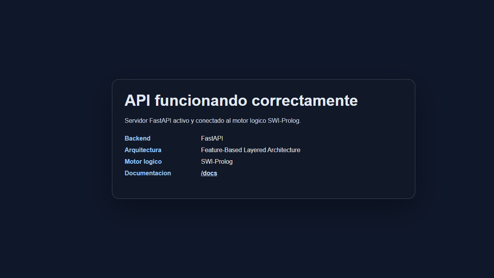
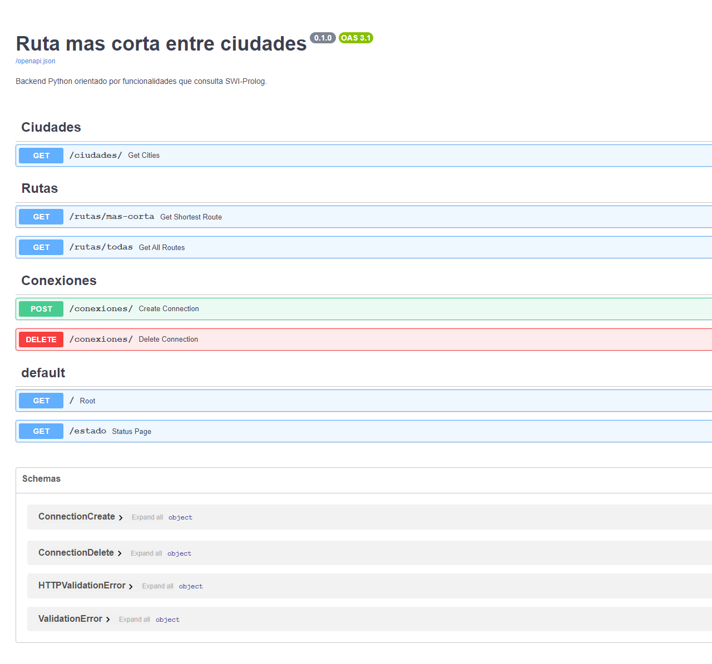
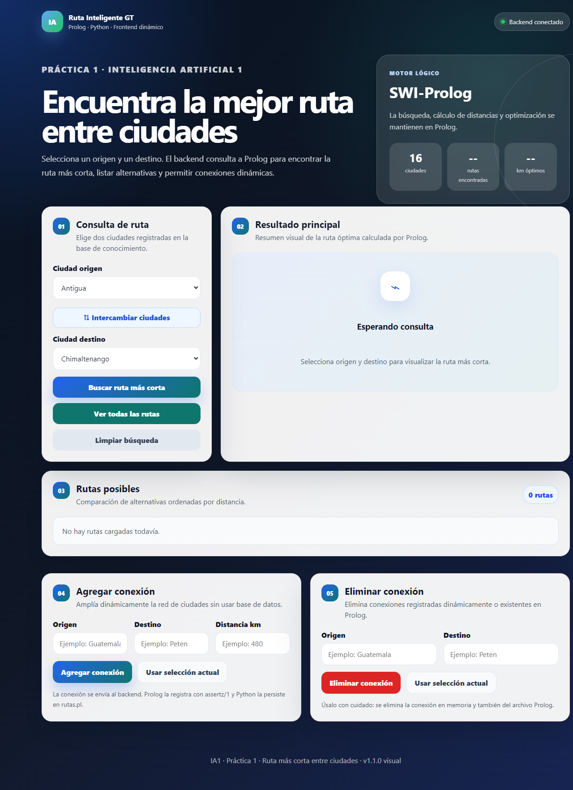
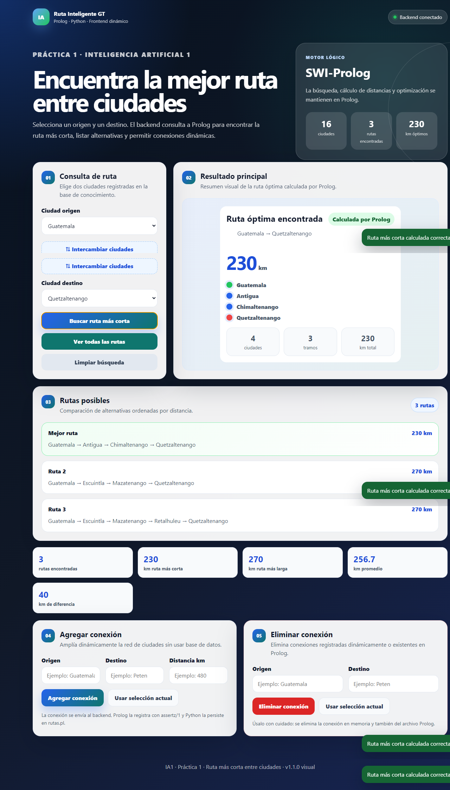

# Manual Técnico

## Nombre del proyecto

Ruta más corta entre ciudades usando Prolog, Python y frontend web.

---

## Objetivo técnico

Desarrollar un sistema híbrido capaz de encontrar rutas entre ciudades, calcular distancias y determinar la ruta más corta utilizando Prolog como motor lógico principal.

Python funciona únicamente como capa de integración entre el frontend y Prolog.  
La lógica de búsqueda y optimización no se implementa en Python.

---

## Cumplimiento del enunciado

| Requisito del enunciado | Implementación en la práctica |
|---|---|
| Base de conocimiento en Prolog con al menos 10 ciudades | `prolog/rutas.pl` define más de 10 ciudades y conexiones con distancias. |
| Representar distancias entre ciudades | Se usa el hecho `conexion(Origen, Destino, Distancia)`. |
| Buscar rutas entre origen y destino | Predicado `ruta/4`, endpoint `GET /rutas/todas` y frontend en la sección `Consulta de ruta`. |
| Evitar ciclos o ciudades repetidas | `viajar/5` mantiene una lista de visitados y valida `\+ member(Intermedio, Visitados)`. |
| Calcular distancia total | Prolog acumula distancias con `DistanciaTotal is Distancia1 + Distancia2`. |
| Determinar ruta más corta | `ruta_mas_corta/4` toma la primera ruta ordenada por distancia. |
| Backend Python para consultar Prolog | FastAPI usa PySwip mediante `PrologEngine`. |
| Python sin algoritmo de rutas | Python solo normaliza entradas, ejecuta consultas y serializa respuestas. |
| Frontend funcional e intuitivo | `frontend/index.html`, `style.css` y `app.js` permiten consultar y administrar conexiones. |
| Agregar nuevas ciudades y conexiones | `POST /conexiones/` usa `assertz/1` y persiste en `rutas.pl`; una nueva conexión puede introducir ciudades nuevas. |
| Mostrar todas las rutas posibles | `GET /rutas/todas` devuelve rutas ordenadas de menor a mayor distancia. |
| Patrón de arquitectura para backend | Arquitectura por funcionalidades con capas `router`, `service`, `schemas` y `prolog_engine`. |
| Manual de usuario y técnico en `.md` | Documentos en `docs/MANUAL_USUARIO.md` y `docs/MANUAL_TECNICO.md`. |
| Evidencia de ejecución | Capturas generadas con Cypress en `evidencias/cypress/screenshots`. |

---

## Arquitectura implementada

El backend utiliza una arquitectura orientada por funcionalidades con separación por capas internas.

Esta arquitectura permite dividir el sistema por responsabilidades, evitando concentrar toda la lógica en un único archivo.

La organización general es:

~~~text
Frontend
   ↓
API FastAPI
   ↓
Features del backend
   ↓
Prolog Engine
   ↓
SWI-Prolog
   ↓
rutas.pl
~~~

---

## Tecnologías utilizadas

| Tecnología | Uso dentro del sistema |
|---|---|
| SWI-Prolog | Base de conocimiento, reglas, búsqueda de rutas, cálculo de distancias y selección de la ruta más corta. |
| Python 3.x | Backend de integración entre HTTP y Prolog. |
| FastAPI | API REST, documentación automática y manejo de endpoints. |
| PySwip | Comunicación directa entre Python y SWI-Prolog. |
| Pydantic | Validación de datos para crear y eliminar conexiones. |
| HTML, CSS y JavaScript | Interfaz web para consulta y administración de rutas. |
| Cypress | Pruebas end-to-end y capturas reales de backend, `/docs` y frontend. |
| Live Server | Servidor local para ejecutar el frontend durante las evidencias. |

---

## Módulos del backend

### `core`

Contiene configuraciones generales del proyecto.

Archivo principal:

~~~text
backend/app/core/config.py
~~~

Responsabilidades:

- Definir rutas principales del proyecto.
- Definir ubicación del archivo Prolog.
- Centralizar configuraciones reutilizables.

---

### `prolog_engine`

Contiene la integración directa entre Python y SWI-Prolog.

Archivos principales:

~~~text
backend/app/prolog_engine/engine.py
backend/app/prolog_engine/serializer.py
~~~

Responsabilidades:

- Cargar el archivo `rutas.pl`.
- Ejecutar consultas Prolog.
- Convertir nombres de ciudades a átomos válidos.
- Agregar conexiones dinámicas.
- Eliminar conexiones dinámicas.
- Persistir cambios en el archivo Prolog.
- Normalizar respuestas de Prolog para enviarlas como JSON.

---

### `cities_feature`

Módulo encargado de consultar las ciudades disponibles.

Archivos principales:

~~~text
backend/app/cities_feature/router.py
backend/app/cities_feature/service.py
~~~

Responsabilidades:

- Exponer endpoint para listar ciudades.
- Consultar a Prolog mediante `ciudades(Ciudades)`.
- Devolver la lista de ciudades al frontend.

Endpoint:

~~~text
GET /ciudades/
~~~

---

### `routes_feature`

Módulo encargado de consultar rutas.

Archivos principales:

~~~text
backend/app/routes_feature/router.py
backend/app/routes_feature/service.py
backend/app/routes_feature/schemas.py
~~~

Responsabilidades:

- Consultar ruta más corta.
- Consultar todas las rutas posibles.
- Convertir resultados de Prolog en JSON.
- Manejar errores cuando no existen rutas.

Endpoints:

~~~text
GET /rutas/mas-corta
GET /rutas/todas
~~~

---

### `connections_feature`

Módulo encargado de administrar conexiones.

Archivos principales:

~~~text
backend/app/connections_feature/router.py
backend/app/connections_feature/service.py
backend/app/connections_feature/schemas.py
~~~

Responsabilidades:

- Agregar conexiones nuevas.
- Eliminar conexiones existentes.
- Validar datos de entrada.
- Enviar cambios hacia Prolog.
- Permitir cambios dinámicos sin usar base de datos.

Endpoints:

~~~text
POST /conexiones/
DELETE /conexiones/
~~~

---

## Archivo Prolog

El archivo principal de lógica se encuentra en:

~~~text
prolog/rutas.pl
~~~

Este archivo contiene:

- Base de conocimiento.
- Hechos de conexión.
- Reglas para caminos bidireccionales.
- Reglas para detectar ciudades.
- Búsqueda recursiva de rutas.
- Prevención de ciclos.
- Cálculo de distancias.
- Consulta de todas las rutas posibles.
- Selección de la ruta más corta.
- Agregado dinámico de conexiones.
- Eliminación dinámica de conexiones.

---

## Base de conocimiento

Las conexiones se representan mediante hechos de la forma:

~~~prolog
conexion(Origen, Destino, Distancia).
~~~

Ejemplo:

~~~prolog
conexion(guatemala, antigua, 45).
~~~

Esto significa que existe una conexión entre Guatemala y Antigua con una distancia de 45 kilómetros.

---

## Caminos bidireccionales

Para evitar escribir dos veces cada carretera, se utiliza la regla `camino/3`:

~~~prolog
camino(A, B, D) :-
    conexion(A, B, D).

camino(A, B, D) :-
    conexion(B, A, D).
~~~

Con esta regla, una conexión registrada en una dirección puede usarse también en sentido contrario.

---

## Detección de ciudades

Una ciudad puede aparecer como origen o destino dentro de una conexión.

~~~prolog
ciudad(C) :-
    conexion(C, _, _).

ciudad(C) :-
    conexion(_, C, _).
~~~

Luego, para obtener todas las ciudades sin repetidos, se usa:

~~~prolog
ciudades(ListaCiudades) :-
    findall(C, ciudad(C), Ciudades),
    sort(Ciudades, ListaCiudades).
~~~

`findall/3` obtiene todas las ciudades posibles y `sort/2` ordena la lista y elimina duplicados.

---

## Búsqueda de rutas

La búsqueda inicia con el predicado:

~~~prolog
ruta(Origen, Destino, Ruta, Distancia)
~~~

Este predicado recibe:

| Parámetro | Descripción |
|---|---|
| `Origen` | Ciudad inicial |
| `Destino` | Ciudad final |
| `Ruta` | Lista de ciudades recorridas |
| `Distancia` | Distancia total de la ruta |

La búsqueda real se realiza mediante recursividad con `viajar/5`.

---

## Prevención de ciclos

Para evitar que una ciudad se repita en una misma ruta, se mantiene una lista de ciudades visitadas.

La validación principal es:

~~~prolog
\+ member(Intermedio, Visitados)
~~~

Esto significa que la ciudad intermedia no debe estar en la lista de ciudades ya visitadas.

Gracias a esta validación se evitan rutas infinitas como:

~~~text
guatemala → antigua → guatemala → antigua
~~~

---

## Cálculo de distancias

La distancia total se calcula acumulando las distancias parciales:

~~~prolog
DistanciaTotal is Distancia1 + Distancia2.
~~~

Prolog suma la distancia desde el origen hacia una ciudad intermedia y luego la distancia desde esa ciudad intermedia hasta el destino.

---

## Todas las rutas posibles

Para obtener todas las rutas se utiliza:

~~~prolog
rutas_posibles(Origen, Destino, RutasOrdenadas)
~~~

Internamente se usa `findall/3`:

~~~prolog
findall(
    [Distancia, Ruta],
    ruta(Origen, Destino, Ruta, Distancia),
    Rutas
)
~~~

Cada solución se guarda con la distancia primero para que luego pueda ordenarse fácilmente.

---

## Ruta más corta

La ruta más corta se obtiene con:

~~~prolog
ruta_mas_corta(Origen, Destino, MejorRuta, MenorDistancia)
~~~

Esta regla toma la primera ruta de la lista ordenada por distancia:

~~~prolog
ruta_mas_corta(Origen, Destino, MejorRuta, MenorDistancia) :-
    rutas_posibles(Origen, Destino, [[MenorDistancia, MejorRuta]|_]).
~~~

Como las rutas están ordenadas de menor a mayor distancia, la primera corresponde a la ruta óptima.

---

## Agregado dinámico de conexiones

Para permitir cambios dinámicos, el archivo Prolog declara:

~~~prolog
:- dynamic conexion/3.
:- discontiguous conexion/3.
~~~

Esto permite modificar hechos `conexion/3` durante la ejecución.

La directiva `discontiguous/1` evita advertencias de SWI-Prolog cuando las conexiones nuevas persisten al final de `rutas.pl`, después de las reglas.

El predicado para agregar conexiones es:

~~~prolog
agregar_conexion(Origen, Destino, Distancia) :-
    Distancia > 0,
    \+ conexion_existente(Origen, Destino),
    assertz(conexion(Origen, Destino, Distancia)).
~~~

`assertz/1` agrega una nueva conexión a la base de conocimiento en memoria.

Además, Python persiste la conexión escribiéndola en el archivo `rutas.pl`, para que el cambio no se pierda al reiniciar el servidor.

---

## Eliminación dinámica de conexiones

El predicado utilizado es:

~~~prolog
eliminar_conexion(Origen, Destino) :-
    retractall(conexion(Origen, Destino, _)),
    retractall(conexion(Destino, Origen, _)).
~~~

`retractall/1` elimina todos los hechos que coincidan con la conexión indicada.

Antes de ejecutar la eliminación, Python consulta `conexion_existente/2`. Si no existe una conexión entre las ciudades indicadas, el endpoint responde `404` y no modifica `rutas.pl`.

---

## Integración Python-Prolog

La integración se realiza mediante PySwip.

El flujo es:

~~~text
Frontend envía solicitud HTTP
        ↓
FastAPI recibe la solicitud
        ↓
Service correspondiente procesa la petición
        ↓
PrologEngine ejecuta una consulta Prolog
        ↓
SWI-Prolog responde
        ↓
Python transforma la respuesta a JSON
        ↓
Frontend muestra el resultado
~~~

Ejemplo de consulta desde Python:

~~~python
query = f"ruta_mas_corta({origen_atom}, {destino_atom}, Ruta, Distancia)"
result = self.engine.query(query)
~~~

La consulta se ejecuta en Prolog, no en Python.

---

## Frontend

El frontend se compone de:

~~~text
frontend/index.html
frontend/style.css
frontend/app.js
~~~

Responsabilidades:

- Mostrar formulario de búsqueda.
- Cargar ciudades dinámicamente.
- Consultar la ruta más corta.
- Consultar todas las rutas posibles.
- Agregar nuevas conexiones.
- Eliminar conexiones.
- Mostrar mensajes de error.
- Limpiar resultados.

---

## Persistencia sin base de datos

La práctica indica que no se puede usar base de datos.

Por ello, el sistema maneja la persistencia de conexiones agregadas escribiendo directamente en el archivo Prolog `rutas.pl`.

Esto permite:

- Mantener Prolog como fuente de conocimiento.
- Evitar el uso de bases de datos.
- Conservar conexiones nuevas después de reiniciar la aplicación.

---

## Validaciones implementadas

| Validación | Lugar |
|---|---|
| Distancia mayor que cero | Prolog y Pydantic |
| Ciudad origen requerida | Pydantic |
| Ciudad destino requerida | Pydantic |
| Evitar conexiones duplicadas | Prolog |
| Evitar ciclos en rutas | Prolog |
| Origen diferente de destino | Prolog y frontend |
| Mensajes cuando no hay ruta | Backend y frontend |
| Eliminar solo conexiones existentes | PrologEngine y FastAPI |

---

## Restricciones cumplidas

- La búsqueda de rutas está implementada en Prolog.
- El cálculo de distancia está implementado en Prolog.
- La ruta más corta se determina en Prolog.
- Python no implementa el algoritmo de rutas.
- Python solo funciona como backend de integración.
- No se utiliza base de datos.
- El frontend permite consultar y administrar conexiones.
- El sistema tiene arquitectura orientada por funcionalidades.
- Se permite el cambio dinámico de rutas.

---

## Mejoras implementadas sobre el mínimo

Además de los requisitos mínimos, la práctica incluye:

- Listado de todas las rutas posibles ordenadas por distancia.
- Panel de estadísticas con ruta más corta, ruta más larga, promedio y diferencia.
- Mensajes visuales para errores, resultados vacíos y operaciones exitosas.
- Botón para intercambiar origen y destino.
- Persistencia de conexiones nuevas directamente en `rutas.pl`, sin base de datos.
- Endpoint `/estado` para evidenciar visualmente que el backend está activo.
- Pruebas end-to-end con Cypress y capturas reales de ejecución.

---

## Pruebas automatizadas

Las pruebas se encuentran en:

~~~text
cypress/e2e/backend.cy.js
cypress/e2e/frontend.cy.js
~~~

La suite realiza las siguientes validaciones:

- El backend responde desde `GET /`.
- La documentación automática carga en `GET /docs`.
- `GET /ciudades/` devuelve ciudades reales desde Prolog.
- `GET /rutas/mas-corta` devuelve la ruta `guatemala -> antigua -> chimaltenango -> quetzaltenango` con `230 km`.
- `DELETE /conexiones/` devuelve `404` cuando se intenta eliminar una conexión inexistente.
- El frontend se sirve con Live Server y confirma conexión real al backend.
- La búsqueda desde la interfaz llama a la API real y muestra el resultado calculado por Prolog.

Para ejecutarlas:

~~~bash
npm run evidencias
~~~

---

## Posibles mejoras futuras

- Mostrar un grafo visual de ciudades y conexiones.
- Agregar edición de distancias.
- Agregar importación/exportación de conexiones.
- Agregar pruebas unitarias al backend.
- Mejorar el diseño visual del frontend.
- Validar nombres repetidos con tildes o variantes.
- Agregar logs de consultas realizadas.
- Mostrar estadísticas de rutas, como ruta más larga, promedio de distancia y número total de rutas.

---

## Evidencias recomendadas

Para demostrar el funcionamiento del sistema se recomienda incluir capturas de:

1. Instalación o versión de SWI-Prolog.
2. Consulta directa en Prolog.
3. Backend ejecutándose con Uvicorn.
4. Documentación automática en `/docs`.
5. Frontend cargando ciudades.
6. Búsqueda de ruta más corta.
7. Visualización de todas las rutas.
8. Agregado dinámico de conexión.
9. Eliminación dinámica de conexión.
10. Archivo `rutas.pl` actualizado.
11. Repositorio en GitHub.

---

## Evidencias generadas con Cypress

Las siguientes capturas fueron generadas ejecutando pruebas reales con Cypress. El flujo levanta o reutiliza el backend FastAPI, sirve el frontend con Live Server y valida endpoints reales sin usar mocks.

Comando utilizado desde la carpeta `practica1`:

~~~bash
npm run evidencias
~~~

### Backend ejecutándose

La prueba valida que el endpoint raíz del backend responda correctamente y captura la página de estado del servidor.

### Documentación automática de FastAPI

La prueba abre `/docs` y verifica que Swagger UI cargue con los grupos de endpoints del sistema.

### Frontend servido con Live Server

La prueba abre el frontend en `http://127.0.0.1:5500`, confirma la conexión real con el backend y valida que las ciudades se carguen desde la API.

### Consulta real de ruta más corta

La prueba selecciona `guatemala` como origen y `quetzaltenango` como destino, consulta la API real y valida que la ruta óptima muestre una distancia de `230 km`.

