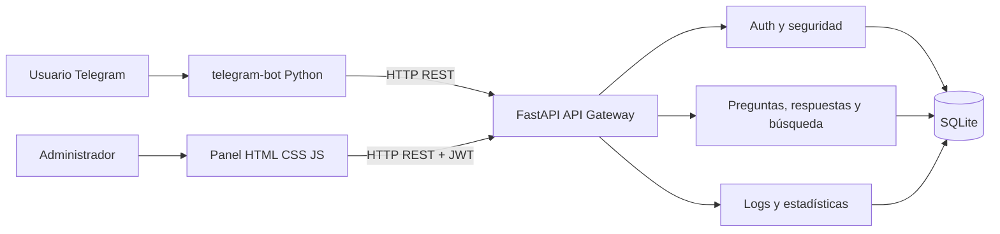
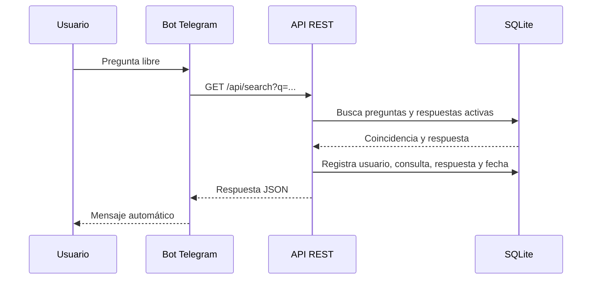

# Arquitectura de SmartBot

> La explicación completa de cada servicio, módulo, función y decisión está en el [Manual Técnico](MANUAL_TECNICO.md).

## Patrón

La solución usa una arquitectura por funcionalidades con capas internas. Cada capacidad del negocio tiene un router independiente en `app/features`:

- `auth`: autenticación y sesión.
- `categories`: clasificación de FAQ.
- `questions`: intenciones consultables.
- `answers`: respuestas priorizadas.
- `search`: normalización, puntuación y registro.
- `settings`: configuración y prueba Telegram.
- `stats`: agregaciones e historial.

Las capas internas son:

| Capa | Responsabilidad |
|---|---|
| Presentación | Panel administrativo y Telegram. |
| API | Endpoints, validación Pydantic y manejo HTTP. |
| Dominio | Autenticación, búsqueda, CRUD y estadísticas. |
| Persistencia | Modelos SQLAlchemy y SQLite. |

Se eligió este patrón para mantener separadas la presentación, la seguridad, cada funcionalidad y el almacenamiento. Web y Telegram comparten la misma API y la misma base de datos, evitando duplicar respuestas dentro del bot.

## Flujo de consulta

