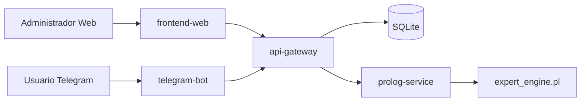
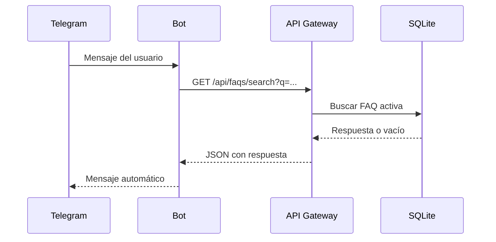
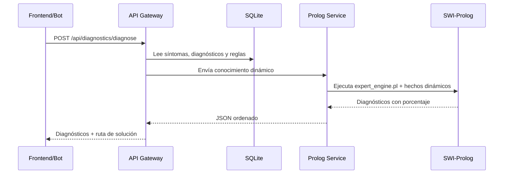

# Arquitectura de SmartBot

La práctica utiliza una **arquitectura orientada a servicios**, para evitar un sistema monolítico.

## Responsabilidades

| Servicio | Responsabilidad |
|---|---|
| `frontend-web` | Panel administrativo, CRUD y pruebas visuales. |
| `api-gateway` | Autenticación, CRUD, base de datos, logs, estadísticas y orquestación. |
| `prolog-service` | Cálculo lógico de diagnósticos, porcentajes y rutas de solución. |
| `telegram-bot` | Recibir mensajes reales desde Telegram y consumir la API REST. |
| `SQLite` | Persistencia de preguntas, respuestas, categorías, síntomas, reglas, diagnósticos, usuarios, configuración y logs. |

## Flujo de una pregunta FAQ

## Flujo de diagnóstico Prolog

