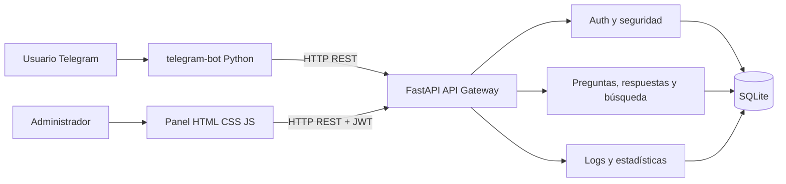
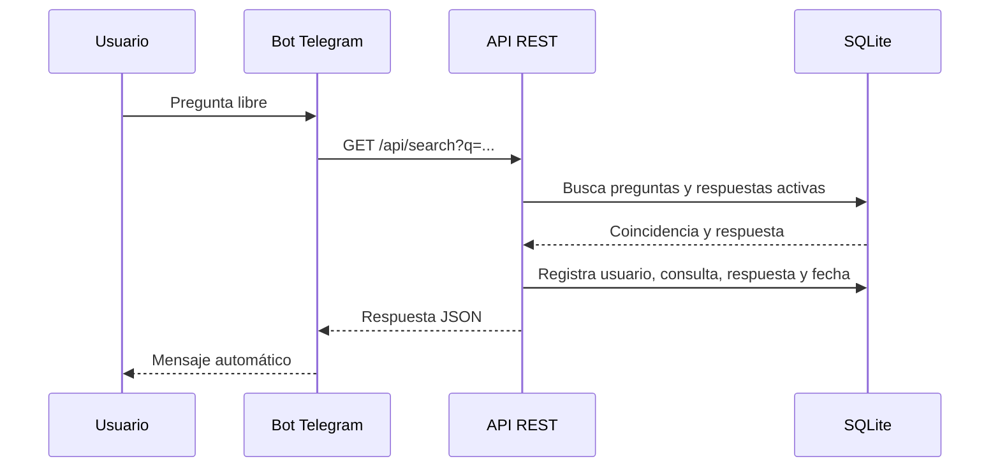

# Arquitectura de SmartBot

## Patrón

La solución usa arquitectura por capas y módulos por funcionalidad:

| Capa | Responsabilidad |
|---|---|
| Presentación | Panel administrativo y Telegram. |
| API | Endpoints, validación Pydantic y manejo HTTP. |
| Dominio | Autenticación, búsqueda, CRUD y estadísticas. |
| Persistencia | Modelos SQLAlchemy y SQLite. |

## Flujo de consulta

