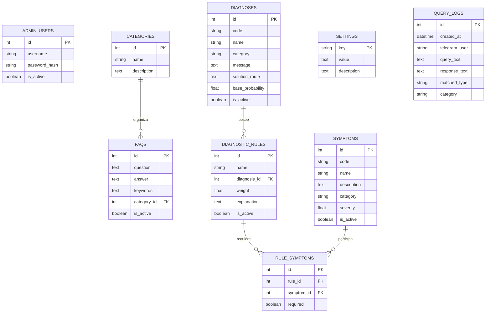

# Diagrama Entidad Relación

```mermaid
erDiagram
    ADMIN_USERS {
        int id PK
        string username
        string password_hash
        boolean is_active
    }
    CATEGORIES {
        int id PK
        string name
        text description
    }
    FAQS {
        int id PK
        text question
        text answer
        text keywords
        int category_id FK
        boolean is_active
    }
    SYMPTOMS {
        int id PK
        string code
        string name
        text description
        string category
        float severity
        boolean is_active
    }
    DIAGNOSES {
        int id PK
        string code
        string name
        string category
        text message
        text solution_route
        float base_probability
        boolean is_active
    }
    DIAGNOSTIC_RULES {
        int id PK
        string name
        int diagnosis_id FK
        float weight
        text explanation
        boolean is_active
    }
    RULE_SYMPTOMS {
        int id PK
        int rule_id FK
        int symptom_id FK
        boolean required
    }
    SETTINGS {
        string key PK
        text value
        text description
    }
    QUERY_LOGS {
        int id PK
        datetime created_at
        string telegram_user
        text query_text
        text response_text
        string matched_type
        string category
    }

    CATEGORIES ||--o{ FAQS : organiza
    DIAGNOSES ||--o{ DIAGNOSTIC_RULES : posee
    DIAGNOSTIC_RULES ||--o{ RULE_SYMPTOMS : requiere
    SYMPTOMS ||--o{ RULE_SYMPTOMS : participa
```
