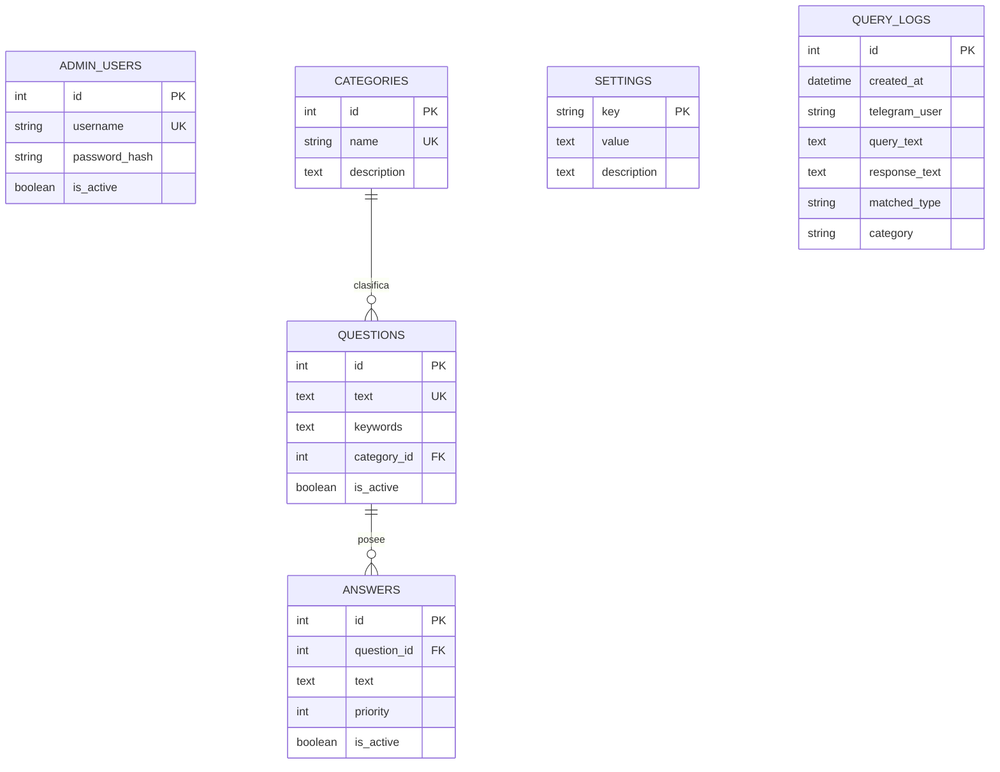

# Diagrama Entidad Relación

```mermaid
erDiagram
    ADMIN_USERS {
        int id PK
        string username UK
        string password_hash
        boolean is_active
    }
    CATEGORIES {
        int id PK
        string name UK
        text description
    }
    QUESTIONS {
        int id PK
        text text UK
        text keywords
        int category_id FK
        boolean is_active
    }
    ANSWERS {
        int id PK
        int question_id FK
        text text
        int priority
        boolean is_active
    }
    SETTINGS {
        string key PK
        text value
        text description
    }
    QUERY_LOGS {
        int id PK
        datetime created_at
        string telegram_user
        text query_text
        text response_text
        string matched_type
        string category
    }
    CATEGORIES ||--o{ QUESTIONS : clasifica
    QUESTIONS ||--o{ ANSWERS : posee
```

`QUERY_LOGS` conserva una copia histórica de la consulta y respuesta, por lo que no depende de que una pregunta sea editada o eliminada después.
