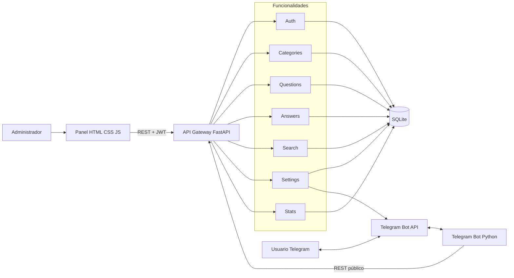
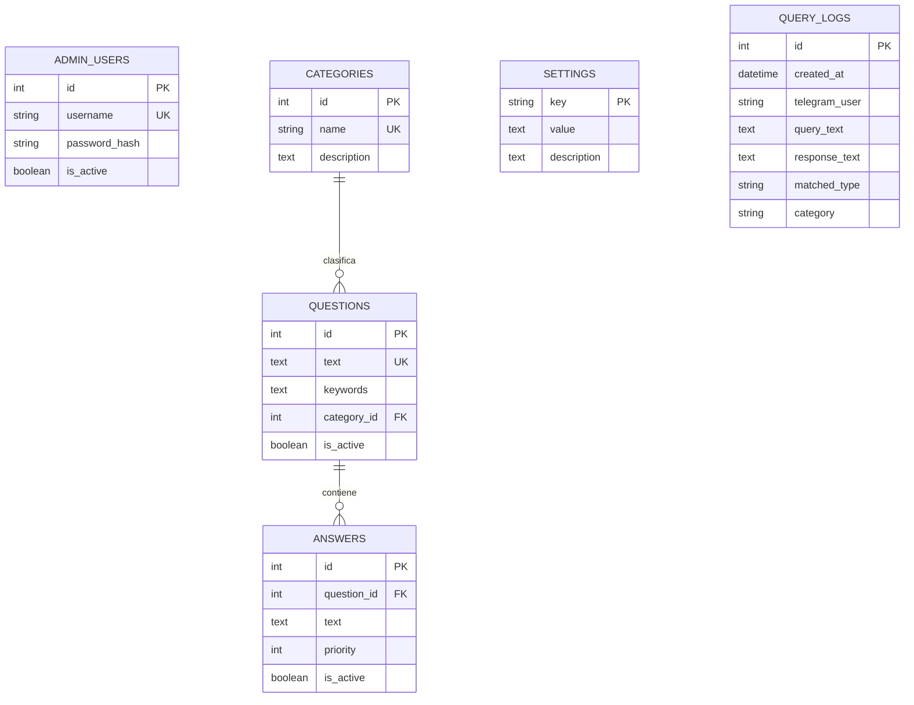
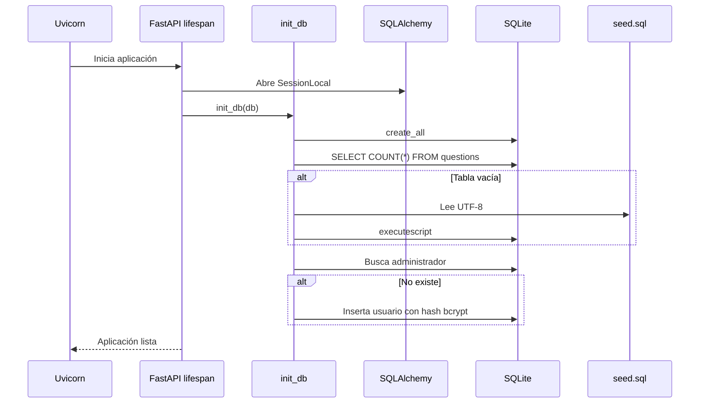
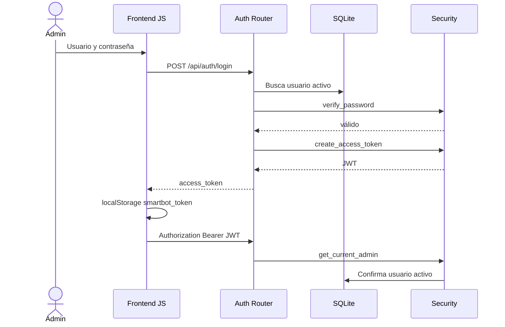

# Manual Técnico - SmartBot

## 1. Identificación

| Campo | Valor |
|---|---|
| Proyecto | SmartBot - Sistema de preguntas frecuentes por web y Telegram |
| Curso | Inteligencia Artificial 1 |
| Entrega | Práctica 2 |
| Autor | Pablo Daniel Fernández Chacón |
| Carnet | 201807411 |
| Backend | Python 3.11 y FastAPI |
| Persistencia | SQLite mediante SQLAlchemy |
| Interfaz | HTML, CSS y JavaScript |
| Canal conversacional | Telegram Bot API |
| Despliegue | Docker Compose |

## 2. Objetivo técnico

SmartBot implementa una plataforma de preguntas frecuentes administrable. Las categorías, preguntas, respuestas, usuarios, configuraciones y consultas viven en una base SQL real. El bot de Telegram no contiene respuestas codificadas: consume la misma API REST que utiliza el panel web.

Los objetivos técnicos son:

- Desarrollar el backend exclusivamente en Python.
- Exponer una API REST organizada por funcionalidades.
- Proteger operaciones administrativas mediante JWT.
- Guardar contraseñas con hash bcrypt.
- Persistir toda la información en SQLite.
- Permitir CRUD de categorías, preguntas y respuestas.
- Resolver consultas mediante normalización y puntuación de tokens.
- Registrar cada consulta y generar estadísticas.
- Integrar un bot de Telegram mediante polling.
- Ejecutar el sistema de forma reproducible con Docker Compose.

## 3. Alcance funcional

### 3.1 Administración

- Login administrativo.
- Verificación del usuario autenticado.
- CRUD de categorías.
- CRUD de preguntas.
- CRUD de respuestas.
- Activación y desactivación de preguntas/respuestas.
- Priorización de respuestas.
- Configuración dinámica almacenada en SQL.
- Prueba de envío a Telegram.

### 3.2 Consulta

- Recepción de una pregunta libre.
- Normalización de mayúsculas, tildes y símbolos.
- Comparación con texto y palabras clave.
- Selección de la mejor pregunta.
- Selección de la primera respuesta activa por prioridad.
- Respuesta configurable cuando no existe coincidencia.
- Registro histórico de la interacción.

### 3.3 Estadísticas

- Total de consultas.
- Usuarios únicos.
- Consultas encontradas y desconocidas.
- Consultas más frecuentes.
- Categorías más consultadas.
- Últimos 100 registros.

### 3.4 Telegram

- Polling de actualizaciones.
- Comandos `/start`, `/ayuda` y `/categorias`.
- Preguntas libres.
- Consulta del backend mediante REST.
- Envío de respuesta y categoría.

## 4. Cumplimiento de requerimientos

| Requerimiento | Implementación concreta |
|---|---|
| Autenticación | `/api/auth/login`, JWT HS256 y bcrypt. |
| CRUD categorías | `features/categories/router.py`. |
| CRUD preguntas | `features/questions/router.py`. |
| CRUD respuestas | `features/answers/router.py`. |
| Configuración | Tabla `settings` y router dedicado. |
| Telegram recibe mensajes | `getUpdates` en `telegram_bot/app/bot.py`. |
| Telegram consulta backend | `api_get('/api/search')`. |
| Respuesta desde base SQL | SQLAlchemy consulta `questions` y `answers`. |
| Consulta desconocida | Clave `unknown_message`. |
| Registro de consultas | Modelo `QueryLog`. |
| Estadísticas | Agregaciones SQL en `features/stats`. |
| Persistencia | SQLite dentro del volumen `smartbot_data`. |
| Docker | API, bot y frontend definidos en Compose. |
| Backend Python | FastAPI y bot implementados únicamente en Python. |

## 5. Arquitectura utilizada

### 5.1 Arquitectura por funcionalidades

El backend se organiza por capacidades del negocio y no como un único archivo con todos los endpoints.

```text
app/features/
|-- auth/
|-- categories/
|-- questions/
|-- answers/
|-- search/
|-- settings/
`-- stats/
```

Cada módulo contiene el router, esquemas de entrada y lógica necesaria para su funcionalidad. Los elementos transversales se ubican en `core`, `db` y `services`.

### 5.2 Capas internas

La arquitectura por funcionalidades convive con cuatro capas conceptuales:

| Capa | Componentes | Responsabilidad |
|---|---|---|
| Presentación | Panel web y Telegram | Capturar acciones y mostrar resultados. |
| API/aplicación | Routers FastAPI | Validar HTTP y coordinar casos de uso. |
| Dominio técnico | Búsqueda, seguridad y cliente Telegram | Ejecutar reglas de aplicación. |
| Persistencia | SQLAlchemy y SQLite | Guardar y consultar datos. |

### 5.3 Diagrama general



### 5.4 Por qué se utilizó esta arquitectura

1. **Las funcionalidades son independientes.** Autenticación, búsqueda y estadísticas tienen reglas diferentes.
2. **Evita un archivo monolítico.** Cada router puede leerse, probarse y cambiarse por separado.
3. **Facilita crecimiento.** Una nueva funcionalidad puede agregarse bajo `features/` y registrarse en `main.py`.
4. **Separa secretos y seguridad.** JWT y bcrypt viven en `core/security.py`.
5. **Centraliza persistencia.** Todos los módulos usan `get_db` y modelos comunes.
6. **Comparte una fuente de verdad.** Web y Telegram consultan la misma API y SQLite.
7. **Hace visible el contrato.** FastAPI genera OpenAPI y Swagger automáticamente.
8. **Docker reproduce el entorno.** No depende de instalaciones manuales de Python en el equipo evaluador.

### 5.5 Razón para usar SQLite

SQLite es una base SQL embebida y transaccional. Se eligió porque:

- La práctica funciona en un solo nodo.
- El volumen de 20 FAQ y consultas es pequeño.
- No requiere administrar un servidor adicional.
- SQLAlchemy conserva una interfaz que podría migrarse a otro motor.
- Docker puede persistir el archivo en un volumen.
- Permite llaves foráneas, índices, unicidad y transacciones.

No se usa JSON como almacenamiento. `seed.sql` solo inicializa una base vacía.

## 6. Tecnologías

| Tecnología | Versión/configuración | Función |
|---|---|---|
| Python | 3.11 en Docker | API y bot. |
| FastAPI | 0.115.6 | API REST, dependencias y OpenAPI. |
| Uvicorn | 0.32.1 | Servidor ASGI. |
| SQLAlchemy | 2.0.36 | ORM, sesiones y consultas. |
| SQLite | Archivo `/data/smartbot.db` | Base SQL persistente. |
| Pydantic | 2.10.3 | Validación de payloads. |
| pydantic-settings | 2.6.1 | Variables de entorno. |
| python-jose | 3.3.0 | Codificación y validación JWT. |
| Passlib + bcrypt | 1.7.4 / 4.0.1 | Hash y verificación de contraseña. |
| Requests | 2.32.3 | Telegram Bot API y consumo del gateway. |
| HTML5 | Nativo | Estructura del panel. |
| CSS3 | Nativo | Diseño adaptable. |
| JavaScript | Nativo | Estado, fetch y CRUD. |
| Nginx | 1.27 Alpine | Servidor estático y proxy `/api`. |
| Docker Compose | Compose v2 | Orquestación, red y volumen. |
| PowerShell | Windows | Inicio, prueba y Telegram. |
| Postman | Colección v2.1 | Pruebas manuales de API. |

## 7. Estructura del proyecto

```text
practica2/
|-- .env.example
|-- docker-compose.yml
|-- README.md
|-- backend/
|   |-- api_gateway/
|   |   |-- app/
|   |   |   |-- main.py
|   |   |   |-- core/
|   |   |   |   |-- config.py
|   |   |   |   `-- security.py
|   |   |   |-- db/
|   |   |   |   |-- session.py
|   |   |   |   |-- models.py
|   |   |   |   `-- init_db.py
|   |   |   |-- features/
|   |   |   |   |-- auth/
|   |   |   |   |-- categories/
|   |   |   |   |-- questions/
|   |   |   |   |-- answers/
|   |   |   |   |-- search/
|   |   |   |   |-- settings/
|   |   |   |   `-- stats/
|   |   |   `-- services/telegram_client.py
|   |   `-- seeds/seed.sql
|   `-- telegram_bot/
|       `-- app/bot.py
|-- frontend/
|   |-- index.html
|   |-- app.js
|   |-- style.css
|   `-- nginx.conf
|-- postman/
|-- scripts/
`-- docs/
```

## 8. Modelo de datos

### 8.1 Diagrama entidad-relación



### 8.2 `admin_users`

| Campo | Detalle |
|---|---|
| `id` | Llave primaria entera. |
| `username` | Único e indexado. |
| `password_hash` | Hash bcrypt, nunca contraseña plana. |
| `is_active` | Permite deshabilitar el acceso. |

### 8.3 `categories`

`name` es único. La relación `questions` usa `passive_deletes=True`; la llave foránea de preguntas usa `RESTRICT`, por lo que SQLite impide eliminar una categoría utilizada.

### 8.4 `questions`

- `text` es único e indexado.
- `keywords` agrega vocabulario de búsqueda.
- `category_id` referencia categorías.
- `is_active` controla participación en búsquedas.
- `answers` usa `cascade="all, delete-orphan"`.

Al eliminar una pregunta, SQLAlchemy elimina sus respuestas y la llave foránea también declara `ON DELETE CASCADE`.

### 8.5 `answers`

- Pertenece obligatoriamente a una pregunta.
- `priority` determina orden ascendente.
- Un valor menor representa mayor preferencia.
- `is_active` excluye temporalmente la respuesta.

### 8.6 `settings`

Usa la clave textual como llave primaria. Este patrón permite agregar configuraciones sin modificar el esquema SQL.

Claves iniciales:

- `telegram_chat_id`.
- `unknown_message`.
- `welcome_message`.

### 8.7 `query_logs`

Guarda una fotografía del texto consultado y respondido. No utiliza llaves foráneas porque el historial debe sobrevivir aunque una FAQ cambie o sea eliminada.

`matched_type` contiene normalmente `faq` o `unknown`.

## 9. Inicialización de la base

### 9.1 Orden de arranque



### 9.2 Semilla SQL

`seed.sql` ejecuta:

1. `PRAGMA foreign_keys = ON`.
2. Inserción de cuatro categorías con `INSERT OR IGNORE`.
3. Inserción de 20 preguntas.
4. Inserción de 20 respuestas.
5. Inserción de tres configuraciones con `INSERT OR IGNORE`.

La semilla se ejecuta únicamente cuando `SELECT COUNT(*) FROM questions` devuelve cero.

## 10. Flujo de autenticación



## 11. Algoritmo de búsqueda

### 11.1 Normalización

La función `normalize`:

1. Aplica Unicode NFKD.
2. Convierte a ASCII ignorando diacríticos.
3. Convierte a minúsculas.
4. Extrae segmentos `[a-z0-9]+`.
5. Une segmentos con un espacio.

Ejemplo:

```text
¿Cómo configuro TELEGRAM?
como configuro telegram
```

### 11.2 Tokens

```python
tokens = {token for token in clean.split() if len(token) > 2}
```

Se usa un conjunto para no contar dos veces la misma palabra. Se descartan tokens cortos como `de`, `la` o `un`.

### 11.3 Puntuación

Para cada pregunta activa:

```text
haystack = pregunta normalizada + palabras clave normalizadas
score base = cantidad de tokens contenidos en haystack
```

Bonificaciones:

| Condición | Bonificación |
|---|---:|
| Consulta exactamente igual a la pregunta | +20 |
| Consulta completa contenida en pregunta/palabras clave | +5 |

La pregunta reemplaza a la mejor solo cuando `score > best_score`. En empate se conserva la primera pregunta encontrada por la consulta a la base.

### 11.4 Respuesta

Cuando existe una pregunta con score mayor que cero:

```sql
WHERE question_id = ? AND is_active = true
ORDER BY priority, id
LIMIT 1
```

Esto significa que la respuesta activa con menor número de prioridad gana. El ID desempata.

### 11.5 Consulta desconocida

Se utiliza `settings.unknown_message` cuando:

- Ninguna pregunta obtiene score positivo.
- La mejor pregunta no tiene una respuesta activa.

En ambos casos se inserta un `QueryLog` con tipo `unknown`.

## 12. Explicación granular del API Gateway

### 12.1 `app/main.py`

#### Importaciones

- `asynccontextmanager` define el ciclo de vida de FastAPI.
- `FastAPI` crea la aplicación.
- `CORSMiddleware` permite llamadas desde los orígenes configurados.
- `settings` centraliza variables de entorno.
- `init_db` prepara tablas, semilla y administrador.
- `SessionLocal` crea la sesión inicial.
- Cada `router` representa una funcionalidad.

#### `lifespan`

Antes de aceptar solicitudes:

1. Abre una sesión con `with SessionLocal()`.
2. Ejecuta `init_db`.
3. Cierra la sesión automáticamente.
4. `yield` entrega el control a FastAPI.

No hay lógica especial de apagado después de `yield`.

#### Aplicación y CORS

FastAPI define título, descripción, versión y lifespan. El middleware acepta credenciales, todos los métodos y encabezados, pero restringe orígenes a `settings.cors_origin_list`.

#### `GET /api/health`

Devuelve estado, nombre de servicio y motor de almacenamiento. No ejecuta una consulta explícita a SQLite; indica que el proceso HTTP está activo.

#### `include_router`

Registra los siete módulos sin duplicar sus rutas en `main.py`.

### 12.2 `app/core/config.py`

`Settings` declara:

| Atributo | Valor predeterminado |
|---|---|
| `database_url` | `sqlite:///./smartbot.db` |
| `jwt_secret` | `change-me` |
| `jwt_algorithm` | `HS256` |
| `jwt_expire_minutes` | 480 |
| `admin_username` | `IA1-User` |
| `admin_password` | `IA1-password@_new` |
| `telegram_bot_token` | vacío |
| `telegram_default_chat_id` | vacío |
| `cors_origins` | frontend local |

`SettingsConfigDict` lee `.env` e ignora variables no utilizadas por este servicio.

`cors_origin_list` separa la cadena por comas, elimina espacios y descarta elementos vacíos.

`settings = Settings()` crea una instancia global al importar el módulo.

### 12.3 `app/core/security.py`

#### Objetos globales

- `CryptContext` configura bcrypt y permite migración futura de esquemas.
- `OAuth2PasswordBearer` extrae el token del encabezado `Authorization`.

#### `verify_password`

Compara contraseña plana con hash. Bcrypt incorpora salt dentro del propio hash.

#### `create_access_token`

1. Calcula expiración UTC.
2. Crea payload con `sub` y `exp`.
3. Firma con `jwt_secret` y algoritmo configurado.

El subject es el username.

#### `get_current_admin`

1. Recibe token mediante dependencia OAuth2.
2. Decodifica firma y expiración.
3. Extrae `sub`.
4. Ante `JWTError`, responde 401.
5. Busca un administrador activo con ese username.
6. Responde 401 si ya no existe o está inactivo.
7. Devuelve el modelo `AdminUser` para el endpoint protegido.

### 12.4 `app/db/session.py`

#### Engine

`connect_args={"check_same_thread": False}` permite usar SQLite con sesiones de solicitudes FastAPI.

`future=True` activa la API moderna de SQLAlchemy 2.

#### Llaves foráneas

SQLite no activa llaves foráneas por defecto en cada conexión. El listener `connect` ejecuta:

```sql
PRAGMA foreign_keys=ON
```

Esto hace efectivos `RESTRICT` y `CASCADE`.

#### Sesión y base

- `SessionLocal` desactiva autocommit y autoflush.
- `Base` es la raíz declarativa.
- `get_db` entrega una sesión y garantiza cierre con `finally`.

### 12.5 `app/db/models.py`

#### `AdminUser`

Representa credenciales administrativas. `username` tiene índice y unicidad.

#### `Category`

Relaciona una categoría con muchas preguntas mediante `back_populates`.

#### `Question`

Contiene texto, palabras clave, categoría y estado. La relación `answers` elimina objetos huérfanos.

#### `Answer`

Contiene texto, prioridad y estado. Su llave foránea usa cascada al eliminar pregunta.

#### `Setting`

Modelo clave-valor con descripción.

#### `QueryLog`

Registra fecha UTC, usuario, consulta, respuesta, tipo y categoría. `created_at` está indexado para ordenar historial.

### 12.6 `app/db/init_db.py`

#### Constantes

- Un `CryptContext` separado genera el hash inicial.
- `SEED_PATH` se calcula desde la ubicación del archivo y apunta a `seeds/seed.sql`.

#### `load_sql_seed_if_needed`

1. Obtiene conexión DBAPI cruda.
2. Consulta cantidad de preguntas.
3. Si es cero, lee el SQL en UTF-8.
4. Ejecuta el script completo con `executescript`.
5. Confirma la transacción.
6. Cierra la conexión en `finally`.

Esta función utiliza una capacidad específica de SQLite: `executescript`.

#### `init_db`

1. Crea tablas ausentes.
2. Carga semilla si corresponde.
3. Expira objetos de la sesión para volver a leer estado.
4. Busca administrador configurado.
5. Si falta, genera hash bcrypt, inserta y confirma.

## 13. Explicación granular de funcionalidades

### 13.1 Autenticación

Archivo: `features/auth/router.py`.

`APIRouter` usa prefijo `/api/auth` y tag `auth`.

`LoginRequest` exige `username` y `password` como strings.

`login`:

1. Busca username activo.
2. Verifica contraseña.
3. Responde 401 con mensaje genérico si falla cualquiera.
4. Crea JWT.
5. Devuelve token, tipo bearer y username.

`me` depende de `get_current_admin` y devuelve ID/username del token.

### 13.2 Categorías

Archivo: `features/categories/router.py`.

`CategoryIn` contiene nombre y descripción opcional.

`list_categories` es público y ordena alfabéticamente.

`create_category`:

1. Requiere administrador.
2. Construye modelo con `model_dump`.
3. Agrega y confirma.
4. Captura `IntegrityError` por nombre repetido.
5. Hace rollback y responde 409.
6. Refresca para obtener ID.

`update_category` busca por ID, responde 404, asigna cada campo con `setattr` y maneja duplicados.

`delete_category` intenta borrar. Si existen preguntas, la llave foránea genera `IntegrityError`; se revierte y responde 409.

### 13.3 Preguntas

Archivo: `features/questions/router.py`.

`QuestionIn` valida:

- Texto de 3 a 500 caracteres.
- Palabras clave hasta 500.
- Categoría entera.
- Estado booleano.

`list_questions` es público y ordena por ID.

`create_question` valida la categoría antes de insertar. Una categoría inexistente produce 422. Un texto duplicado produce 409.

`update_question` valida pregunta y categoría, reemplaza todos los campos y maneja texto duplicado.

`delete_question` elimina la pregunta; las respuestas se eliminan en cascada.

### 13.4 Respuestas

Archivo: `features/answers/router.py`.

`AnswerIn` valida:

- Pregunta existente.
- Texto de 2 a 2000 caracteres.
- Prioridad 1-100.
- Estado booleano.

`list_answers` ordena por pregunta, prioridad e ID.

Crear y actualizar validan primero la pregunta asociada. Eliminar responde 404 cuando no existe.

### 13.5 Búsqueda

Archivo: `features/search/router.py`.

`normalize` realiza la transformación descrita en el algoritmo.

El endpoint `GET /api/search`:

1. Exige consulta de 2 a 500 caracteres.
2. Acepta `telegram_user`, por defecto `panel`.
3. Normaliza y crea tokens.
4. Carga preguntas activas.
5. Puntúa una por una.
6. Conserva la mejor.
7. Busca respuesta activa por prioridad ascendente.
8. Obtiene nombre de categoría.
9. Inserta log `faq` y confirma.
10. Devuelve pregunta, respuesta, categoría y score.
11. Si no logra responder, consulta `unknown_message`.
12. Inserta log `unknown` y devuelve `found: false`.

El endpoint es público para que Telegram pueda consultarlo sin manejar credenciales administrativas.

### 13.6 Configuración

Archivo: `features/settings/router.py`.

`SettingIn` contiene valor y descripción opcional.

`TelegramTestIn` contiene texto predeterminado y chat opcional.

Todos los endpoints requieren administrador.

`list_settings` ordena por clave.

`upsert_setting` crea si la clave no existe. Si existe, reemplaza valor y conserva descripción cuando el payload trae texto vacío.

`delete_setting` responde 404 o elimina.

`send_telegram_test` elige chat explícito, luego SQLite, luego `.env`, y delega al servicio cliente.

### 13.7 Estadísticas

Archivo: `features/stats/router.py`.

Todos los endpoints requieren administrador.

`stats` ejecuta agregaciones:

- `count()` total.
- `distinct().count()` usuarios.
- `GROUP BY matched_type`.
- `GROUP BY query_text`, orden descendente y límite 10.
- `GROUP BY category`, orden descendente y límite 10.

Transforma tuplas SQLAlchemy en listas de diccionarios JSON.

`logs` devuelve los últimos 100 registros por fecha descendente.

## 14. Servicio de salida Telegram

Archivo: `app/services/telegram_client.py`.

`send_telegram_message(chat_id, text)`:

1. Comprueba token.
2. Comprueba chat ID.
3. Construye URL `sendMessage`.
4. Ejecuta POST JSON con timeout de 20 segundos.
5. No eleva error por código HTTP; lo convierte en `sent: false`.
6. Devuelve la respuesta JSON cuando es correcto.

Este cliente se usa desde el panel para pruebas. El bot receptor tiene su propia integración en otro contenedor.

## 15. Explicación granular del bot

Archivo: `backend/telegram_bot/app/bot.py`.

### 15.1 Configuración global

- `TOKEN` lee y limpia `TELEGRAM_BOT_TOKEN`.
- `API_BASE` lee `API_BASE_URL` y elimina `/` final.
- `POLL_SECONDS` convierte el intervalo a float.

### 15.2 `telegram`

Función genérica para llamar métodos de la Bot API:

- Construye URL con token.
- Envía payload JSON por POST.
- Usa timeout de 30 segundos.
- Eleva excepción para códigos incorrectos.
- Devuelve JSON.

### 15.3 `send`

Especializa `telegram` para `sendMessage`.

### 15.4 `api_get`

Consulta el API Gateway con parámetros de query y timeout de 20 segundos. Eleva errores HTTP y devuelve JSON.

### 15.5 `handle_message`

1. Extrae chat ID, remitente y texto.
2. Ignora mensajes no textuales.
3. `/start` y `/ayuda` envían texto fijo.
4. `/categorias` llama al catálogo público y forma una lista.
5. Para cualquier otro texto, determina username o ID.
6. Llama `/api/search` con texto y usuario.
7. Usa `answer` o fallback local.
8. Si hay coincidencia y categoría, la anexa.
9. Envía el resultado.

El mensaje `welcome_message` de SQLite no se consulta en esta función. El saludo actual está codificado en el archivo.

### 15.6 `main`

Si el token está vacío, imprime una advertencia y duerme en un ciclo. Esto mantiene el contenedor activo sin afectar API/frontend.

Con token:

1. Inicia `offset=0`.
2. Llama `getUpdates` con long polling de 25 segundos.
3. Solicita solo mensajes.
4. Avanza offset a `update_id + 1`.
5. Procesa cada mensaje.
6. Ante cualquier excepción, registra error y espera cinco segundos.
7. Espera `POLL_SECONDS` entre ciclos.

El guard `if __name__ == "__main__"` permite ejecutar `python -m app.bot`.

## 16. Explicación granular del frontend

### 16.1 `frontend/index.html`

#### Cabecera HTML

- `<!doctype html>` activa HTML5.
- `lang="es"` declara idioma.
- UTF-8 permite tildes.
- Viewport adapta móviles.
- Carga `style.css`.

#### Barra superior

Muestra nombre, descripción y botón de cierre de sesión. El botón inicia oculto con `hidden`.

#### Login

`loginSection` contiene:

- Usuario con autocomplete.
- Contraseña de tipo password.
- Botón de entrada.
- Mensaje específico de error.

Los valores de evaluación aparecen precargados para facilitar la demostración.

#### Aplicación

`appSection` inicia oculto. Incluye navegación y seis secciones con IDs usados por JavaScript.

#### Dashboard

Contiene contenedores para estadísticas, consultas, categorías y tabla de logs.

#### Formularios CRUD

Cada formulario incluye un ID oculto. Si está vacío, JavaScript crea; si tiene valor, actualiza.

#### Prueba y configuración

La prueba contiene input, botón y resultado. Configuración se genera dinámicamente porque sus claves vienen de SQLite.

#### Script

`app.js` se carga al final para que todos los elementos DOM ya existan.

### 16.2 `frontend/app.js`: configuración y estado

#### URL de API

El orden de selección es:

1. Parámetro `?api=`.
2. Variable global `window.SMARTBOT_API_URL`.
3. `http://localhost:8100` si se abre como archivo.
4. `location.origin` si Nginx sirve el panel.

Se elimina `/` final para evitar rutas dobles.

#### Estado global

- `token`: JWT recuperado de `localStorage`.
- `categories`: caché del catálogo.
- `questions`: caché para tablas/selectores.
- `answers`: caché para edición.

#### Helpers

| Helper | Función |
|---|---|
| `$` | Obtiene elemento por ID. |
| `escapeHtml` | Escapa caracteres para evitar inyección al usar `innerHTML`. |
| `authHeaders` | Construye Bearer si existe token. |
| `getErrorMessage` | Extrae `detail`, JSON o texto. |
| `message` | Escribe mensaje global con `textContent`. |
| `actions` | Genera botones Editar/Eliminar para tablas. |

#### `req`

1. Decide no enviar auth únicamente al login.
2. Ejecuta `fetch` con JSON.
3. Combina encabezados personalizados y Bearer.
4. Si recibe 401, elimina token y muestra login.
5. Convierte respuestas incorrectas en `Error`.
6. Devuelve JSON.

### 16.3 Sesión visual

- `showLogin` muestra acceso y oculta aplicación/logout.
- `showApp` invierte visibilidad y ejecuta `initData`.
- `loginBtn.onclick` envía credenciales, guarda token y muestra panel.
- `logoutBtn.onclick` elimina token y vuelve al acceso.

Al final, si ya existe token se intenta abrir el panel; de lo contrario se muestra login.

### 16.4 Pestañas

JavaScript asigna un handler a cada botón:

1. Quita clase `active` de todos.
2. Oculta todas las secciones `.tab`.
3. Activa el botón presionado.
4. Muestra el ID indicado en `data-tab`.

### 16.5 Carga inicial

`initData` carga categorías primero porque preguntas y respuestas necesitan sus nombres/selectores. Después ejecuta preguntas, respuestas, configuración y estadísticas en paralelo.

### 16.6 Categorías en JavaScript

- `loadCategories` consulta API, llena selector y tabla.
- El `onsubmit` decide POST/PUT según `categoryId`.
- `editCategory` copia valores desde caché.
- `deleteCategory` confirma, captura error 409 y recarga.
- `clearCategoryForm` borra ID y formulario.

### 16.7 Preguntas en JavaScript

- `loadQuestions` llena caché, selector de respuestas y tabla.
- El formulario construye tipos correctos, especialmente `Number(category_id)` y checkbox.
- `editQuestion` recupera la fila de memoria.
- `deleteQuestion` recarga preguntas y respuestas porque existe cascada.
- `clearQuestionForm` restablece activa a `true`.

### 16.8 Respuestas en JavaScript

- `loadAnswers` relaciona `question_id` con texto usando caché.
- El formulario convierte pregunta y prioridad a número.
- `editAnswer` carga estado.
- `deleteAnswer` elimina y recarga.
- `clearAnswerForm` restablece prioridad 1 y activa.

### 16.9 Prueba de búsqueda

`testSearch` codifica la consulta con `encodeURIComponent`, usa usuario `panel`, escapa contenido antes de insertarlo y recarga estadísticas después de registrar la consulta.

### 16.10 Configuración

`loadSettings` crea una tarjeta por clave y agrega una tarjeta extra de prueba Telegram.

`saveSetting` envía valor y descripción vacía; el backend conserva la descripción anterior.

`sendTelegramTest` muestra éxito o razón sin usar el mensaje global.

### 16.11 Estadísticas

`loadStats`:

1. Consulta resumen.
2. Renderiza total y usuarios.
3. Recorre tipos.
4. Renderiza top de consultas o estado vacío.
5. Renderiza top de categorías.
6. Consulta logs.
7. Construye tabla histórica.

### 16.12 `frontend/style.css`

El archivo define:

- Variables visuales globales en `:root`.
- Barra superior con gradiente azul.
- Tarjetas blancas con sombra.
- Login centrado.
- Navegación flexible.
- Botones principales y secundarios.
- Clase utilitaria `.hidden` con `!important`.
- Formularios con CSS Grid adaptable.
- Estadísticas con borde azul.
- Tablas con scroll horizontal y cabecera fija.
- Resultados de búsqueda y badges.
- Paneles de configuración.
- Media query móvil a 700 px.

### 16.13 `frontend/nginx.conf`

- Escucha puerto 80.
- Sirve archivos desde `/usr/share/nginx/html`.
- Usa fallback `index.html`.
- Redirige `/api/` a `http://api-gateway:8000/api/`.

Gracias al proxy, el JavaScript usa `location.origin` dentro de Docker y evita problemas CORS en el flujo normal.

## 17. Docker

### 17.1 API Gateway

```yaml
api-gateway:
```

- Construye `backend/api_gateway`.
- Lee `.env`.
- Define base, JWT y credenciales.
- Monta `smartbot_data:/data`.
- Publica `API_PORT`, por defecto 8100, hacia 8000.
- Ejecuta healthcheck.

### 17.2 Telegram Bot

- Construye `backend/telegram_bot`.
- Lee token e intervalo.
- Sobrescribe `API_BASE_URL` con DNS interno.
- Espera API saludable.
- No publica puertos porque solo hace conexiones salientes.

### 17.3 Frontend

- Usa directamente `nginx:1.27-alpine`.
- Monta la carpeta frontend como solo lectura.
- Monta la configuración Nginx.
- Publica 8090 hacia 80.
- Espera API saludable.

### 17.4 Red y volumen

`smartbot-net` permite resolver `api-gateway` por nombre. `smartbot_data` conserva el archivo SQLite entre recreaciones.

## 18. Dockerfiles

### 18.1 API

1. Parte de `python:3.11-slim`.
2. Fija `/app`.
3. Copia requirements.
4. Instala sin caché.
5. Copia `app` y `seeds`.
6. Expone 8000.
7. Ejecuta Uvicorn.

### 18.2 Bot

Sigue el mismo patrón, instala únicamente `requests`, copia `app` y ejecuta el módulo `app.bot`.

## 19. Variables de entorno

| Variable | Uso |
|---|---|
| `API_PORT` | Puerto del gateway en el host. |
| `FRONTEND_PORT` | Puerto Nginx en el host. |
| `DATABASE_URL` | Cadena SQLAlchemy. |
| `JWT_SECRET` | Firma de tokens. |
| `JWT_EXPIRE_MINUTES` | Duración de sesión. |
| `CORS_ORIGINS` | Orígenes autorizados. |
| `ADMIN_USERNAME` | Usuario inicial. |
| `ADMIN_PASSWORD` | Contraseña usada al crear usuario. |
| `TELEGRAM_BOT_TOKEN` | Token de BotFather. |
| `TELEGRAM_DEFAULT_CHAT_ID` | Fallback para pruebas. |
| `TELEGRAM_POLL_SECONDS` | Pausa entre ciclos. |
| `API_BASE_URL` | Gateway consumido por el bot. |

El secreto JWT predeterminado debe cambiarse fuera de un entorno local.

## 20. Scripts PowerShell

### `start_docker_windows.ps1`

Cambia a la raíz y ejecuta `docker compose up --build` en primer plano.

### `stop_docker_windows.ps1`

Cambia a la raíz y ejecuta `docker compose down`.

### `open_telegram_bot_windows.ps1`

1. Encuentra `.env`.
2. Extrae token.
3. Valida con `getMe`.
4. Construye URL `t.me`.
5. Abre el navegador.

### `telegram_chat_id_windows.ps1`

1. Define funciones para leer/escribir `.env`.
2. Valida token.
3. Consulta identidad del bot.
4. Consulta actualizaciones.
5. Extrae chats de mensajes.
6. Elimina duplicados mediante hashtable.
7. Ordena y muestra tabla.
8. Con `-SaveFirst`, prefiere chat privado y guarda ID.

### `telegram_test_windows.ps1`

Lee token/chat, construye JSON y llama directamente a `sendMessage`. Esta prueba no pasa por el API Gateway.

### `test_api.ps1`

1. Lee `API_PORT`.
2. Ejecuta login.
3. Construye Bearer.
4. Lista tres catálogos.
5. Ejecuta búsqueda conocida.
6. Consulta estadísticas protegidas.
7. Muestra resumen.

## 21. Catálogo de endpoints

### Sistema y autenticación

| Método | Endpoint | Acceso | Función |
|---|---|---|---|
| GET | `/api/health` | Público | Estado. |
| POST | `/api/auth/login` | Público | Obtener JWT. |
| GET | `/api/auth/me` | JWT | Identidad actual. |

### Categorías

| Método | Endpoint | Acceso |
|---|---|---|
| GET | `/api/categories` | Público |
| POST | `/api/categories` | JWT |
| PUT | `/api/categories/{id}` | JWT |
| DELETE | `/api/categories/{id}` | JWT |

### Preguntas

| Método | Endpoint | Acceso |
|---|---|---|
| GET | `/api/questions` | Público |
| POST | `/api/questions` | JWT |
| PUT | `/api/questions/{id}` | JWT |
| DELETE | `/api/questions/{id}` | JWT |

### Respuestas

| Método | Endpoint | Acceso |
|---|---|---|
| GET | `/api/answers` | Público |
| POST | `/api/answers` | JWT |
| PUT | `/api/answers/{id}` | JWT |
| DELETE | `/api/answers/{id}` | JWT |

### Consulta, configuración y estadísticas

| Método | Endpoint | Acceso | Función |
|---|---|---|---|
| GET | `/api/search?q=...` | Público | Buscar y registrar. |
| GET | `/api/settings` | JWT | Listar opciones. |
| PUT | `/api/settings/{key}` | JWT | Crear/actualizar. |
| DELETE | `/api/settings/{key}` | JWT | Eliminar. |
| POST | `/api/settings/telegram/test` | JWT | Enviar prueba. |
| GET | `/api/stats` | JWT | Resumen. |
| GET | `/api/stats/logs` | JWT | Últimos registros. |

## 22. Códigos de error

| Código | Uso |
|---|---|
| 401 | Credenciales o token inválido. |
| 404 | Entidad solicitada no existe. |
| 409 | Nombre/texto duplicado o categoría con preguntas. |
| 422 | Validación Pydantic o referencia inexistente. |
| 500 | Error no controlado de aplicación/dependencia. |

El frontend convierte `detail` en un mensaje visible. Un 401 también elimina la sesión local.

## 23. Seguridad

- Contraseñas almacenadas con bcrypt.
- Tokens firmados y con expiración.
- Escrituras protegidas mediante dependencias.
- Estadísticas/configuración protegidas.
- Token Telegram y secreto JWT por entorno.
- Escapado HTML antes de insertar datos del servidor.
- Llaves foráneas activas.
- Consultas construidas con ORM, sin concatenar SQL de usuario.

Limitaciones de seguridad actuales:

- Las lecturas de categorías, preguntas y respuestas son públicas.
- No existe refresh token.
- No hay rate limiting.
- No hay HTTPS dentro del entorno local.
- Las credenciales aparecen precargadas en el HTML para evaluación.
- El panel no implementa roles múltiples.

## 24. Persistencia y transacciones

Cada operación de escritura utiliza `commit`. Los casos que pueden violar unicidad o restricciones capturan `IntegrityError` y ejecutan `rollback`.

El archivo vive en:

```text
/data/smartbot.db
```

dentro del volumen `smartbot_data`.

`docker compose down` conserva el volumen. `docker compose down -v` lo elimina.

## 25. Pruebas y verificación

### 25.1 Smoke test

```powershell
.\scripts\test_api.ps1
```

Valida login, catálogos, búsqueda, health y estadísticas.

### 25.2 JavaScript

```powershell
node --check frontend\app.js
```

Comprueba sintaxis del cliente.

### 25.3 Docker Compose

```powershell
docker compose config -q
docker compose up -d --build
docker compose ps
```

### 25.4 Postman

Importar `postman/SmartBot.postman_collection.json` y ejecutar los seis ejemplos incluidos.

### 25.5 Casos importantes

- Login correcto e incorrecto.
- Conteo inicial 4/20/20.
- CRUD de los tres recursos.
- Bloqueo de eliminación de categoría.
- Cascada al eliminar pregunta.
- Pregunta exacta y pregunta por palabras clave.
- Respuesta de menor prioridad.
- Pregunta inactiva.
- Respuesta inactiva.
- Consulta desconocida.
- Registro y estadísticas.
- Persistencia tras recrear contenedores.

## 26. Respaldo y restauración

### Copia dentro del volumen

```powershell
docker compose exec api-gateway sh -c "cp /data/smartbot.db /data/smartbot-backup.db"
```

### Copia al host

```powershell
docker cp smartbot-api-gateway:/data/smartbot.db .\smartbot.db
```

### Restauración

Detener servicios, copiar el archivo respaldado a `/data/smartbot.db` dentro del contenedor/volumen y reiniciar. La restauración debe hacerse sin solicitudes simultáneas para evitar reemplazar una base abierta.

## 27. Cómo extender SmartBot

### Nueva funcionalidad

1. Crear carpeta bajo `app/features/nueva_funcion`.
2. Crear `router.py` y `__init__.py`.
3. Definir modelos Pydantic.
4. Agregar modelos SQLAlchemy si se requieren.
5. Implementar endpoints y dependencias.
6. Importar el router en `main.py`.
7. Agregar UI y funciones JavaScript.
8. Actualizar Postman y documentación.

### Nueva configuración

Insertar una clave en `settings` o usar `PUT /api/settings/{key}`. Si debe modificar comportamiento, el componente correspondiente debe leerla explícitamente.

### Migración a PostgreSQL

SQLAlchemy facilita el cambio de URL, pero `load_sql_seed_if_needed` usa `executescript`, `PRAGMA` y sintaxis SQLite. Para PostgreSQL sería necesario:

- Sustituir inicialización por migraciones Alembic.
- Adaptar semilla.
- Instalar driver PostgreSQL.
- Eliminar listener PRAGMA.
- Probar tipos, restricciones y concurrencia.

## 28. Limitaciones conocidas

- La búsqueda es heurística por tokens, no semántica ni aprendizaje automático.
- Los empates entre preguntas dependen del primer registro recuperado.
- No se eliminan stopwords más allá de tokens cortos.
- `welcome_message` todavía no se consume desde el bot.
- El healthcheck no ejecuta una consulta de base de datos.
- No hay migraciones de esquema.
- No existe suite unitaria automatizada en Python; se utiliza smoke test.
- El bot usa polling y una sola instancia debe procesar las actualizaciones.
- SQLite limita escalamiento con múltiples escritores.

## 29. Decisiones clave para la defensa

1. El backend y el bot están escritos en Python.
2. SQLite es una base SQL real y persistente.
3. Las FAQ no viven en JSON ni en el código.
4. El bot consulta la API; no duplica preguntas/respuestas.
5. Las funcionalidades están separadas en routers.
6. JWT protege la administración.
7. bcrypt protege contraseñas.
8. Cada consulta queda registrada para estadísticas.
9. Docker Compose conecta servicios y conserva datos.
10. La búsqueda normaliza tildes y usa texto más palabras clave.

## 30. Documentos relacionados

- [Manual de usuario](MANUAL_USUARIO.md)
- [Arquitectura](ARQUITECTURA.md)
- [Entidad-relación](ER.md)
- [Explicación de código](EXPLICACION_CODIGO.md)
- [Requerimientos](REQUERIMIENTOS.md)
- [Casos de prueba](CASOS_PRUEBA.md)
- [Hoja de cumplimiento](HOJA_CUMPLIMIENTO.md)
