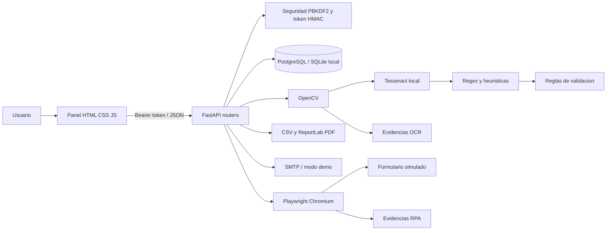
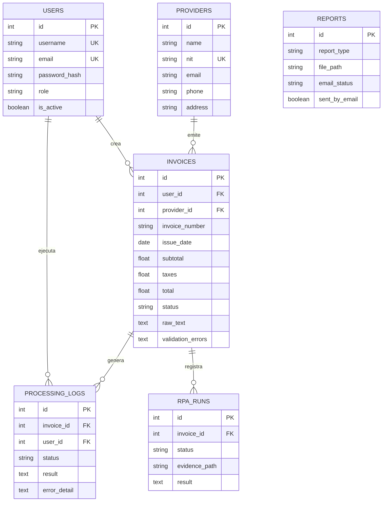

# Manual Tecnico - SmartInvoice

## Resumen

SmartInvoice automatiza la recepcion de facturas: carga documentos, mejora imagenes, ejecuta OCR local, extrae siete campos, valida, persiste, genera reportes, envia correo y registra los datos en un formulario mediante RPA.

## Patron de arquitectura

Se usa una **arquitectura por capas**:

- Presentacion: HTML/CSS/JavaScript.
- API/controladores: routers FastAPI por dominio.
- Servicios: OCR, CV, parser, validacion, reportes, correo y RPA.
- Persistencia: modelos SQLAlchemy y sesiones.
- Infraestructura: PostgreSQL/SQLite, Tesseract, Playwright, Nginx y Docker.

La separacion permite probar parser/validacion sin navegador y cambiar PostgreSQL/SQLite mediante `DATABASE_URL`.

## Diagrama de arquitectura



## Modelo de datos



Las tablas se crean automaticamente. `init_db.py` incluye migraciones compatibles para bases creadas con versiones anteriores.

## Tecnologias

- Python 3.11 y FastAPI.
- SQLAlchemy, PostgreSQL 16 y SQLite local.
- OpenCV, Pillow y PyMuPDF.
- Tesseract/pytesseract, idiomas `spa+eng`.
- Playwright Chromium.
- ReportLab y CSV estandar.
- Nginx, Docker y Docker Compose.
- Pytest y TestClient.

## Flujo OCR y Computer Vision

1. Se valida extension PDF/JPG/JPEG/PNG.
2. El archivo se guarda con nombre sanitizado y UUID.
3. PyMuPDF renderiza hasta tres paginas PDF a 2x.
4. OpenCV aplica escala de grises, Gaussian blur, Otsu, filtro mediano y deskew.
5. Se guarda cada imagen preprocesada en `evidencias/ocr/`.
6. Tesseract usa `--oem 3 --psm 6` con `spa+eng`.
7. Se guarda el OCR bruto en texto.
8. El parser extrae numero, fecha, proveedor, NIT, subtotal, IVA y total.
9. Validacion comprueba obligatorios, fecha, NIT, montos, suma y duplicados.

El parser toma el total rotulado final, evitando confundirlo con la columna `Total` del detalle.

## Estados y errores

- `Pendiente`: archivo guardado, procesamiento iniciado.
- `Procesado`: OCR util y validacion correcta.
- `Rechazado`: OCR util, pero reglas incumplidas o rechazo manual.
- `Error`: fallo tecnico u OCR sin contenido util.

Errores HTTP usados: 400 formato invalido, 401 token, 404 recurso, 409 duplicado, 422 DTO invalido y 500 servicio interno. Los errores de carga/OCR/RPA/correo quedan en `processing_logs`.

## API REST

| Metodo | Ruta | Funcion |
|---|---|---|
| GET | `/api/health` | DB, Tesseract y URL publica |
| POST | `/api/auth/register` | Registrar usuario |
| POST | `/api/auth/login` | Obtener token |
| GET | `/api/me` | Usuario autenticado |
| GET/POST | `/api/providers` | Listar/crear |
| GET/PUT/DELETE | `/api/providers/{id}` | Detalle/editar/eliminar |
| POST | `/api/invoices/upload` | Cargar y procesar |
| GET | `/api/invoices` | Lista con `status` y `search` |
| GET | `/api/invoices/{id}` | Detalle y OCR |
| GET | `/api/invoices/{id}/file` | Original |
| POST | `/api/invoices/{id}/process` | Procesar |
| POST | `/api/invoices/{id}/validate` | Validar |
| POST | `/api/invoices/{id}/reject` | Rechazar |
| POST | `/api/invoices/{id}/reprocess` | Reprocesar |
| GET | `/api/logs` | Bitacora filtrable |
| GET | `/api/logs/{id}` | Detalle de log |
| GET | `/api/reports` | Historial de reportes |
| GET | `/api/reports/csv` | Descargar CSV |
| GET | `/api/reports/pdf` | Descargar PDF |
| POST | `/api/reports/email` | SMTP/demo |
| POST | `/api/rpa/invoices/{id}/register` | Ejecutar RPA |
| GET | `/api/rpa/runs` | Historial RPA |
| GET | `/api/rpa/runs/{id}/evidence` | Evidencia |
| GET | `/api/dashboard/metrics` | Metricas |

## RPA

Playwright abre `rpa_form.html`, llena numero, proveedor, NIT, total y estado, envia y espera `#rpa_result.ready`. En exito guarda PNG y JSON; en error guarda TXT. Todo se persiste en `rpa_runs` y bitacora.

## Reportes y correo

CSV y PDF se guardan en `reports/` y se registran en `reports`. SMTP usa TLS y credenciales de entorno. Sin credenciales se crea `*.email_demo.txt`, permitiendo demostrar el flujo sin fingir un envio real.

## Variables de entorno

| Variable | Uso |
|---|---|
| `DATABASE_URL` | Conexion SQL |
| `JWT_SECRET` | Firma de token |
| `ACCESS_TOKEN_MINUTES` | Vigencia |
| `UPLOAD_DIR` | Archivos originales |
| `REPORT_DIR` | Reportes |
| `EVIDENCE_DIR` | OCR/RPA |
| `RPA_FORM_URL` | Formulario objetivo |
| `SMTP_*` | Correo |
| `PUBLIC_URL` | URL publicada |
| `FRONTEND_DIR` | Frontend unificado en nube |

## Docker Compose

```powershell
cd practica3
Copy-Item .env.example .env
docker compose up --build -d
docker compose ps
```

Puertos: backend `8300`, frontend `8301`, PostgreSQL solo en red interna. Los directorios uploads/reports/evidencias se montan como volumen.

## Despliegue

`Dockerfile.cloud` empaqueta backend y frontend en un dominio. `render.yaml` conecta PostgreSQL y health check. Instrucciones en `DESPLIEGUE_NUBE.md`. La URL real requiere crear el servicio desde la cuenta del estudiante.

## Pruebas

```powershell
cd practica3/backend
python -m pytest tests -q
```

Cobertura funcional: health/auth, CRUD, archivo invalido, parser de factura real, total final, validacion aritmetica, rechazo, logs, CSV y correo demo. La prueba final Docker debe incluir PDF, PNG y RPA con Chromium.

## Requerimientos no funcionales

- Seguridad: hash PBKDF2, token firmado y secretos por entorno.
- Trazabilidad: logs y estados persistentes.
- Mantenibilidad: routers/servicios/modelos separados.
- Portabilidad: Docker Compose e imagen cloud.
- Usabilidad: panel responsive, filtros y detalle.
- Recuperacion: reproceso sin eliminar la factura original.

## Guia rapida para defensa

Ver `GUIA_DEFENSA.md`. Punto central: Python coordina, OpenCV/Tesseract extraen localmente, las reglas validan, PostgreSQL persiste y Playwright automatiza un formulario real dejando evidencia.

## Mejoras futuras

Cola de tareas, edicion humana de campos, Excel, almacenamiento de objetos, rotacion de tokens y observabilidad centralizada.
