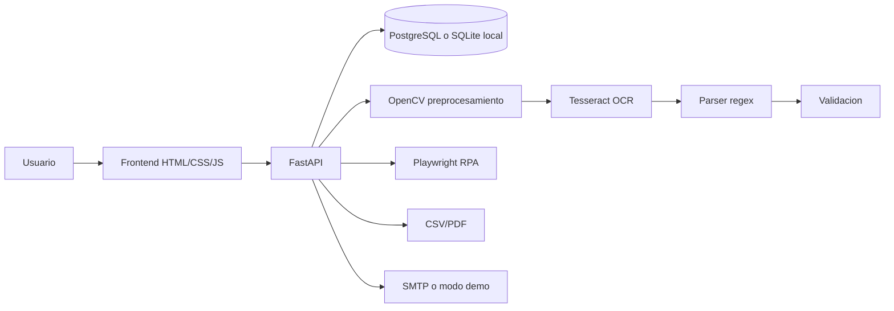

# Manual Tecnico - SmartInvoice

## Resumen

SmartInvoice es una plataforma full-stack para cargar facturas digitales, preprocesarlas con OpenCV, extraer texto con OCR local, obtener campos relevantes, validar datos, persistir resultados, generar reportes, registrar bitacora, enviar reportes por correo y ejecutar RPA sobre un formulario simulado.

## Arquitectura



## Tecnologias

- Python 3.11, FastAPI, SQLAlchemy.
- PostgreSQL en Docker Compose; SQLite como modo local.
- OpenCV, PyMuPDF, Pillow y Tesseract/pytesseract para OCR local.
- ReportLab para PDF y `csv` de Python para CSV.
- Playwright para RPA.
- HTML, CSS y JavaScript puro para frontend.
- Docker y Docker Compose.

## Modelo de datos

- `users`: usuarios y hashes PBKDF2.
- `providers`: proveedores con NIT, contacto y categoria.
- `invoices`: campos extraidos, estado, archivo, OCR bruto y errores.
- `processing_logs`: bitacora con usuario, documento, estado y resultado.
- `reports`: reportes generados y estado de correo.
- `rpa_runs`: ejecuciones RPA por factura.

## Flujo OCR + Computer Vision

1. El usuario sube PDF/JPG/JPEG/PNG.
2. El archivo se guarda en `uploads/`.
3. Si es PDF, PyMuPDF extrae texto embebido y renderiza paginas.
4. OpenCV convierte a escala de grises, binariza con Otsu y limpia ruido.
5. Tesseract procesa la imagen localmente.
6. `invoice_parser.py` extrae numero, fecha, proveedor, NIT, subtotal, impuestos y total.
7. `validation_service.py` valida campos, fecha, total, NIT y duplicados.
8. La factura se guarda como `Procesado` o `Rechazado`; errores tecnicos quedan como `Error`.

## Flujo RPA

`rpa_service.py` abre `frontend/rpa_form.html` con Playwright, llena numero, proveedor, NIT, total y estado, pulsa registrar y guarda el resultado en `rpa_runs`. Si no hay navegador local, devuelve modo demo documentado; en Docker se instala Chromium de Playwright.

## Reportes y correo

- CSV: `GET /api/reports/csv`.
- PDF: `GET /api/reports/pdf`.
- Correo: `POST /api/reports/email`.

Si `SMTP_HOST`, `SMTP_USER` o `SMTP_PASSWORD` estan vacios, se crea una evidencia `.email_demo.txt` junto al reporte.

## Variables de entorno

Ver `.env.example`:

- `DATABASE_URL`
- `JWT_SECRET`
- `CORS_ORIGINS`
- `UPLOAD_DIR`
- `REPORT_DIR`
- `SMTP_HOST`, `SMTP_PORT`, `SMTP_USER`, `SMTP_PASSWORD`, `SMTP_FROM`, `SMTP_TLS`
- `RPA_FORM_URL`

## API REST

| Metodo | Ruta | Uso |
|---|---|---|
| POST | `/api/auth/register` | Crear usuario |
| POST | `/api/auth/login` | Obtener token |
| GET | `/api/me` | Usuario actual |
| GET/POST | `/api/providers` | Listar/crear proveedores |
| PUT/DELETE | `/api/providers/{id}` | Editar/eliminar proveedor |
| POST | `/api/invoices/upload` | Cargar y procesar factura |
| GET | `/api/invoices` | Listar facturas |
| GET | `/api/invoices/{id}` | Detalle con OCR bruto |
| POST | `/api/invoices/{id}/validate` | Revalidar factura |
| POST | `/api/invoices/{id}/rpa-register` | Ejecutar RPA |
| GET | `/api/logs` | Bitacora |
| GET | `/api/reports/csv` | Reporte CSV |
| GET | `/api/reports/pdf` | Reporte PDF |
| POST | `/api/reports/email` | Enviar reporte |
| GET | `/api/dashboard/metrics` | Metricas |

## Docker

```bash
cd practica3
cp .env.example .env
docker compose up --build
```

Servicios: PostgreSQL, backend FastAPI y frontend Nginx.

## Despliegue en nube

Opcion Render:

1. Crear PostgreSQL administrado.
2. Crear Web Service para `practica3/backend` con `uvicorn app.main:app --host 0.0.0.0 --port $PORT`.
3. Configurar `DATABASE_URL`, `JWT_SECRET`, `SMTP_*`.
4. Crear Static Site para `practica3/frontend`.
5. Configurar proxy o `window.API_BASE_URL` si se sirve en dominios separados.

## Requerimientos funcionales

Autenticacion, CRUD de proveedores, carga de facturas, OCR/CV local, extraccion de campos, validacion, bitacora, reportes CSV/PDF, correo SMTP/demo, RPA y dashboard.

## Requerimientos no funcionales

Persistencia real, separacion frontend/backend, contenedores reproducibles, variables de entorno para secretos, trazabilidad por bitacora, manejo de errores y documentacion.

## Mejoras futuras

Cola de procesamiento, OCR por lotes, revision humana de campos, exportacion Excel, despliegue CI/CD y entrenamiento de plantillas por proveedor.
