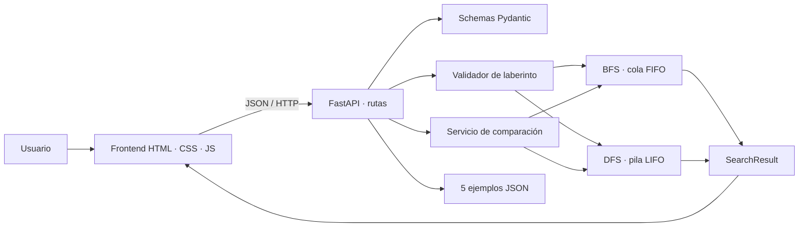

# Manual técnico — RoboMaze

> **Navegación:** [README principal](README.md) ·
> [Manual de usuario](MANUAL_USUARIO.md) ·
> [Guía de defensa](docs/GUIA_DEFENSA.md)

## 1. Introducción y objetivo

RoboMaze representa una cuadrícula como un grafo implícito: cada celda transitable
es un estado y cada movimiento ortogonal es una arista de costo uno. El objetivo
es encontrar una secuencia desde `start` hasta `goal` mediante BFS o DFS, ejecutar
la lógica en Python y presentar métricas comparables en una interfaz web.

## 2. Arquitectura

Se utiliza **arquitectura por capas**:

1. `api`: traduce HTTP a llamadas del dominio y códigos de estado.
2. `models`: define contratos Pydantic de entrada y salida.
3. `services`: valida, busca, reconstruye rutas y compara resultados.
4. `core`: centraliza versión, rutas de archivos y límites.
5. `frontend`: consume la API y solo edita/visualiza; no resuelve rutas.

La separación permite probar los algoritmos sin servidor, cambiar la interfaz sin
alterar el dominio y mantener las reglas de validación en un único lugar.



El diagrama también está disponible en `docs/diagramas/arquitectura.mmd`.

## 3. Estructura relevante

| Ruta | Responsabilidad |
|---|---|
| `backend/app/main.py` | Aplicación, CORS, health y errores Pydantic |
| `backend/app/api/maze_routes.py` | Seis rutas REST |
| `backend/app/models/schemas.py` | Contratos y tipos |
| `backend/app/services/maze_validator.py` | Reglas y vecinos válidos |
| `backend/app/services/bfs_service.py` | BFS manual |
| `backend/app/services/dfs_service.py` | DFS iterativo manual |
| `backend/app/services/comparison_service.py` | Métricas y conclusión |
| `backend/app/services/example_service.py` | Lectura de JSON, sin BD |
| `frontend/js/maze.js` | Edición y representación visual |
| `frontend/js/api.js` | Cliente HTTP |
| `frontend/js/app.js` | Coordinación de interfaz |

## 4. Modelo del espacio de estados

- Estado: tupla `(fila, columna)`.
- Estado inicial: `start`.
- Prueba de meta: igualdad con `goal`.
- Acciones: arriba, derecha, abajo e izquierda.
- Restricciones: límites y conjunto de obstáculos.
- Costo: una unidad por movimiento.
- Ciclos: se evitan con el conjunto `discovered`.

Las coordenadas son de base cero. `path_length` cuenta aristas o pasos, por eso es
`len(path) - 1`; si inicio y meta coinciden, la longitud es cero.

### 4.1 Glosario de métricas

| Campo | Significado técnico |
|---|---|
| `path_found` | Indica si la meta fue alcanzada |
| `path` | Secuencia ordenada desde inicio hasta meta, incluidos ambos extremos |
| `visited_nodes` | Orden real en que los estados salieron de la cola o pila |
| `nodes_explored` | Cantidad de elementos en `visited_nodes` |
| `path_length` | Número de movimientos; equivale a `len(path) - 1` |
| `execution_time_ms` | Tiempo exclusivo del algoritmo medido con `perf_counter()` |

La animación consume `visited_nodes`, mientras que la línea verde consume `path`.
Así, el frontend representa exactamente lo calculado en Python sin repetir la
lógica de búsqueda.

## 5. Breadth-First Search (BFS)

BFS usa `collections.deque` como cola FIFO. Descubre primero todos los estados a
distancia `d` antes de los de distancia `d + 1`. Al descubrir un vecino se guarda
su padre y se marca inmediatamente para impedir inserciones duplicadas. Al sacar
la meta de la cola se reconstruye el camino siguiendo padres hasta el inicio.

```text
cola <- [inicio]
descubiertos <- {inicio}
mientras cola no esté vacía:
    actual <- sacar por la izquierda
    si actual es meta: reconstruir y terminar
    para cada vecino válido:
        si no fue descubierto:
            padre[vecino] <- actual
            agregar vecino a la derecha
```

En una cuadrícula sin pesos, BFS es completo y garantiza una ruta con el mínimo
número de pasos. Complejidad temporal y espacial: `O(V + E)`; aquí `V <= rows × cols`
y cada celda tiene como máximo cuatro aristas.

## 6. Depth-First Search (DFS)

DFS usa una lista Python como pila LIFO, evitando el límite de recursión. Los
vecinos se insertan en orden inverso para que la exploración observable sea arriba,
derecha, abajo e izquierda. También guarda padres y estados descubiertos.

DFS es completo en este grafo finito porque evita ciclos, pero no garantiza el
camino mínimo. Su complejidad límite también es `O(V + E)` y espacio `O(V)`.

## 7. Comparación BFS vs DFS

| Propiedad | BFS | DFS |
|---|---|---|
| Frontera | Cola FIFO | Pila LIFO |
| Estrategia | Por niveles | En profundidad |
| Ruta mínima sin pesos | Sí | No |
| Memoria típica | Mayor en grafos anchos | Menor en ramas estrechas |
| Sensible al orden de vecinos | En ruta elegida | Mucho, también en longitud/esfuerzo |

El servicio ejecuta ambos sobre la misma entrada y calcula diferencias como
`BFS - DFS`. La duración usa `time.perf_counter()` y se expresa en milisegundos.
Los tiempos muy pequeños varían entre equipos; longitud y nodos son deterministas.

Resultados funcionales de los ejemplos con el orden configurado:

| Caso | BFS longitud/nodos | DFS longitud/nodos | Propósito |
|---|---:|---:|---|
| 1 | 10 / 32 | 10 / 11 | Ruta simple |
| 2 | 22 / 67 | 26 / 27 | Alternativas |
| 3 | 22 / 67 | 62 / 63 | Ruta larga/no óptima de DFS |
| 4 | 7 / 36 | 31 / 42 | Trampa explícita para DFS |
| 5 | sin ruta / 44 | sin ruta / 44 | Manejo de no solución |

## 8. Modelos JSON

### Entrada `MazeRequest`

```json
{
  "rows": 10,
  "cols": 10,
  "start": {"row": 0, "col": 0},
  "goal": {"row": 9, "col": 9},
  "obstacles": [{"row": 1, "col": 1}]
}
```

No se aceptan propiedades desconocidas (`extra="forbid"`).

### Salida `SearchResult`

```json
{
  "algorithm": "BFS",
  "path_found": true,
  "path": [{"row": 0, "col": 0}],
  "visited_nodes": [{"row": 0, "col": 0}],
  "nodes_explored": 1,
  "path_length": 0,
  "execution_time_ms": 0.012,
  "message": "Ruta encontrada correctamente."
}
```

`ComparisonResult` contiene `bfs`, `dfs`, `differences` y `conclusion`.

## 9. API REST

| Método y ruta | Respuesta | Errores esperados |
|---|---|---|
| `GET /api/health` | Estado y versión | — |
| `POST /api/maze/solve/bfs` | `SearchResult` | 422 |
| `POST /api/maze/solve/dfs` | `SearchResult` | 422 |
| `POST /api/maze/solve/compare` | `ComparisonResult` | 422 |
| `GET /api/maze/examples` | Lista de cinco | — |
| `GET /api/maze/examples/{id}` | `MazeExample` | 404 |

FastAPI publica OpenAPI/Swagger en `/docs` y ReDoc en `/redoc`.

## 10. Validaciones y errores

- Filas y columnas mayores que cero y máximo `50 × 50` en la API.
- Inicio, meta y cada obstáculo dentro de los límites.
- Inicio y meta no pueden ser obstáculos.
- No se aceptan obstáculos duplicados.
- Tipos, campos faltantes, propiedades extra y JSON malformado producen 422.
- Un ejemplo inexistente produce 404.
- No encontrar ruta es un resultado válido HTTP 200 con `path_found=false`, no una
  excepción; se conservan los nodos explorados para análisis.
- El cliente muestra errores de la API y de red mediante estado, mensaje y toast.

## 11. Requerimientos funcionales

| ID | Requerimiento | Implementación |
|---|---|---|
| RF-01 | Crear cuadrícula | Entradas de filas/columnas |
| RF-02 | Definir inicio/meta | Herramientas y clic |
| RF-03 | Agregar/quitar obstáculos | Clic y arrastre |
| RF-04 | Ejecutar BFS | API + botón BFS |
| RF-05 | Ejecutar DFS | API + botón DFS |
| RF-06 | Mostrar explorados/ruta | Animación por clases CSS |
| RF-07 | Mostrar métricas | Cinco tarjetas |
| RF-08 | Comparar algoritmos | Tabla y conclusión |
| RF-09 | Cargar cinco casos | Archivos JSON + endpoints |
| RF-10 | Manejar ausencia de ruta | Respuesta segura y estado visual |
| RF-11 | Limpiar/reiniciar | Controles independientes |

## 12. Requerimientos no funcionales

- **Rendimiento:** hasta 2,500 celdas en API; operaciones lineales.
- **Usabilidad:** leyenda, estados de color, mensajes y controles agrupados.
- **Accesibilidad:** etiquetas, roles de cuadrícula, foco y texto además de color.
- **Mantenibilidad:** capas, funciones pequeñas, type hints y tests.
- **Portabilidad:** Python 3.11+, navegador moderno o Docker.
- **Seguridad:** no hay credenciales, persistencia ni ejecución de código recibido;
  Pydantic rechaza contratos inesperados.
- **Disponibilidad:** health check y errores de red recuperables.
- **Escalabilidad:** servicios sin estado; pueden replicarse si fuera necesario.

## 13. Pruebas

La suite contiene 22 casos para BFS mínimo, camino DFS válido, inicio igual a meta,
sin solución, ocho reglas de dominio, optimalidad de BFS en los cinco JSON,
comparación, health, endpoints, ejemplos, 404, JSON inválido y campos faltantes.

```powershell
cd practica4\backend
python -m pytest tests -q
```

## 14. Mejoras futuras

Generación automática reproducible, A*, pesos de terreno, pausa/velocidad de
animación, exportación CSV/PDF, múltiples metas y pruebas E2E en CI. Ninguna se
incluye en el núcleo para mantener visibles BFS/DFS y respetar el alcance.
