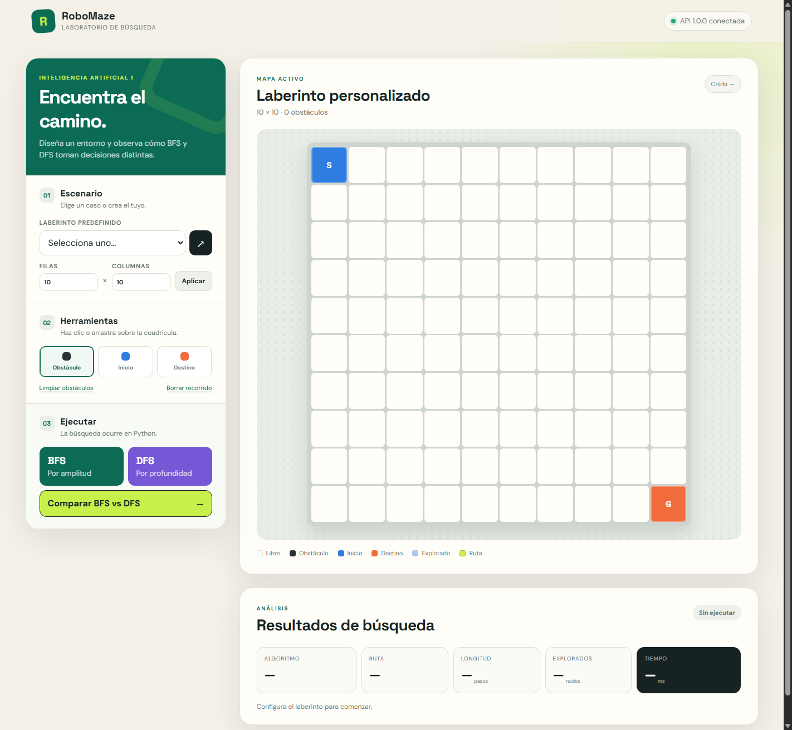
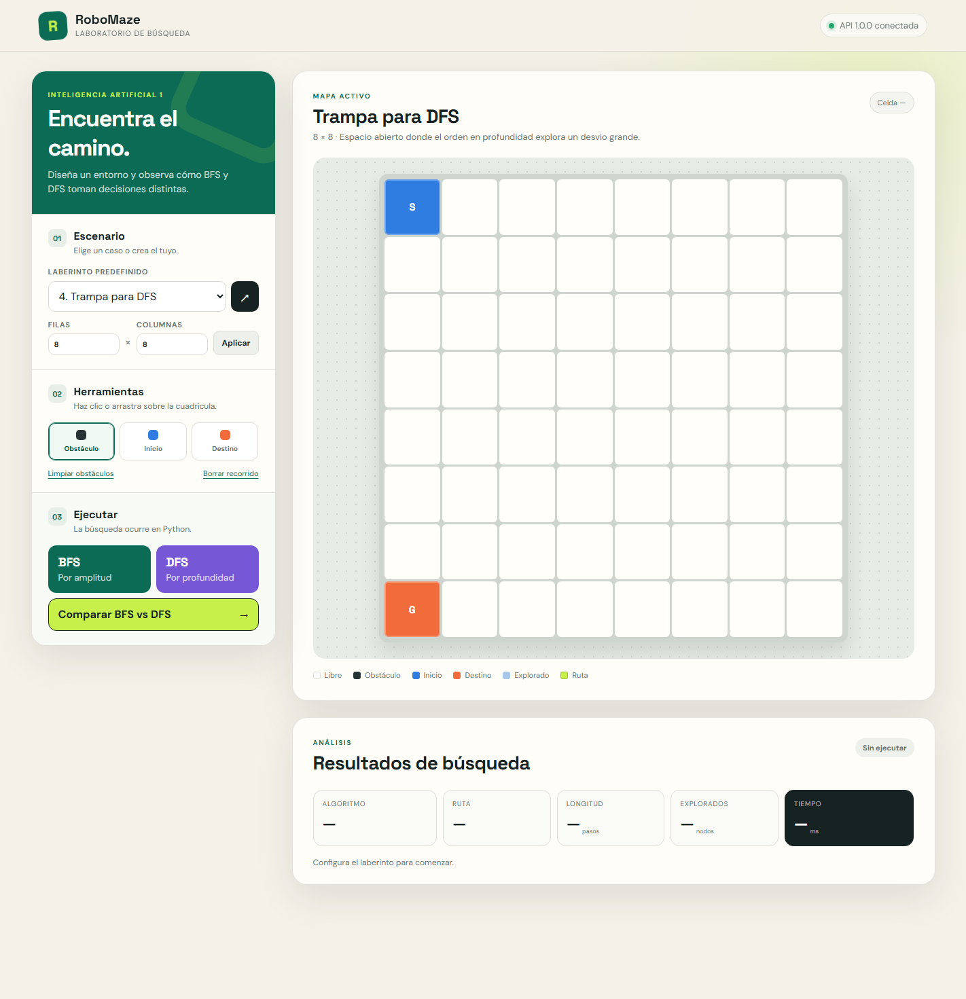
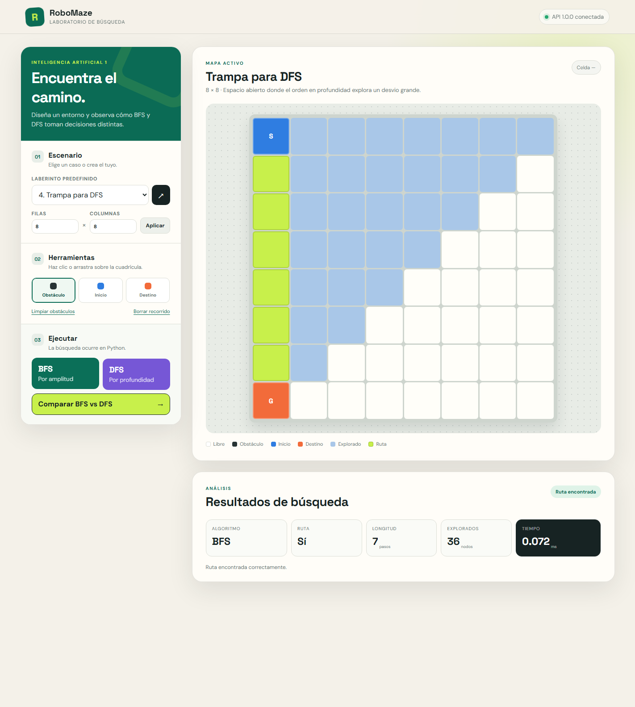
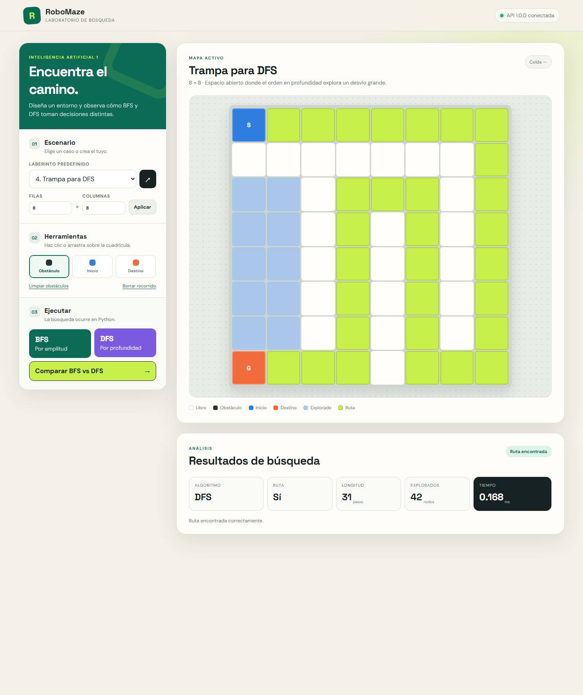
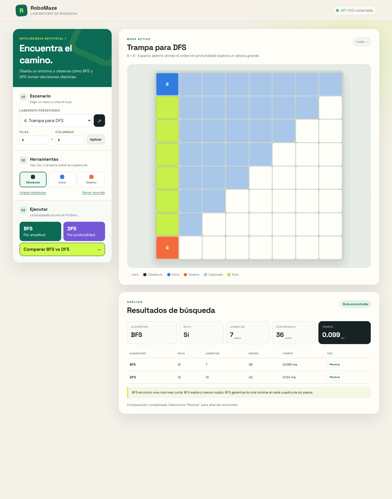
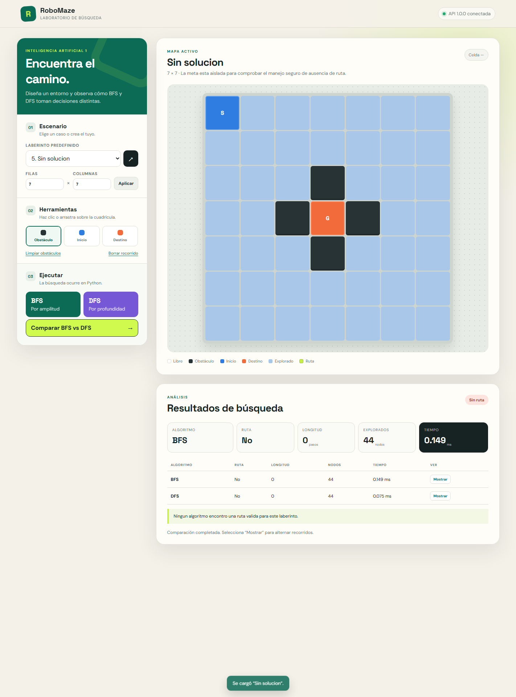

# Manual de usuario — RoboMaze

## 1. Requisitos

- Python 3.11 o superior.
- Navegador actualizado.
- Terminal PowerShell, Bash o Docker Desktop.
- No se necesita base de datos ni cuenta externa.

## 2. Iniciar el sistema

### Opción A: Python

En la primera terminal:

```powershell
cd practica4\backend
python -m venv venv
.\venv\Scripts\Activate.ps1
pip install -r requirements.txt
uvicorn app.main:app --reload --host 0.0.0.0 --port 8400
```

En la segunda:

```powershell
cd practica4\frontend
python -m http.server 5500
```

Visite http://localhost:5500. El indicador superior debe decir **API 1.0.0
conectada**. Si abre `index.html` directamente, mantenga el backend encendido.

### Opción B: Docker

```powershell
cd practica4
docker compose up --build -d
```

Visite http://localhost:8401.

## 3. Conocer la interfaz

La columna izquierda contiene escenario, tamaño, herramientas y ejecución. La
zona principal contiene la cuadrícula, leyenda, métricas y tabla comparativa.

| Color/símbolo | Significado |
|---|---|
| Blanco | Celda libre |
| Gris oscuro | Obstáculo |
| Azul `S` | Punto inicial |
| Naranja `G` | Destino |
| Azul claro | Nodo explorado |
| Verde lima | Ruta final |

La longitud cuenta movimientos, no celdas. “Explorados” indica los estados que el
algoritmo sacó de su cola o pila. El tiempo mide solo la búsqueda en el backend.

## 4. Crear un laberinto

1. Escriba filas y columnas entre 2 y 30.
2. Pulse **Aplicar**; inicio y meta se ubican en esquinas opuestas.
3. Elija **Inicio** y pulse una celda para mover `S`.
4. Elija **Destino** y pulse una celda para mover `G`.
5. Elija **Obstáculo**. Pulse para alternar una pared o arrastre para dibujar.
6. **Limpiar obstáculos** conserva inicio/meta; **Borrar recorrido** conserva el
   diseño y quita únicamente la visualización anterior.

Inicio y destino también pueden coincidir: el resultado correcto tiene cero pasos.

## 5. Cargar casos predefinidos

Seleccione uno y pulse el botón `↗`:

1. **Ruta directa:** introducción simple.
2. **Barreras moderadas:** varios corredores.
3. **Ruta larga:** evidencia una ruta DFS no óptima.
4. **Trampa para DFS:** BFS usa 7 pasos y DFS 31 con el orden actual.
5. **Sin solución:** meta aislada y mensaje controlado.

## 6. Ejecutar BFS

Pulse **BFS / Por amplitud**. Las celdas visitadas aparecen en azul claro y al
final el camino mínimo aparece en verde. Revise algoritmo, ruta, longitud, nodos y
tiempo. BFS garantiza la menor cantidad de pasos en esta cuadrícula sin pesos.

## 7. Ejecutar DFS

Pulse **DFS / Por profundidad**. DFS se interna por una rama antes de retroceder;
puede hallar un recorrido válido más largo. La interfaz usa el resultado enviado
por Python; JavaScript no calcula el camino.

## 8. Comparar BFS y DFS

1. Pulse **Comparar BFS vs DFS**.
2. Revise las dos filas de la tabla.
3. Lea la conclusión generada por el backend.
4. Pulse **Mostrar** en cualquier fila para alternar el recorrido sobre el mapa.

Las diferencias de tiempo de fracciones de milisegundo no son significativas por
sí solas y pueden cambiar entre ejecuciones. Para este problema, longitud y nodos
explorados son las métricas didácticas principales.

## 9. Mensajes y solución de problemas

| Situación | Acción |
|---|---|
| “API desconectada” | Inicie Uvicorn en el puerto 8400 y recargue |
| No aparecen ejemplos | Compruebe `/api/maze/examples` en el navegador |
| Puerto ocupado | Cierre el proceso previo o use Docker tras liberar 8400 |
| “Dimensiones…” | Use enteros de 2 a 30 en la interfaz |
| “Sin ruta” | Quite paredes o pruebe el caso 5 para demostrar el control |
| Frontend antiguo | Recarga forzada con `Ctrl+F5` |

Los errores no bloquean la interfaz: corrija el diseño y vuelva a ejecutar.

## 10. Evidencias de funcionamiento

Las imágenes están en `docs/evidencias/` y prueban el flujo solicitado.

### Inicio



### Laberinto predefinido



### Resultado BFS



### Resultado DFS



### Comparación



### Caso sin ruta



## 11. Cerrar

- Python: `Ctrl+C` en cada terminal.
- Docker: `docker compose down` desde `practica4/`.
