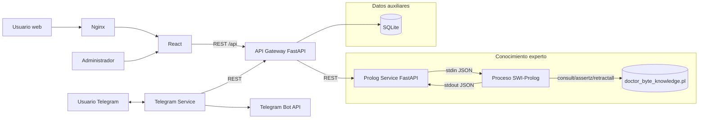
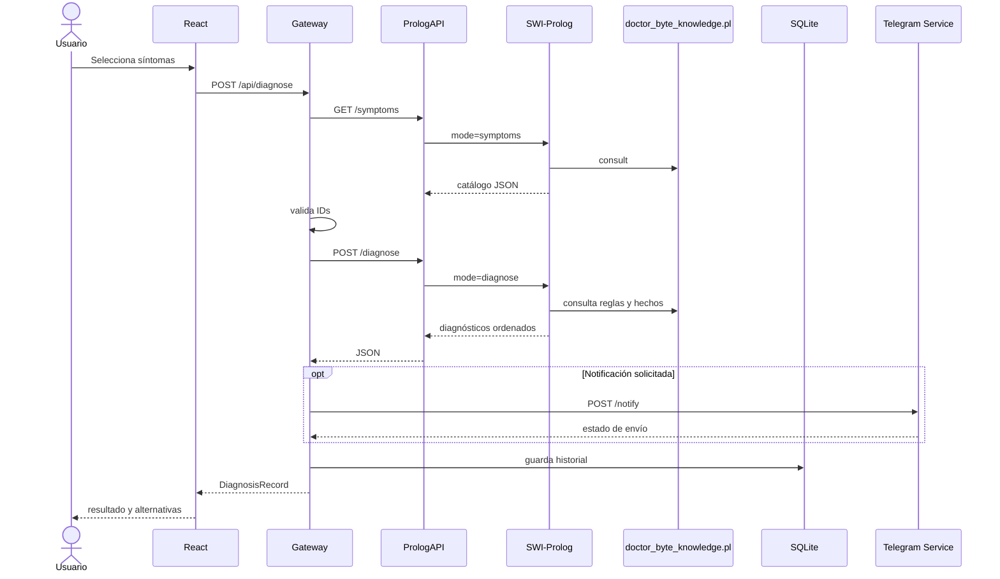
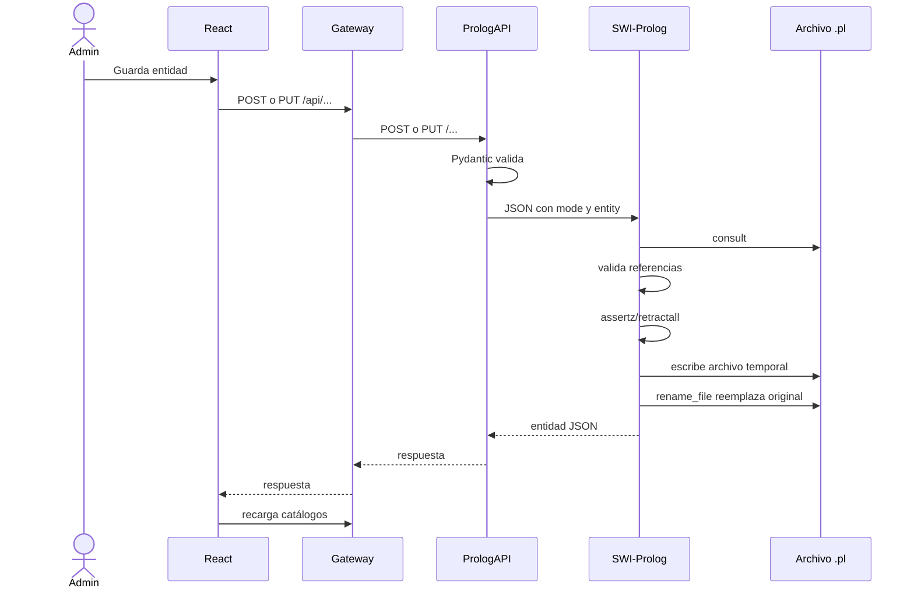
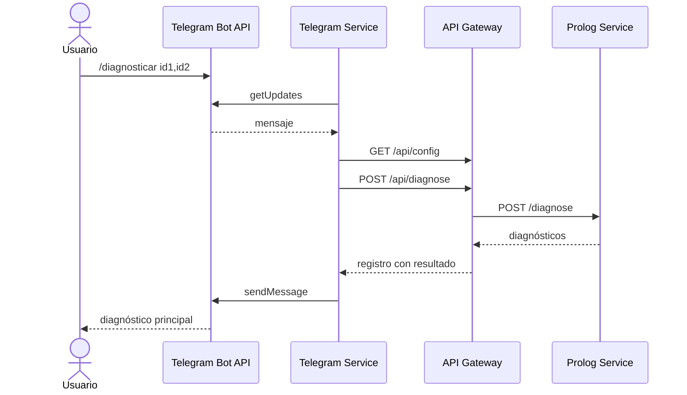

# Manual Técnico - Doctor Byte

## 1. Identificación del proyecto

| Campo | Valor |
|---|---|
| Proyecto | Doctor Byte - Sistema experto para diagnóstico de computadoras |
| Curso | Inteligencia Artificial 1 |
| Fase | Proyecto Fase 1 |
| Autor | Pablo Daniel Fernández Chacón |
| Carnet | 201807411 |
| Paradigma principal | Programación lógica con SWI-Prolog |
| Integración | Python, FastAPI y procesos SWI-Prolog |
| Interfaz | React y Vite |
| Canal adicional | Bot de Telegram |
| Despliegue | Docker Compose |

## 2. Objetivo técnico

Doctor Byte implementa un sistema experto editable que recibe síntomas de una computadora y produce diagnósticos ordenados mediante reglas lógicas y puntuación ponderada.

La decisión técnica principal es que los síntomas, fallas, recomendaciones, pasos, reglas y cálculo diagnóstico viven en Prolog. Python no reemplaza el motor experto: valida solicitudes, ejecuta SWI-Prolog, expone HTTP, conserva historial y coordina Telegram.

Los objetivos técnicos son:

- Mantener a SWI-Prolog como fuente de conocimiento y motor de inferencia.
- Permitir CRUD real sobre la base de conocimiento.
- Persistir modificaciones directamente en un archivo `.pl`.
- Exponer el motor mediante servicios HTTP desacoplados.
- Ofrecer interfaz web para consulta y administración.
- Conservar historial y configuración sin contaminar la inferencia.
- Recibir y responder comandos de Telegram mediante el mismo backend.
- Ejecutar todo el sistema de forma reproducible con Docker Compose.

## 3. Alcance funcional

### 3.1 Diagnóstico

- Selección de uno o más síntomas.
- Validación de IDs existentes.
- Evaluación de todas las reglas activas.
- Peso doble para síntomas requeridos.
- Peso simple para síntomas de apoyo.
- Cálculo de puntuación, porcentaje del problema y efectividad estimada.
- Ordenamiento por puntuación y severidad.
- Presentación de alternativas, recomendaciones y pasos.

### 3.2 Administración

- Crear, listar, editar y eliminar síntomas.
- Crear, listar, editar y eliminar fallas.
- Crear, listar, editar y eliminar recomendaciones.
- Crear, listar, editar y eliminar reglas diagnósticas.
- Mantener asociaciones cuando cambia un ID.
- Eliminar referencias dependientes cuando se elimina una entidad.

### 3.3 Funciones auxiliares

- Historial de diagnósticos en SQLite.
- Configuración persistente del bot.
- Notificación opcional desde la web.
- Recepción de comandos de Telegram por polling.
- Scripts de preparación, inicio, parada y prueba.

## 4. Cumplimiento técnico

| Requisito | Implementación |
|---|---|
| Hechos en Prolog | `symptom/4`, `failure/5`, `recommendation/4`, `solution_step/3` y `diagnosis_rule/6`. |
| Reglas en Prolog | Conversión a diccionarios, puntuación, faltantes, ordenamiento, CRUD y persistencia. |
| Variables | Todos los predicados utilizan variables para consultar y construir resultados. |
| Listas | Síntomas requeridos, apoyo, coincidencias, faltantes, recomendaciones y pasos. |
| Recursividad | `puntuar_sintomas/6`, `faltantes/3`, `unir_unicos/3`, `assert_steps/3` y reemplazo de referencias. |
| Cortes | Severidad, booleanos, peso por defecto, reemplazo y finalización del diagnóstico. |
| Integración Python-Prolog | `subprocess.run` ejecuta `swipl` y transmite JSON por entrada y salida estándar. |
| CRUD dinámico | `assertz/1`, `retractall/1`, `retract/1` y reescritura del archivo de conocimiento. |
| Frontend | React consume el API, diagnostica, administra y consulta historial. |
| Telegram | Servicio propio con `getUpdates`, `sendMessage` y comunicación con el gateway. |
| Persistencia auxiliar | SQLite solo guarda historial y configuración. |
| Contenedores | Cuatro servicios, red privada, healthchecks y volúmenes. |

Estado actual de la base editable al redactar este manual:

| Hecho | Cantidad |
|---|---:|
| `symptom/4` | 26 |
| `failure/5` | 14 |
| `recommendation/4` | 26 |
| `solution_step/3` | 27 |
| `diagnosis_rule/6` | 14 |

Estas cantidades pueden cambiar mediante la interfaz administrativa.

## 5. Arquitectura utilizada

### 5.1 Tipo de arquitectura

El proyecto usa una **arquitectura distribuida por funcionalidades**, implementada como servicios pequeños con responsabilidades separadas. Cada servicio representa una capacidad completa del sistema:

| Funcionalidad | Componente propietario |
|---|---|
| Presentación, interacción y administración | Frontend React |
| Orquestación de casos de uso | API Gateway FastAPI |
| Conocimiento e inferencia | Prolog Service + SWI-Prolog |
| Mensajería externa | Telegram Service |
| Historial y configuración | API Gateway + SQLite |
| Ejecución y conectividad | Docker Compose + Nginx |

No es una colección de capas genéricas dentro de un único proceso. Es una separación por capacidades desplegables, conectadas mediante REST y JSON.

### 5.2 Diagrama de componentes



### 5.3 Por qué se utilizó

1. **Prolog debe conservar autoridad sobre la inferencia.** Separar el servicio evita implementar accidentalmente la lógica experta en Python o JavaScript.
2. **Las funcionalidades cambian a ritmos distintos.** La interfaz, el bot y el motor experto pueden modificarse sin reescribir todo el sistema.
3. **Telegram es una integración externa.** Su polling, token y errores no deben bloquear la lógica central.
4. **SQLite es auxiliar.** Mantenerlo en el gateway deja claro que no forma parte del razonamiento experto.
5. **La comunicación es demostrable.** Cada servicio expone Swagger y healthchecks, útil para pruebas y defensa.
6. **Docker hace reproducible el entorno.** SWI-Prolog queda instalado dentro de la imagen correspondiente.
7. **La persistencia queda delimitada.** El conocimiento usa `.pl`; historial y configuración usan SQL.

### 5.4 Ventajas y costos

| Ventaja | Explicación |
|---|---|
| Separación de responsabilidades | Cada componente tiene una razón principal para cambiar. |
| Pruebas aisladas | El formato de Telegram y el motor Prolog pueden probarse por separado. |
| Reemplazo controlado | Es posible cambiar React o Telegram sin alterar las reglas Prolog. |
| Fallos localizados | Un error del bot no modifica la base de conocimiento. |
| Claridad académica | Se evidencia que la inteligencia está en Prolog. |

| Costo | Explicación |
|---|---|
| Más procesos | Se administran cuatro servicios y una red. |
| Más saltos HTTP | Una solicitud web atraviesa frontend, gateway y servicio Prolog. |
| Configuración | URLs, puertos y variables deben coincidir. |
| Observabilidad | Para depurar se revisan logs de más de un componente. |

## 6. Flujo de extremo a extremo

### 6.1 Diagnóstico desde la web



### 6.2 Mutación de conocimiento



### 6.3 Diagnóstico desde Telegram



## 7. Tecnologías utilizadas

| Tecnología | Función | Motivo |
|---|---|---|
| SWI-Prolog | Hechos, reglas, inferencia y CRUD lógico | Lenguaje requerido y adecuado para conocimiento declarativo. |
| Python 3.12 | Servicios de integración | Buen soporte para FastAPI, HTTP, procesos y SQLAlchemy. |
| FastAPI | API Gateway, Prolog Service y Telegram Service | Validación, asincronía, Swagger y bajo código ceremonial. |
| Pydantic | Esquemas y variables de entorno | Validación declarativa de payloads. |
| pydantic-settings | Configuración | Carga `.env` y variables del contenedor. |
| HTTPX | Comunicación HTTP asíncrona | Clientes simples para servicios internos y Telegram. |
| SQLAlchemy | Persistencia auxiliar | Modelado de historial y configuración. |
| SQLite | Historial y configuración | Base ligera, suficiente para datos auxiliares locales. |
| React | Interfaz declarativa | Estados, formularios y actualización dinámica. |
| Vite | Desarrollo y compilación | Servidor rápido y bundle de producción. |
| Lucide React | Iconografía | Iconos consistentes sin imágenes externas. |
| Nginx | Servidor del frontend y proxy `/api` | Entrega estática y resolución de rutas SPA. |
| Docker | Empaquetado | Reproduce dependencias y versiones de sistema. |
| Docker Compose | Orquestación | Red, dependencias, healthchecks, puertos y volúmenes. |
| Pytest | Pruebas | Verifica diagnósticos y formateo. |
| PowerShell | Automatización Windows | Setup, ejecución, Telegram y control de puertos. |

## 8. Estructura del proyecto

```text
proyecto_f1/
|-- .env.example
|-- docker-compose.yml
|-- README.md
|-- backend/
|   |-- api_gateway/
|   |   |-- app/
|   |   |   |-- main.py
|   |   |   |-- config.py
|   |   |   |-- database.py
|   |   |   |-- models.py
|   |   |   |-- schemas.py
|   |   |   `-- services/
|   |   |       |-- prolog_client.py
|   |   |       |-- telegram_client.py
|   |   |       `-- formatters.py
|   |   `-- tests/
|   |-- prolog_service/
|   |   |-- app/main.py
|   |   |-- knowledge_base/
|   |   |   |-- doctor_byte.pl
|   |   |   `-- doctor_byte_knowledge.pl
|   |   `-- tests/
|   `-- telegram_service/
|       `-- app/main.py
|-- frontend/
|   |-- index.html
|   |-- nginx.conf
|   |-- package.json
|   `-- src/
|       |-- App.jsx
|       |-- api.js
|       `-- styles.css
|-- scripts/
`-- docs/
```

## 9. Modelo de conocimiento Prolog

### 9.1 `symptom/4`

```prolog
symptom(Id, Name, Category, Weight).
```

| Posición | Significado |
|---|---|
| `Id` | Átomo único usado por reglas y API. |
| `Name` | Nombre visible. |
| `Category` | Categoría para búsqueda y presentación. |
| `Weight` | Importancia numérica entre 1 y 5. |

### 9.2 `failure/5`

```prolog
failure(Id, Name, Category, Severity, Message).
```

Define la falla diagnosticable, su severidad y el mensaje explicativo.

### 9.3 `recommendation/4`

```prolog
recommendation(Id, FailureId, Text, Order).
```

`FailureId` actúa como referencia lógica a `failure/5`. `Order` expresa la posición esperada.

### 9.4 `solution_step/3`

```prolog
solution_step(FailureId, Order, Text).
```

Representa una ruta de solución ordenada para la falla.

### 9.5 `diagnosis_rule/6`

```prolog
diagnosis_rule(Id, FailureId, Required, Support, MinScore, Enabled).
```

| Campo | Significado |
|---|---|
| `Required` | Lista de síntomas principales. |
| `Support` | Lista de síntomas complementarios. |
| `MinScore` | Umbral registrado en el resultado. |
| `Enabled` | Solo las reglas con `true` se evalúan. |

## 10. Algoritmo de inferencia

### 10.1 Peso individual

Para cada síntoma de una regla:

```text
peso_ajustado = peso_base * multiplicador
```

- Multiplicador requerido: `2`.
- Multiplicador de apoyo: `1`.

### 10.2 Puntuación

```text
score = round((puntos_coincidentes * 100) / puntos_posibles)
```

Si la regla no tiene puntos posibles, el score es `0`.

### 10.3 Porcentaje del problema

```text
problem_percentage = round((requeridos_coincidentes * 100) / requeridos_totales)
```

Si no hay requeridos, se reutiliza `score`.

### 10.4 Efectividad estimada

```text
raw_effectiveness = 45 + round(score * 0.5)
effectiveness = clamp(0, 98, raw_effectiveness)
```

Esta cifra es una estimación académica derivada del score, no una probabilidad clínica ni estadística entrenada.

### 10.5 Ordenamiento

```text
valor_orden = score * 10 + severity_weight
```

Pesos de severidad:

| Severidad | Peso |
|---|---:|
| crítica | 4 |
| alta | 3 |
| media | 2 |
| baja | 1 |

La puntuación domina el orden y la severidad desempata. Si persiste el empate, se compara el ID.

### 10.6 Umbral

`passes_threshold` vale `true` cuando `Score >= MinScore`. En la implementación actual las reglas activas aparecen en la lista aunque no superen el umbral; el campo informa el estado, pero no filtra el resultado.

## 11. Explicación granular del servicio Prolog

### 11.1 `backend/prolog_service/app/main.py`

#### Importaciones y constantes

- `json` serializa el payload enviado a SWI-Prolog y analiza la respuesta.
- `re` normaliza IDs de reglas.
- `shutil.which` comprueba que `swipl` esté instalado.
- `subprocess` crea un proceso independiente por operación.
- `unicodedata` elimina tildes al normalizar IDs.
- `Path` calcula rutas independientes del directorio actual.
- `Lock` evita escrituras concurrentes sobre el mismo archivo `.pl`.
- `BASE_DIR` apunta al directorio del servicio.
- `ENGINE_PATH` apunta a `doctor_byte.pl`.
- `KNOWLEDGE_PATH` apunta a `doctor_byte_knowledge.pl`.
- `PROLOG_LOCK` serializa todas las invocaciones locales a Prolog.

#### Modelos Pydantic

| Clase | Validaciones |
|---|---|
| `DiagnoseRequest` | Al menos un síntoma. |
| `SymptomPayload` | ID Prolog, nombre y categoría mínimos, peso 1-5. |
| `FailurePayload` | ID válido, severidad permitida y lista de pasos. |
| `RecommendationPayload` | ID, falla, texto y orden 1-100. |
| `DiagnosisRulePayload` | Listas, score 0-100 y bandera booleana. |

`normalize_id` se ejecuta antes del patrón del ID. Convierte a minúsculas, separa caracteres no alfanuméricos con `_`, elimina tildes y antepone `regla_` si el texto empieza con un número.

#### `run_prolog(payload)`

1. Comprueba `swipl`.
2. Agrega `knowledge_path` al payload.
3. Adquiere `PROLOG_LOCK`.
4. Ejecuta `swipl -q -s doctor_byte.pl -g doctor_byte_cli`.
5. Envía JSON por `stdin` con UTF-8.
6. Captura `stdout` y `stderr`.
7. Limita la ejecución a 15 segundos.
8. Convierte timeout en HTTP 504.
9. Convierte fallo de proceso en HTTP 500.
10. Analiza el JSON de salida.
11. Convierte errores lógicos devueltos por Prolog en HTTP 400.

#### `entity_crud`

Construye el sobre uniforme:

```json
{
  "mode": "create_symptom",
  "entity": {},
  "target_id": "opcional"
}
```

Usa `model_dump()` para convertir Pydantic a diccionario y delega en `run_prolog`.

#### `register_crud`

Esta fábrica evita repetir cuatro endpoints por recurso. Define internamente listar, crear, actualizar y eliminar, cambia los nombres de función para que FastAPI no genere operaciones duplicadas y registra rutas con `app.add_api_route`.

Se utiliza para síntomas, fallas, recomendaciones y reglas.

#### Endpoints propios

- `GET /health`: informa disponibilidad de SWI-Prolog y ruta de conocimiento.
- `GET /knowledge`: devuelve todos los catálogos juntos.
- `POST /diagnose`: envía la lista de síntomas al modo `diagnose`.

### 11.2 `backend/prolog_service/knowledge_base/doctor_byte.pl`

#### Librerías

- `http/json`: conversión JSON-diccionario.
- `lists`: operaciones como `memberchk/2` y `delete/3`.
- `pairs`: `pairs_values/2` para extraer valores ordenados.

#### Predicados de conversión

| Predicado | Función detallada |
|---|---|
| `severidad_peso/2` | Convierte severidad a número. Los cortes impiden retroceso a casos inferiores. |
| `bool_value/2` | Acepta booleanos JSON y átomos Prolog. |
| `cargar_conocimiento/1` | Ejecuta `consult/1` sobre el archivo dinámico. |
| `symptom_dict/1` | Convierte un hecho `symptom/4` a diccionario. |
| `failure_dict/1` | Convierte falla y agrega pasos ordenados. |
| `recommendation_dict/1` | Convierte recomendación a diccionario. |
| `rule_dict/1` | Convierte regla a diccionario. |
| `knowledge_dict/1` | Usa cuatro `findall/3` para construir el catálogo completo. |

#### Predicados de puntuación

| Predicado | Caso base | Caso recursivo |
|---|---|---|
| `peso_sintoma/2` | Peso 1 para ID desconocido | Busca el peso real y corta. |
| `puntuar_sintomas/6` | Lista vacía produce ceros | Calcula peso, recorre resto y acumula posible/coincidente. |
| `faltantes/3` | Lista vacía produce `[]` | Conserva únicamente síntomas no seleccionados. |
| `unir_unicos/3` | Sin elementos devuelve acumulador | Agrega solo elementos no presentes. |
| `clamp/4` | No aplica | Limita un valor entre mínimo y máximo. |

`crear_diagnostico/7` reúne toda la lógica de una regla: consulta la falla, puntúa requeridos y apoyo, calcula porcentajes, encuentra faltantes, agrega recomendaciones, ordena pasos y construye el diccionario final.

`comparar_diagnosticos/3` implementa el comparador requerido por `predsort/3`.

`diagnosticar/2` obtiene todas las reglas activas, crea cada diagnóstico y las ordena. El corte final confirma una única lista ordenada.

#### Validación y construcción

| Predicado | Responsabilidad |
|---|---|
| `valid_symptom_refs/1` | Comprueba recursivamente que cada ID exista. |
| `assert_payload_symptom/1` | Inserta `symptom/4` con `assertz/1`. |
| `assert_payload_failure/1` | Inserta falla y delega pasos. |
| `assert_steps/3` | Numera pasos desde 1 mediante recursividad. |
| `assert_payload_recommendation/1` | Inserta recomendación. |
| `assert_payload_rule/1` | Normaliza booleano e inserta regla. |

#### Integridad de referencias

- `replace_symptom_in_list/4` reemplaza un ID dentro de una lista.
- `replace_symptom_references/2` recupera todas las reglas, las retira y vuelve a insertarlas con listas actualizadas.
- `remove_symptom_references/1` elimina el síntoma de requeridos y apoyo.
- Al cambiar el ID de una falla, `update_failure` mueve recomendaciones y reglas.
- Al eliminar una falla se eliminan pasos, recomendaciones y reglas asociadas.

#### Persistencia

`write_fact/2` llama cada hecho, copia el término instanciado y lo escribe con `portray_clause/2`.

`persist_knowledge/1`:

1. Crea una ruta temporal con sufijo `.tmp`.
2. Abre el archivo en UTF-8 con `setup_call_cleanup/3`.
3. Escribe la directiva `dynamic`.
4. Escribe síntomas, fallas, recomendaciones, pasos y reglas.
5. Cierra el stream incluso ante error.
6. Reemplaza el archivo original con `rename_file/2`.

El archivo temporal reduce el riesgo de dejar una base parcialmente escrita.

#### Modos CRUD

`handle_mode/3` funciona como despachador. Los modos de lectura generan diccionarios; los modos de escritura validan existencia o ausencia, modifican hechos y devuelven la entidad.

`mutation_mode/1` enumera qué operaciones requieren persistencia.

#### `doctor_byte_cli/0`

Es el punto de entrada del proceso:

1. Lee toda la entrada estándar.
2. Convierte strings JSON a átomos con `value_string_as(atom)`.
3. Consulta la base de conocimiento.
4. Extrae `mode`.
5. Ejecuta `handle_mode` dentro de `catch/3`.
6. Persiste únicamente si el modo es mutación y no existe error.
7. Devuelve error genérico si el modo falla lógicamente.
8. Escribe JSON compacto.
9. Finaliza con `halt/0`.

### 11.3 `doctor_byte_knowledge.pl`

La directiva inicial declara los cinco predicados como dinámicos. Esto permite `assertz`, `retract` y `retractall`.

El archivo contiene datos, no el algoritmo. La separación permite reemplazar o editar el conocimiento sin mezclarlo con la mecánica de inferencia.

Cada bloque tiene una responsabilidad:

- `symptom/4`: señales observables y pesos.
- `failure/5`: conclusiones posibles.
- `recommendation/4`: consejos asociados.
- `solution_step/3`: procedimiento ordenado.
- `diagnosis_rule/6`: relación entre evidencia y conclusión.

## 12. Explicación granular del API Gateway

### 12.1 `config.py`

- `SERVICE_DIR` encuentra la raíz del servicio.
- `PROJECT_ENV` encuentra el `.env` general.
- `Settings` declara URLs, puertos, base de datos y CORS.
- `SettingsConfigDict` permite leer `.env` e ignorar claves de otros servicios.
- `cors_origin_list` convierte la cadena separada por comas a lista limpia.
- `get_settings` usa `lru_cache` para construir configuración una sola vez por proceso.

### 12.2 `database.py`

- `connect_args` agrega `check_same_thread=False` solo para SQLite.
- `engine` representa la conexión SQLAlchemy.
- `SessionLocal` crea sesiones sin autocommit ni autoflush.
- `Base` es la clase declarativa común.
- `get_db` entrega una sesión por petición y la cierra en `finally`.

### 12.3 `models.py`

#### `DiagnosisHistory`

| Columna | Uso |
|---|---|
| `id` | Llave primaria. |
| `user_name` | Persona o usuario Telegram. |
| `selected_symptoms` | Lista serializada como JSON. |
| `result_json` | Respuesta completa de Prolog. |
| `top_diagnosis` | Resumen para listar rápidamente. |
| `telegram_sent` | Estado de notificación. |
| `created_at` | Fecha automática. |

#### `SystemConfig`

Tiene una única fila con ID 1. Guarda chat predeterminado, estado del bot y tres mensajes editables.

### 12.4 `schemas.py`

- `DiagnoseRequest` valida lista no vacía y opciones de usuario/Telegram.
- `DiagnosisRecord` define la respuesta histórica completa.
- `TelegramMessage` representa un mensaje, aunque el cliente utiliza un diccionario equivalente.
- `SystemConfigPayload` exige mensajes de al menos dos caracteres.

### 12.5 `services/prolog_client.py`

`PrologClient` centraliza todas las llamadas al servicio Prolog.

- El constructor elimina `/` final de la URL.
- `_request` crea un cliente de 20 segundos, ejecuta el método, eleva errores HTTP y devuelve JSON.
- Los métodos de lectura extraen listas de sus claves.
- Los métodos CRUD trasladan payload e ID sin alterar la lógica.
- `diagnose` envía únicamente `{"symptoms": [...]}`.

### 12.6 `services/telegram_client.py`

El cliente construye `POST /notify`, envía texto y chat ID, usa timeout de 15 segundos y propaga estados HTTP incorrectos.

### 12.7 `services/formatters.py`

`build_telegram_text`:

1. Toma el primer diagnóstico.
2. Crea encabezado con usuario y síntomas.
3. Agrega categoría, severidad y métricas.
4. Recorre pasos y recomendaciones.
5. Si no hay diagnóstico, escribe un mensaje alternativo.
6. Une líneas con saltos de línea.

### 12.8 `main.py`

#### Inicialización

- Carga `settings`.
- Crea tablas con `Base.metadata.create_all`.
- `ensure_system_config` crea la fila 1 si falta.
- El bloque `with SessionLocal()` garantiza configuración desde el arranque.
- FastAPI registra título, descripción y versión.
- CORS usa la lista definida en configuración.

#### `proxy_error`

Conserva el código HTTP del servicio remoto y extrae su `detail`. Para errores no HTTP responde 502, indicando fallo de dependencia.

#### Endpoints de catálogo y CRUD

Los endpoints `/api/symptoms`, `/api/failures`, `/api/recommendations` y `/api/diagnosis-rules` son proxies explícitos. Cada uno llama el método correspondiente de `PrologClient` y traduce errores con `proxy_error`.

#### Configuración

- `GET /api/config` devuelve o crea la fila única.
- `PUT /api/config` recorre `model_dump`, asigna campos, confirma la transacción y refresca el objeto.

#### Diagnóstico

`POST /api/diagnose`:

1. Consulta síntomas disponibles.
2. Calcula IDs desconocidos con diferencia de conjuntos.
3. Responde 422 si existen IDs inválidos.
4. Solicita inferencia a Prolog.
5. Obtiene el primer diagnóstico para el resumen.
6. Consulta configuración.
7. Si se pidió Telegram, respeta `bot_active`.
8. Elige chat en orden: payload, configuración, variable de entorno.
9. Formatea y envía el texto.
10. Guarda estado de envío.
11. Serializa síntomas y resultado a JSON.
12. Inserta historial y confirma.
13. Devuelve un `DiagnosisRecord`.

#### Historial

- `GET /api/history` limita a 100 registros y ordena más recientes primero.
- `GET /api/history/{id}` devuelve 404 cuando no existe.
- `DELETE /api/history/{id}` elimina y confirma.

## 13. Explicación granular del servicio Telegram

### 13.1 Configuración y esquema

- `Settings` carga token, chat predeterminado, URL del gateway e intervalo.
- `NotifyRequest` exige texto y acepta chat opcional.
- `PROJECT_ENV` permite usar el `.env` común desde ejecución local.

### 13.2 Funciones HTTP

- `telegram_request` construye la URL oficial del bot, usa POST, soporta JSON y query params.
- `send_message` especializa `telegram_request` para `sendMessage`.
- `gateway_get` consulta configuración o síntomas.
- `gateway_post` envía diagnósticos al gateway.

### 13.3 `process_message`

1. Extrae chat, remitente, ID y texto.
2. Ignora mensajes sin texto o chat.
3. Consulta configuración actual.
4. Detiene la interacción si el bot está inactivo.
5. `/start` y `/ayuda` muestran bienvenida y comandos.
6. `/sintomas` consulta catálogo y forma líneas `id: nombre`.
7. `/diagnosticar` separa IDs por coma.
8. Valida que exista al menos uno.
9. Usa username o ID como nombre.
10. Llama `/api/diagnose` con notificación desactivada para evitar doble envío.
11. Extrae el primer diagnóstico.
12. Envía mensaje configurable, probabilidad y recomendaciones.
13. Un texto desconocido recibe instrucción de ayuda.
14. Errores HTTP muestran una parte de la respuesta; otros errores informan fallo de comunicación.

### 13.4 Polling y ciclo de vida

`polling_loop` termina inmediatamente si no hay token. De lo contrario mantiene `offset`, llama `getUpdates` con long polling de 25 segundos, avanza el offset y procesa mensajes. Los errores esperan cinco segundos para no saturar Telegram.

`lifespan` crea el polling como tarea al iniciar FastAPI y lo cancela limpiamente al detener el servicio.

### 13.5 Endpoints

- `GET /health`: informa configuración, recepción y backend.
- `POST /notify`: valida token y chat, envía y devuelve estado sin derribar el servicio ante errores de Telegram.

## 14. Explicación granular del frontend

### 14.1 `index.html`

- Declara HTML5 y lenguaje español.
- Usa UTF-8.
- Configura viewport adaptable.
- Define el título del navegador.
- Contiene `#root`, punto de montaje de React.
- Carga `App.jsx` como módulo.

### 14.2 `api.js`

`API_BASE` usa `VITE_API_BASE` cuando existe y, en desarrollo, cae a `http://localhost:8000`.

`request`:

1. Une base y ruta.
2. Agrega `Content-Type: application/json`.
3. Respeta encabezados adicionales.
4. Ejecuta `fetch`.
5. Intenta leer JSON.
6. Para errores, extrae `detail` simple o lista de Pydantic.
7. Lanza `Error` con mensaje legible.
8. Devuelve datos en respuestas correctas.

Las funciones exportadas forman un cliente por recurso: conocimiento, síntomas, fallas, recomendaciones, reglas, diagnóstico, historial y configuración.

### 14.3 `App.jsx`: constantes y helpers

| Elemento | Uso |
|---|---|
| `emptySymptom` | Estado inicial del formulario de síntomas. |
| `emptyRule` | Estado inicial de reglas. |
| `emptyFailure` | Estado inicial de fallas. |
| `emptyRecommendation` | Estado inicial de recomendaciones. |
| `defaultConfig` | Valores visuales antes de cargar API. |
| `Badge` | Componente pequeño para contadores. |
| `splitList` | Convierte coma o salto de línea en lista limpia. |
| `lines` | Convierte pasos escritos por línea en lista. |
| `normalizeId` | Normaliza el ID de regla también en el cliente. |
| `ruleToForm` | Convierte listas de una regla en texto editable. |
| `formToRule` | Convierte formulario en payload tipado. |

### 14.4 Estados de React

| Estado | Responsabilidad |
|---|---|
| `symptoms` | Catálogo de síntomas. |
| `failures` | Catálogo de fallas. |
| `recommendations` | Catálogo de recomendaciones. |
| `rules` | Reglas diagnósticas. |
| `selected` | IDs marcados para diagnosticar. |
| `query` | Texto de búsqueda. |
| `category` | Filtro activo. |
| `userName` | Nombre guardado en historial. |
| `notifyTelegram` | Solicitud de notificación. |
| `chatId` | Chat específico opcional. |
| `result` | `DiagnosisRecord` actual. |
| `history` | Registros cargados. |
| `loading` | Bloquea diagnóstico durante la solicitud. |
| `error` | Mensaje visible. |
| `adminTab` | Pestaña administrativa activa. |
| Formularios | Valores editables por entidad. |
| IDs de edición | Distinguen crear de actualizar. |
| `systemConfig` | Configuración editable. |
| `expandedDiagnosisId` | Alternativa expandida. |

### 14.5 Carga y valores derivados

- `loadCatalogs` usa `Promise.all` para cargar cinco recursos en paralelo.
- `loadAll` carga historial y catálogos juntos.
- El primer `useEffect` ejecuta la carga al montar.
- `categories` crea un conjunto sin duplicados.
- `diagnostics` y `top` extraen la respuesta actual.
- El segundo `useEffect` expande automáticamente el diagnóstico principal.
- `symptomName` crea un mapa ID-nombre.
- `filteredSymptoms` aplica texto y categoría.

### 14.6 Acciones

| Función | Trabajo realizado |
|---|---|
| `toggleSymptom` | Agrega o quita un ID de selección. |
| `setRuleSymptomRole` | Garantiza que un síntoma sea requerido, apoyo o ninguno, nunca ambos. |
| `handleDiagnose` | Valida selección, llama API, actualiza historial y desplaza la página. |
| `handleSaveSymptom` | Convierte peso, crea/actualiza, limpia y recarga. |
| `handleDeleteSymptom` | Elimina y retira el ID de selección. |
| `handleSaveRule` | Normaliza, exige síntomas, crea/actualiza y recarga. |
| `handleSaveFailure` | Convierte pasos de texto a lista. |
| `handleSaveRecommendation` | Convierte orden a número. |
| `handleSaveConfig` | Guarda y sustituye configuración con respuesta. |
| Funciones `handleDelete...` | Eliminan y recargan catálogos o historial. |
| `handleLoadHistory` | Recupera un registro y restaura selección/usuario. |

### 14.7 JSX por funcionalidad

- **Hero:** identidad, descripción, contadores y tarjeta de motor Prolog.
- **Alert:** error global.
- **Resultado principal:** anillo de score, datos, pasos y alternativas expandibles.
- **Controles:** usuario, Telegram, selección y botones.
- **Catálogo:** búsqueda, categoría y tarjetas activables.
- **Administración:** pestañas y formularios CRUD.
- **Selector de regla:** botones Requerido/Apoyo por síntoma.
- **Historial:** tabla de registros, carga y eliminación.
- `createRoot(...).render(<App />)` monta la aplicación al final del archivo.

### 14.8 `styles.css`

El CSS está agrupado por función:

- `:root`, `*` y `body`: tipografía, colores y caja global.
- `.page-shell`: ancho y márgenes.
- `.hero`, `.hero-card`, `.badge`: portada y métricas.
- `.alert`: errores.
- `.grid-main`, `.panel`: estructura de tarjetas.
- Reglas de `input`, `select`, `textarea`: formularios oscuros y foco turquesa.
- `.selected-*`, `.symptom-*`: selección de síntomas.
- `.result-*`, `.diagnostic-*`: resultados y alternativas.
- `.tabs`, `.admin-*`, `.editor-form`: administración.
- `.rule-symptom-*`: selección requerida/apoyo.
- `.icon-btn`, `.danger`: acciones visuales.
- `@media`: cambia rejillas a una columna en pantallas menores de 1100 px.

La paleta principal usa fondo `#101418`, texto `#eef3f8` y acento `#7dd3c7`.

### 14.9 Nginx y compilación

`nginx.conf`:

- Escucha puerto 80.
- Sirve `/usr/share/nginx/html`.
- Envía `/api/` al contenedor `api-gateway`.
- Usa `try_files $uri /index.html` para navegación SPA.

`package.json` declara Vite, React, ReactDOM y Lucide. Los scripts son desarrollo, compilación y preview.

`frontend/Dockerfile` usa dos etapas:

1. Node instala y genera `dist`.
2. Nginx copia el bundle y lo sirve sin incluir Node en producción.

## 15. Docker e infraestructura

### 15.1 `docker-compose.yml`

#### `prolog-service`

- Construye su Dockerfile.
- Publica `8001`.
- Monta `knowledge_base` para persistir cambios en el host.
- Comprueba `/health`.

#### `telegram-service`

- Lee `.env`.
- Sobrescribe `API_GATEWAY_URL` con el nombre DNS interno.
- Publica `8002`.
- Depende lógicamente del gateway durante uso, aunque puede arrancar antes.

#### `api-gateway`

- Usa URLs internas `prolog-service` y `telegram-service`.
- Guarda SQLite en `/app/data/doctor_byte.db`.
- Monta el volumen `doctor-byte-data`.
- Espera healthchecks de Prolog y Telegram.
- Publica `8000`.

#### `frontend`

- Publica el puerto configurable `FRONTEND_PORT`, por defecto 8081.
- Espera al gateway saludable.
- Nginx resuelve `api-gateway` dentro de la red.

#### Red y volumen

`doctor-byte-net` permite DNS por nombre de servicio. `doctor-byte-data` conserva SQLite fuera del ciclo de vida del contenedor.

### 15.2 Dockerfiles de Python

Los tres parten de `python:3.12-slim`, fijan `/app`, instalan requirements, copian código y ejecutan Uvicorn. Solo el servicio Prolog instala `swi-prolog` mediante `apt-get`.

### 15.3 `.env.example`

| Variable | Consumidor |
|---|---|
| `DATABASE_URL` | Gateway |
| `PROLOG_SERVICE_URL` | Gateway |
| `TELEGRAM_SERVICE_URL` | Gateway |
| `CORS_ORIGINS` | Gateway |
| `FRONTEND_PORT` | Compose |
| `TELEGRAM_BOT_TOKEN` | Telegram Service |
| `TELEGRAM_DEFAULT_CHAT_ID` | Gateway y Telegram Service |
| `API_GATEWAY_URL` | Telegram Service |
| `TELEGRAM_POLL_SECONDS` | Telegram Service |

## 16. Scripts PowerShell

| Script | Explicación granular |
|---|---|
| `setup_windows.ps1` | Crea `.env`, crea tres entornos virtuales, instala requirements y ejecuta `npm install`. |
| `start_dev_windows.ps1` | Revisa puertos, opcionalmente detiene procesos, valida Python, crea logs y lanza cuatro procesos ocultos. |
| `stop_services_windows.ps1` | Busca listeners locales, evita matar procesos de Docker y detiene servicios de desarrollo. |
| `start_docker_windows.ps1` | Verifica Docker, limpia Compose, detiene modo local, construye, inicia y espera URLs. |
| `stop_docker_windows.ps1` | Ejecuta `docker compose down --remove-orphans`. |
| `open_telegram_bot_windows.ps1` | Lee token, consulta `getMe`, construye `t.me/usuario` y abre el navegador. |
| `telegram_chat_id_windows.ps1` | Consulta actualizaciones, enumera chats y opcionalmente guarda el primero en `.env`. |
| `telegram_test_windows.ps1` | Envía un mensaje directo con la Bot API para comprobar token y chat. |

`$ErrorActionPreference = "Stop"` convierte errores de PowerShell en fallos controlables. `Push-Location` y `Pop-Location` evitan depender de la carpeta desde la que se invoca cada script.

## 17. Catálogo de endpoints

### 17.1 API Gateway, puerto 8000

| Método | Ruta | Función |
|---|---|---|
| GET | `/api/health` | Estado agregado. |
| GET | `/api/knowledge` | Conocimiento completo. |
| GET/POST | `/api/symptoms` | Listar/crear síntomas. |
| PUT/DELETE | `/api/symptoms/{id}` | Editar/eliminar síntoma. |
| GET/POST | `/api/failures` | Listar/crear fallas. |
| PUT/DELETE | `/api/failures/{id}` | Editar/eliminar falla. |
| GET/POST | `/api/recommendations` | Listar/crear recomendaciones. |
| PUT/DELETE | `/api/recommendations/{id}` | Editar/eliminar recomendación. |
| GET/POST | `/api/diagnosis-rules` | Listar/crear reglas. |
| PUT/DELETE | `/api/diagnosis-rules/{id}` | Editar/eliminar regla. |
| GET/PUT | `/api/config` | Leer/editar configuración. |
| POST | `/api/diagnose` | Ejecutar diagnóstico y guardar historial. |
| GET | `/api/history` | Listar historial. |
| GET/DELETE | `/api/history/{id}` | Consultar/eliminar registro. |

### 17.2 Prolog Service, puerto 8001

Expone las mismas operaciones de conocimiento sin prefijo `/api`, además de `/health`, `/knowledge` y `/diagnose`.

### 17.3 Telegram Service, puerto 8002

| Método | Ruta | Función |
|---|---|---|
| GET | `/health` | Estado y configuración. |
| POST | `/notify` | Enviar texto a Telegram. |

## 18. Persistencia e integridad

### 18.1 Fuente de verdad

- Conocimiento experto: `doctor_byte_knowledge.pl`.
- Algoritmo experto: `doctor_byte.pl`.
- Historial/configuración: SQLite.
- Secretos y URLs locales: `.env`.

### 18.2 Concurrencia

`PROLOG_LOCK` evita que dos solicitudes del mismo proceso modifiquen simultáneamente el archivo. Dentro de Docker hay una instancia del servicio, por lo que el bloqueo cubre el caso normal.

Si se escalaran varias réplicas del servicio Prolog compartiendo el archivo, sería necesario un bloqueo distribuido o almacenamiento transaccional especializado.

### 18.3 Integridad referencial lógica

Prolog valida que:

- Una recomendación apunte a una falla existente.
- Una regla apunte a una falla existente.
- Todos los síntomas de una regla existan.
- Los IDs no estén duplicados al crear.

También actualiza o elimina referencias dependientes durante cambios de ID y eliminaciones.

## 19. Manejo de errores

| Capa | Mecanismo |
|---|---|
| Frontend | `try/catch`, estado `error` y mensajes de API. |
| Gateway | `proxy_error`, 422 para síntomas desconocidos y 404 para historial. |
| Prolog Service | Pydantic, timeout 504, proceso 500, error lógico 400. |
| Prolog | `catch/3` y respuesta JSON con `error`. |
| Telegram | Captura HTTP y excepciones generales, respuesta al usuario. |
| Docker | Healthchecks y dependencias condicionadas. |

## 20. Seguridad

- El token de Telegram no está escrito en el código.
- `.env` debe permanecer fuera de repositorios públicos.
- Pydantic limita formatos y rangos.
- El servicio Prolog recibe modos definidos, no consultas Prolog arbitrarias.
- Nginx expone el frontend y proxy controlado.
- SQLite no participa en inferencia.

Para producción sería necesario agregar autenticación al panel administrativo, HTTPS, restricción de CORS, límites de solicitudes, rotación de secretos y versiones fijas de dependencias frontend.

## 21. Pruebas

### 21.1 Prolog Service

`test_prolog_service.py` verifica:

- Healthcheck.
- Cantidad mínima y estructura de síntomas.
- Diagnóstico de GPU.
- Alternativas ante coincidencia parcial.
- Creación de síntoma y uso inmediato en una regla nueva.
- Doce casos documentados mediante parametrización.

La prueba de CRUD copia la base a `tmp_path` y usa `monkeypatch`, por lo que no modifica el archivo real.

### 21.2 API Gateway

`test_formatters.py` verifica que el texto de Telegram contenga el diagnóstico principal esperado.

### 21.3 Comandos

```powershell
backend\prolog_service\.venv\Scripts\python -m pytest -q backend\prolog_service\tests
backend\api_gateway\.venv\Scripts\python -m pytest -q backend\api_gateway\tests
cd frontend
npm run build
cd ..
docker compose config -q
```

## 22. Instalación y ejecución

### Docker

```powershell
Copy-Item .env.example .env
.\scripts\start_docker_windows.ps1
```

### Local

```powershell
.\scripts\setup_windows.ps1
.\scripts\start_dev_windows.ps1
```

## 23. Cómo extender el sistema

### Agregar una falla completa desde la interfaz

1. Crear la falla y sus pasos.
2. Crear recomendaciones asociadas.
3. Crear síntomas faltantes.
4. Crear una regla y marcar requeridos/apoyo.
5. Ejecutar una combinación de prueba.
6. Agregar el caso a `DIAGNOSIS_CASES`.

### Agregar un nuevo recurso técnico

1. Definir el hecho en Prolog.
2. Declararlo `dynamic`.
3. Crear conversor a diccionario.
4. Agregar validación y modos CRUD.
5. Incluirlo en `persist_knowledge`.
6. Crear modelo Pydantic.
7. Registrar rutas en Prolog Service.
8. Crear cliente y proxy en Gateway.
9. Crear funciones en `api.js`.
10. Crear estado, formulario y lista en React.
11. Añadir pruebas.

## 24. Limitaciones conocidas

- La probabilidad es una puntuación heurística, no un modelo estadístico entrenado.
- El umbral se reporta, pero no excluye reglas de la lista.
- El panel administrativo no tiene autenticación.
- La base `.pl` es apropiada para el tamaño académico actual, no para escrituras masivas.
- El polling de Telegram depende de una sola instancia para evitar procesar actualizaciones duplicadas.
- `package.json` usa `latest`; para despliegues prolongados conviene fijar versiones.
- La configuración actual está diseñada para entorno local o demostración académica.

## 25. Decisiones clave para la defensa

1. Prolog calcula el diagnóstico; Python no simula resultados.
2. El archivo de conocimiento es editable y persistente.
3. SQLite está justificada solo para historial y configuración.
4. La arquitectura separa presentación, orquestación, inteligencia y mensajería.
5. El bot utiliza la misma API y las mismas reglas que la web.
6. El CRUD conserva asociaciones lógicas.
7. Docker instala SWI-Prolog y reproduce el sistema completo.

## 26. Documentos relacionados

- [Manual de usuario](manual_usuario.md)
- [Arquitectura Mermaid](arquitectura.mmd)
- [Casos de prueba](casos_prueba.md)
- [Guía de verificación](guia_verificacion.md)
- [Hoja de cumplimiento](HOJA_CUMPLIMIENTO.md)
