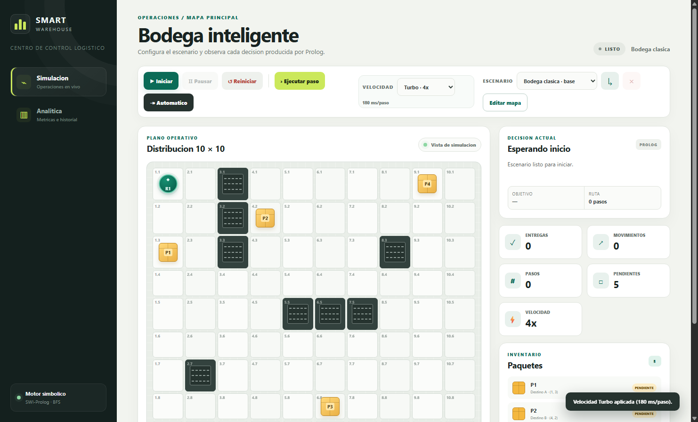

# Smart Warehouse - Proyecto 2 IA1

Smart Warehouse es una simulación de bodega inteligente configurable. Un robot recoge paquetes y los entrega en zonas asignadas; la selección del objetivo, la ruta mínima BFS y cada acción se originan en SWI-Prolog. FastAPI coordina el estado, SQLAlchemy guarda escenarios e historial, y el frontend permite diseñar, ejecutar, analizar y descargar reportes PDF.



## Funciones principales

- Editor visual para paquetes, estanterías y zonas A/B.
- Administración de inventario: añadir, mover, reasignar o eliminar paquetes.
- Estanterías configurables: añadir, mover o eliminar respetando el mínimo del escenario.
- Reubicación libre de zonas de entrega A/B.
- Biblioteca de escenarios persistentes.
- Escenario base protegido: `Bodega clásica`.
- Eliminación de escenarios personalizados sin borrar historial.
- Autoguardado de diseños temporales al iniciar.
- Checkpoints automáticos antes de reiniciar, pausar, reanudar, completar o reemplazar.
- Ruta mínima BFS implementada en Prolog.
- Sincronización de mapa, robot, paquetes, zonas y obstáculos en cada paso.
- Selector de velocidad: lenta, normal, rápida y turbo.
- Dashboard analítico con historial, métricas, detalle por corrida y decisiones paso a paso.
- Reporte PDF individual por cada corrida con recorrido registrado.
- Interfaz adaptable para escritorio y pantallas pequeñas.

La visión por computadora no forma parte de esta versión.

## Ejecutar con Docker Compose

```powershell
cd C:\Users\pabda\OneDrive\Escritorio\IA-VACAS\proyecto_f2
docker compose up --build -d
```

Abrir:

- Interfaz: http://localhost:8621
- API: http://localhost:8620/api/health
- Swagger: http://localhost:8620/docs

Si esos puertos están ocupados:

```powershell
$env:PROYECTO_F2_BACKEND_PORT="8720"
$env:PROYECTO_F2_FRONTEND_PORT="8721"
docker compose up --build -d
```

Nombres Docker exclusivos:

| Recurso | Nombre |
|---|---|
| Proyecto Compose | `ia-vacas-proyecto-f2` |
| Backend | `ia-vacas-proyecto-f2-backend` |
| Frontend | `ia-vacas-proyecto-f2-frontend` |
| Red | `ia-vacas-proyecto-f2-net` |
| Volumen | `ia-vacas-proyecto-f2-data` |

## Flujo recomendado

1. Abrir `Simulación`.
2. Pulsar `Editar mapa`.
3. Añadir o mover paquetes, estanterías y zonas.
4. Pulsar `Aplicar diseño` o `Guardar como`.
5. Elegir velocidad.
6. Pulsar `Iniciar`.
7. Ejecutar paso a paso o en modo `Automático`.
8. Revisar la ruta y explicación generada por Prolog.
9. Abrir `Analítica`.
10. Pulsar `Analizar` o `Descargar` para obtener el PDF de una corrida.

## Capturas y evidencias

| Evidencia | Archivo |
|---|---|
| Simulación con velocidad | `docs/evidencias/simulacion_velocidad_actualizada.png` |
| Editor actualizado | `docs/evidencias/editor_mapa_actualizado.png` |
| Historial con reportes PDF | `docs/evidencias/analitica_reportes_pdf.png` |
| Detalle analítico | `docs/evidencias/detalle_analitica_pdf.png` |
| PDF de ejemplo | `docs/evidencias/reporte_proceso_demo.pdf` |

## Documentación

- [Manual de usuario](docs/MANUAL_USUARIO.md)
- [Manual técnico](docs/MANUAL_TECNICO.md)
- [Evidencias](docs/evidencias/README.md)

## Pruebas

Pruebas locales:

```powershell
$env:PYTHONPATH="backend"
python -m unittest discover -s backend/tests -v
```

Prueba integral dentro de la imagen Docker:

```powershell
docker compose build backend
docker run --rm -v "${PWD}/backend/tests:/app/tests:ro" `
  -e PROLOG_PATH=/app/prolog/warehouse.pl `
  ia-vacas-proyecto-f2-backend:latest python -m unittest discover -s tests -v
```

La prueba integral con Prolog verifica que el robot complete las entregas sin devolver `esperar` cuando el escenario tiene ruta válida.

## Estructura resumida

```text
backend/app/schemas/       Validación de escenarios
backend/app/services/      Simulación, escenarios, Prolog y PDF
backend/app/routers/       API REST
backend/tests/             Pruebas unitarias e integrales
prolog/                    Hechos, BFS, reglas y entrada JSON
frontend/                  Simulación, editor y dashboard
docs/                      Manuales y evidencias
```

## Apagar

```powershell
docker compose down
```

Para borrar también el volumen de datos:

```powershell
docker compose down -v
```
