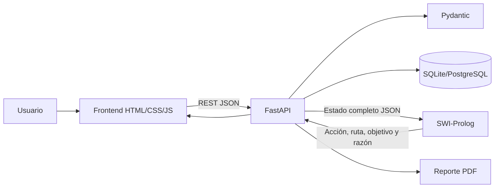
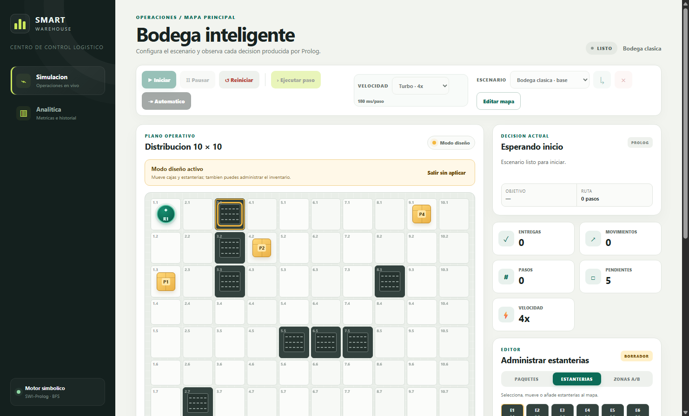
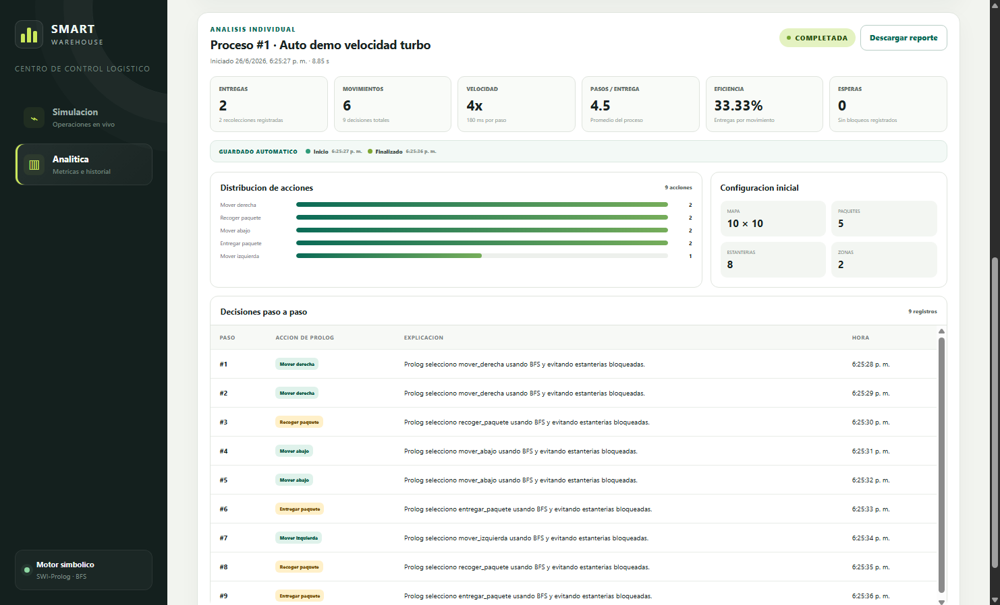
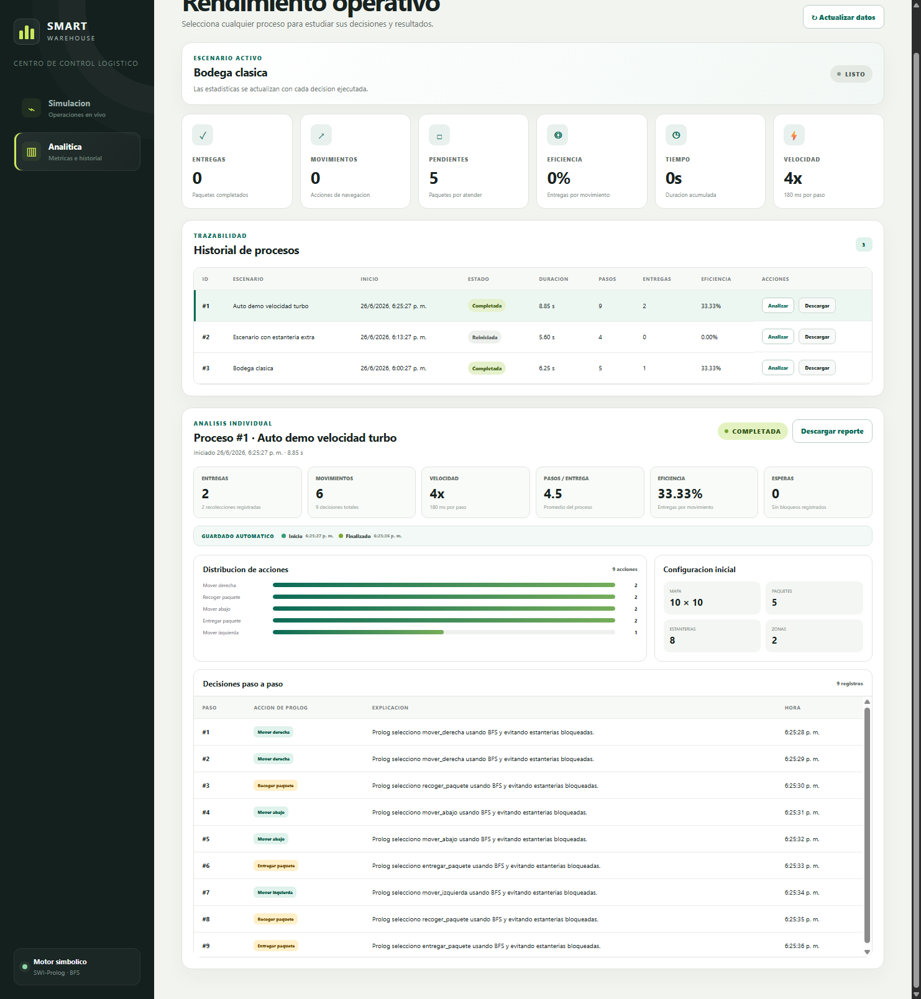

# Manual Técnico - Smart Warehouse

## 1. Resumen técnico

Smart Warehouse es una simulación de bodega inteligente configurable. Integra una interfaz web, una API FastAPI, persistencia con SQLAlchemy y un motor simbólico en SWI-Prolog. El robot no decide en JavaScript ni en Python: cada paso consulta Prolog, que selecciona el objetivo y calcula una ruta mínima mediante BFS.

El sistema conserva escenarios, cambios de diseño, corridas, checkpoints, pasos, métricas y reportes PDF individuales.

## 2. Arquitectura general



Responsabilidades:

| Capa | Responsabilidad |
|---|---|
| Frontend | Edición visual, simulación, analítica y descarga de reportes |
| FastAPI | Estado, validación, API REST, persistencia y coordinación |
| Prolog | Selección de objetivo, BFS y acción siguiente |
| SQLAlchemy | Modelado de tablas y almacenamiento histórico |
| Docker | Empaquetado reproducible con SWI-Prolog incluido |

## 3. Tecnologías

- Python 3.11.
- FastAPI.
- SQLAlchemy.
- Pydantic.
- SWI-Prolog 9.
- SQLite por defecto.
- PostgreSQL compatible mediante `DATABASE_URL`.
- HTML, CSS y JavaScript sin frameworks.
- Nginx para frontend en Docker.
- Docker Compose.

## 4. Estructura del proyecto

```text
proyecto_f2/
├─ backend/
│  ├─ app/
│  │  ├─ core/                 Configuración
│  │  ├─ database/             Engine, sesión e inicialización
│  │  ├─ models/               Entidades SQLAlchemy
│  │  ├─ routers/              Endpoints REST
│  │  ├─ schemas/              Validaciones Pydantic
│  │  └─ services/             Simulación, escenarios, Prolog y PDF
│  └─ tests/                   Pruebas unitarias e integrales
├─ frontend/
│  ├─ css/style.css            Diseño visual
│  ├─ js/api.js                Cliente REST y shell visual
│  ├─ js/simulation.js         Simulación y editor
│  └─ js/dashboard.js          Analítica y reportes
├─ prolog/
│  ├─ facts.pl                 Hechos dinámicos
│  ├─ rules.pl                 Reglas, objetivos y BFS
│  └─ warehouse.pl             Entrada JSON para CLI
├─ docs/
│  ├─ MANUAL_USUARIO.md
│  ├─ MANUAL_TECNICO.md
│  └─ evidencias/
└─ docker-compose.yml
```

## 5. Configuración y puertos

Variables principales:

| Variable | Valor por defecto | Uso |
|---|---|---|
| `PROYECTO_F2_BACKEND_PORT` | `8620` | Puerto host para FastAPI |
| `PROYECTO_F2_FRONTEND_PORT` | `8621` | Puerto host para Nginx |
| `DATABASE_URL` | `sqlite:////data/warehouse.db` en Docker | Base de datos |
| `PROLOG_PATH` | `/app/prolog/warehouse.pl` en Docker | Archivo principal Prolog |
| `CORS_ORIGINS` | `*` | Orígenes permitidos |

El Compose define nombres explícitos:

- `ia-vacas-proyecto-f2`
- `ia-vacas-proyecto-f2-backend`
- `ia-vacas-proyecto-f2-frontend`
- `ia-vacas-proyecto-f2-net`
- `ia-vacas-proyecto-f2-data`

Esto evita colisiones con contenedores de otras prácticas.

## 6. Flujo de ejecución

1. El usuario diseña o selecciona un escenario.
2. El frontend envía la configuración al backend.
3. Pydantic valida mapa, robots, paquetes, zonas y obstáculos.
4. Al iniciar, el backend crea una fila en `simulations`.
5. Si el escenario era temporal, se persiste como `Auto fecha-hora`.
6. En cada paso, FastAPI construye el estado completo.
7. `prolog_service.py` invoca SWI-Prolog por subprocess.
8. Prolog reconstruye hechos dinámicos desde JSON.
9. Prolog calcula objetivo y ruta BFS.
10. Prolog devuelve acción, ruta, objetivo, algoritmo y explicación.
11. Python aplica la acción al estado.
12. SQLAlchemy guarda snapshot, métricas y entidades históricas.
13. El frontend redibuja mapa, ruta y métricas.

## 7. Modelo de estado de simulación

El estado activo contiene:

```json
{
  "map": {"width": 10, "height": 10},
  "phase": "running",
  "simulation_id": 1,
  "steps": 9,
  "moves": 6,
  "deliveries": 2,
  "robots": [],
  "packages": [],
  "zones": [],
  "obstacles": [],
  "last_action": "mover_derecha",
  "last_reason": "Prolog calculo...",
  "last_route": [],
  "last_target": {"x": 10, "y": 10},
  "speed": {"key": "turbo", "interval_ms": 180, "multiplier": 4}
}
```

El estado runtime vive en `simulation_service.py`. El escenario activo se mantiene separado para que un reinicio no destruya la configuración personalizada.

## 8. Velocidad de recorrido

La velocidad es una configuración del proceso de simulación expuesta por:

```http
PUT /api/simulation/speed
```

Payload:

```json
{"speed": "turbo"}
```

Velocidades:

| Clave | Etiqueta | Intervalo |
|---|---|---:|
| `lenta` | Lenta | 1100 ms |
| `normal` | Normal | 650 ms |
| `rapida` | Rápida | 350 ms |
| `turbo` | Turbo | 180 ms |

El frontend usa el intervalo para controlar `setInterval`. El backend guarda la velocidad en snapshots y reportes para que el historial sea trazable.

## 9. Integración con Prolog

El backend ejecuta:

```text
swipl -q -s prolog/warehouse.pl -g warehouse_cli
```

Entrada enviada:

```json
{
  "robot_id": "r1",
  "map": {"width": 10, "height": 10},
  "robots": [{"id": "r1", "x": 1, "y": 1, "carrying": "none"}],
  "packages": [{"id": "p1", "x": 1, "y": 3, "zone": "zona_a", "status": "pendiente"}],
  "zones": [{"id": "zona_a", "x": 10, "y": 10}],
  "obstacles": [{"x": 3, "y": 1}]
}
```

Respuesta esperada:

```json
{
  "action": "mover_abajo",
  "algorithm": "bfs",
  "route": [{"x": 1, "y": 2}, {"x": 1, "y": 3}],
  "target": {"x": 1, "y": 3},
  "reason": "Prolog calculo con BFS una ruta minima...",
  "source": "prolog"
}
```

## 10. Reglas principales en Prolog

Archivo principal: `prolog/rules.pl`.

Predicados relevantes:

| Predicado | Responsabilidad |
|---|---|
| `dentro_mapa/2` | Verifica límites |
| `celda_libre/2` | Evita obstáculos |
| `puede_recoger/2` | Detecta paquete pendiente en posición del robot |
| `puede_entregar/2` | Verifica zona destino del paquete cargado |
| `ruta_mas_corta/4` | Calcula camino mínimo |
| `bfs/5` | Implementa búsqueda en anchura |
| `paquete_pendiente_mas_cercano/2` | Escoge paquete alcanzable más cercano |
| `objetivo/2` | Define paquete o zona de entrega |
| `plan_ruta/4` | Convierte ruta en acción siguiente |
| `accion/2` | Prioriza recoger, entregar, mover o esperar |

La regla de objetivo para paquetes pendientes es:

```prolog
objetivo(Robot, posicion(TX, TY)) :-
    paquete_pendiente_mas_cercano(Robot, Paquete),
    paquete_estado(Paquete, TX, TY, _, pendiente).
```

Cuando el robot transporta un paquete, el objetivo pasa a ser la zona asignada.

## 11. Validación de escenarios

Archivo: `backend/app/schemas/scenario.py`.

Reglas:

- Mapa de 10 a 30 casillas por eje.
- Al menos un robot.
- Al menos dos zonas.
- Al menos ocho obstáculos.
- Paquetes con IDs únicos.
- Robots con IDs únicos.
- Zonas con IDs únicos.
- Sin colisiones iniciales.
- Paquetes asignados a zonas existentes.
- Coordenadas dentro del mapa.

Los escenarios personalizados pueden tener inventario variable, incluso cero paquetes. Si no hay paquetes, la corrida finaliza inmediatamente.

## 12. Persistencia

Modelos principales en `backend/app/models/entities.py`:

| Tabla | Contenido |
|---|---|
| `scenarios` | Escenarios persistentes |
| `scenario_changes` | Creación y actualizaciones |
| `simulation_scenarios` | Snapshot inicial asociado a cada corrida |
| `simulation_checkpoints` | Estados guardados por evento |
| `simulations` | Resumen de cada corrida |
| `simulation_steps` | Acción, explicación y snapshot por paso |
| `robots` | Histórico de posición del robot |
| `packages` | Histórico de paquetes |
| `metrics` | Métricas registradas por paso |

La base se crea con `Base.metadata.create_all`.

## 13. Checkpoints automáticos

Eventos guardados:

| Evento | Cuándo ocurre |
|---|---|
| `started` | Al iniciar una corrida |
| `paused` | Al pausar |
| `resumed` | Al continuar una corrida pausada |
| `completed` | Al entregar todos los paquetes |
| `reset` | Antes de reiniciar |
| `restarted` | Antes de reemplazar una ejecución activa |

Cada checkpoint conserva el estado completo como JSON.

## 14. API REST

| Método | Ruta | Uso |
|---|---|---|
| GET | `/api/health` | Salud de la API |
| GET | `/api/simulation/state` | Estado actual |
| PUT | `/api/simulation/configuration` | Aplicar diseño temporal |
| PUT | `/api/simulation/speed` | Cambiar velocidad |
| POST | `/api/simulation/start` | Iniciar corrida |
| POST | `/api/simulation/pause` | Pausar |
| POST | `/api/simulation/reset` | Reiniciar |
| POST | `/api/simulation/step` | Ejecutar un paso Prolog |
| POST | `/api/simulation/auto` | Ejecutar varios pasos desde API |
| GET | `/api/metrics` | Métricas actuales |
| GET/POST | `/api/scenarios` | Listar o crear escenarios |
| GET/PUT/DELETE | `/api/scenarios/{id}` | Consultar, editar o eliminar escenario |
| POST | `/api/scenarios/{id}/activate` | Activar escenario |
| GET | `/api/scenarios/{id}/changes` | Cambios de escenario |
| GET | `/api/history` | Historial de corridas |
| GET | `/api/history/{id}` | Detalle analítico |
| GET | `/api/history/{id}/report` | Reporte PDF |

## 15. Reportes PDF

Archivo: `backend/app/services/report_service.py`.

El reporte se genera sin dependencias externas adicionales. El servicio construye un PDF básico con comandos PDF nativos:

- Cabecera oscura estilo Analítica.
- Tarjetas de métricas.
- Barras de distribución de acciones.
- Configuración inicial.
- Velocidad de recorrido.
- Tabla de pasos.

Endpoint:

```http
GET /api/history/{simulation_id}/report
```

Respuesta:

```http
Content-Type: application/pdf
Content-Disposition: attachment; filename="reporte_proceso_1.pdf"
```

Solo se permite descargar si la corrida tiene al menos un paso registrado.

## 16. Frontend

### `api.js`

Define:

- `API_BASE`.
- Función `api()`.
- `escapeHtml()`.
- Shell visual compartido.

### `simulation.js`

Gestiona:

- Render del mapa.
- Editor visual.
- Escenarios.
- Velocidad.
- Simulación paso a paso.
- Modo automático.
- Inventario.

### `dashboard.js`

Gestiona:

- Métricas generales.
- Historial.
- Detalle por corrida.
- Botones de reporte PDF.
- Barras de distribución de acciones.

### `style.css`

Contiene:

- Layout lateral.
- Paneles.
- Grid de bodega.
- Tokens de robot, paquete, estantería y zona.
- Tarjetas analíticas.
- Botones de reporte.
- Responsive.

## 17. Evidencias visuales

### Simulación y velocidad


### Editor de mapa



### Analítica y reportes



### Detalle por proceso



PDF de ejemplo:

[reporte_proceso_demo.pdf](evidencias/reporte_proceso_demo.pdf)

## 18. Pruebas

Ejecutar pruebas locales:

```powershell
$env:PYTHONPATH="backend"
python -m unittest discover -s backend/tests -v
```

Ejecutar prueba integral dentro de Docker:

```powershell
docker compose build backend
docker run --rm -v "${PWD}/backend/tests:/app/tests:ro" `
  -e PROLOG_PATH=/app/prolog/warehouse.pl `
  ia-vacas-proyecto-f2-backend:latest python -m unittest discover -s tests -v
```

Cobertura funcional:

- Validación de escenarios.
- Inventario variable.
- Estanterías añadidas.
- Zonas reubicadas.
- Autoguardado.
- Checkpoints.
- Reportes PDF.
- Velocidad registrada.
- Corrida integral con Prolog cuando `swipl` está disponible.

## 19. Despliegue

Construcción:

```powershell
docker compose build
```

Inicio:

```powershell
docker compose up -d
```

Logs:

```powershell
docker compose logs -f backend
docker compose logs -f frontend
```

Apagado:

```powershell
docker compose down
```

Apagado eliminando datos persistentes:

```powershell
docker compose down -v
```

## 20. Limitaciones y mejoras futuras

La visión por computadora no forma parte de esta versión. Queda como mejora futura usando marcadores ArUco o detección de objetos para reconstruir automáticamente el escenario físico.

Mejoras posibles:

- Múltiples robots.
- Prevención de colisiones entre robots.
- Prioridades por tipo de paquete.
- Exportación adicional a CSV.
- Autenticación.
- Vista previa web del PDF.
- Integración real con cámara.
