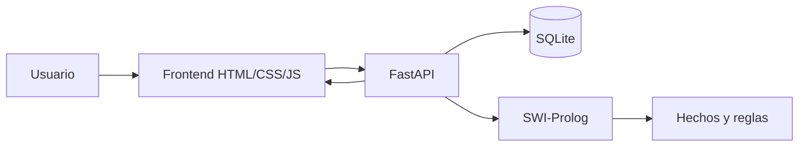

# Manual Tecnico - Smart Warehouse

## Resumen

Smart Warehouse es una simulacion de bodega inteligente. El frontend muestra un mapa 10x10 y controles de ejecucion; el backend guarda estado, metricas e historial; SWI-Prolog decide la siguiente accion del robot segun hechos y reglas de inferencia.

## Arquitectura



## Tecnologias

- SWI-Prolog para inferencia.
- Python 3.11, FastAPI y SQLAlchemy.
- SQLite para historial y estadisticas.
- HTML, CSS y JavaScript para simulacion visual.
- Docker y Docker Compose.

## Estructura

```text
backend/app/main.py
backend/app/services/prolog_service.py
backend/app/services/simulation_service.py
backend/app/models/entities.py
prolog/facts.pl
prolog/rules.pl
prolog/warehouse.pl
frontend/index.html
frontend/dashboard.html
```

## Integracion frontend/backend/Prolog

1. El usuario pulsa `Paso` o activa modo automatico.
2. El frontend llama `POST /api/simulation/step`.
3. Python envia el estado actual a `warehouse.pl`.
4. Prolog responde una accion y una explicacion.
5. Python aplica la accion devuelta, actualiza estado y guarda el paso.
6. El frontend renderiza robot, paquetes, obstaculos y zonas.

## Hechos Prolog

`facts.pl` define:

- `mapa(10,10)`.
- `robot_base/3`.
- `paquete_base/4`.
- `zona_entrega/2`.
- `obstaculo/1`.
- `acciones/1`, una lista con las acciones validas.

## Reglas, variables, listas y corte

`rules.pl` usa variables en reglas como `robot_estado(Robot, X, Y, Carrying)`, listas con `findall/3`, `append/3`, `member/2`, ordenamiento con `keysort/2` y cortes `!` para priorizar recoger, entregar y seleccionar el primer movimiento valido.

Reglas principales implementadas:

1. `dentro_mapa/2`: valida limites.
2. `celda_libre/2`: evita obstaculos.
3. `puede_recoger/2`: detecta paquete en la posicion del robot.
4. `puede_entregar/2`: detecta zona correcta para paquete cargado.
5. `paquete_pendiente_mas_cercano/2`: selecciona objetivo por distancia Manhattan.
6. `objetivo/2`: decide si ir a zona o a paquete.
7. `decision_movimiento/2`: elige movimiento valido.
8. `accion/2`: prioriza recoger, entregar, mover o esperar.

## Consulta usada por backend

El backend ejecuta:

```bash
swipl -q -s prolog/warehouse.pl -g warehouse_cli
```

Envia JSON por stdin:

```json
{
  "robot_id": "r1",
  "robots": [{"id": "r1", "x": 1, "y": 1, "carrying": "none"}],
  "packages": [{"id": "p1", "x": 1, "y": 3, "zone": "zona_a", "status": "pendiente"}]
}
```

Prolog responde:

```json
{"robot_id":"r1","action":"mover_abajo","reason":"...","source":"prolog"}
```

## API REST

| Metodo | Ruta | Uso |
|---|---|---|
| GET | `/api/health` | Estado de API |
| GET | `/api/simulation/state` | Estado actual |
| POST | `/api/simulation/start` | Iniciar |
| POST | `/api/simulation/pause` | Pausar |
| POST | `/api/simulation/reset` | Reiniciar |
| POST | `/api/simulation/step` | Ejecutar un paso |
| POST | `/api/simulation/auto` | Ejecutar varios pasos |
| GET | `/api/robots` | Robots |
| GET | `/api/packages` | Paquetes |
| GET | `/api/obstacles` | Obstaculos |
| GET | `/api/zones` | Zonas |
| GET | `/api/metrics` | Metricas actuales |
| GET | `/api/history` | Historial |
| GET | `/api/history/{id}` | Detalle |

## Base de datos

- `simulations`: corrida, estado, pasos, entregas, movimientos.
- `simulation_steps`: accion, explicacion y snapshot por paso.
- `robots`: snapshot de robot por paso.
- `packages`: snapshot de paquetes por paso.
- `metrics`: entregas, movimientos, pendientes, eficiencia y tiempo.

## Flujo de simulacion

El estado inicial contiene 1 robot en `(1,1)`, 5 paquetes, 2 zonas y 8 obstaculos. Al iniciar, se crea un registro `Simulation`. Cada paso consulta Prolog, aplica la accion, sincroniza paquete cargado, calcula metricas y guarda snapshot.

## Docker

```bash
cd proyecto_f2
cp .env.example .env
docker compose up --build
```

El backend instala SWI-Prolog dentro del contenedor y usa `/app/prolog/warehouse.pl`.

## Distribucion de trabajo

Plantilla para completar:

| Integrante | Responsabilidad |
|---|---|
| Pablo Fernandez | Backend, Prolog, frontend, documentacion |

## Pruebas sugeridas

1. Abrir http://localhost:8401.
2. Pulsar `Iniciar`.
3. Pulsar `Paso` hasta que el robot recoja `P1`.
4. Continuar hasta que entregue en `Zona A`.
5. Revisar `Dashboard` e historial.

## Mejoras futuras

Multiples robots, prioridades por paquete, congestion, niveles de dificultad, reportes PDF y notificaciones.
