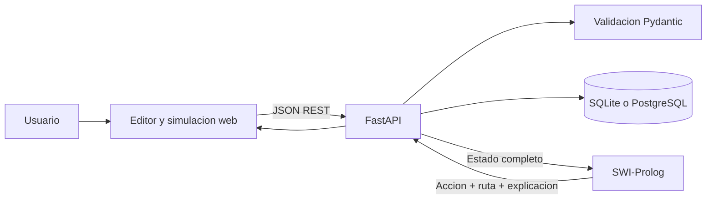

# Manual Tecnico - Smart Warehouse

## Resumen

Smart Warehouse es una simulacion de bodega inteligente configurable. El frontend permite diseñar escenarios y controlar la ejecucion; FastAPI valida y coordina el estado; SWI-Prolog selecciona objetivos y calcula rutas minimas con BFS; SQLAlchemy conserva escenarios, revisiones, simulaciones, pasos y metricas.

## Arquitectura



## Tecnologias

- SWI-Prolog 9 para hechos, inferencia y BFS.
- Python 3.11, FastAPI, Pydantic y SQLAlchemy.
- SQLite por defecto; compatible con PostgreSQL mediante `DATABASE_URL`.
- HTML, CSS y JavaScript sin frameworks.
- Nginx y Docker Compose.

## Componentes

```text
backend/app/main.py
backend/app/models/entities.py
backend/app/schemas/scenario.py
backend/app/services/prolog_service.py
backend/app/services/scenario_service.py
backend/app/services/simulation_service.py
backend/app/routers/simulation.py
backend/tests/
prolog/facts.pl
prolog/rules.pl
prolog/warehouse.pl
frontend/js/simulation.js
frontend/js/dashboard.js
frontend/css/style.css
```

## Flujo frontend, backend y Prolog

1. El frontend obtiene o edita una configuracion.
2. Pydantic valida dimensiones, minimos, identificadores, zonas, limites y colisiones.
3. `Iniciar` crea una simulacion usando el escenario activo, sin volver a posiciones codificadas.
4. Cada paso envia a Prolog `map`, `robots`, `packages`, `zones` y `obstacles`.
5. Prolog reconstruye sus hechos dinamicos y calcula el objetivo alcanzable mas cercano.
6. BFS devuelve la ruta minima; `accion/2` prioriza recoger, entregar, mover y esperar.
7. Python aplica exclusivamente la accion recibida, guarda el snapshot y actualiza metricas.
8. El frontend resalta la ruta y presenta la explicacion de Prolog.

## Logica Prolog

`facts.pl` incluye hechos base y declara dinamicos `mapa/2`, `robot_estado/4`, `paquete_estado/5`, `zona_entrega/2` y `obstaculo/1`. `warehouse.pl` reemplaza esos hechos con el estado JSON actual en cada consulta.

Reglas principales:

1. `dentro_mapa/2`: valida limites.
2. `celda_libre/2`: evita obstaculos.
3. `puede_recoger/2`: detecta un paquete pendiente bajo el robot.
4. `puede_entregar/2`: valida la zona del paquete transportado.
5. `ruta_mas_corta/4`: ejecuta busqueda en anchura.
6. `bfs/5`: expande la frontera y conserva posiciones visitadas.
7. `paquete_pendiente_mas_cercano/2`: compara longitudes de rutas alcanzables.
8. `objetivo/2`: selecciona paquete o zona.
9. `plan_ruta/4`: produce acciones y posiciones de la ruta.
10. `accion/2`: usa cortes `!` para priorizar recoger, entregar y mover.

Se emplean variables, terminos `posicion(X,Y)`, listas de nodos pendientes y visitados, `findall/3`, `append/3`, `memberchk/2`, `keysort/2`, `maplist/3` y cortes.

## Contrato con Prolog

El backend ejecuta:

```text
swipl -q -s prolog/warehouse.pl -g warehouse_cli
```

Entrada abreviada:

```json
{
  "robot_id": "r1",
  "map": {"width": 10, "height": 10},
  "robots": [{"id": "r1", "x": 1, "y": 1, "carrying": "none"}],
  "packages": [{"id": "p1", "x": 1, "y": 3, "zone": "zona_a", "status": "pendiente"}],
  "zones": [{"id": "zona_a", "x": 10, "y": 10}],
  "obstacles": [{"x": 3, "y": 1}]
}
```

Respuesta:

```json
{
  "action": "mover_abajo",
  "algorithm": "bfs",
  "route": [{"x": 1, "y": 2}, {"x": 1, "y": 3}],
  "target": {"x": 1, "y": 3},
  "reason": "Prolog calculo con BFS una ruta minima...",
  "source": "prolog"
}
```

## API REST

| Metodo | Ruta | Uso |
|---|---|---|
| GET | `/api/health` | Salud de la API |
| GET | `/api/simulation/state` | Estado y escenario activo |
| PUT | `/api/simulation/configuration` | Aplicar un diseño temporal |
| POST | `/api/simulation/start` | Iniciar sobre el escenario activo |
| POST | `/api/simulation/pause` | Pausar |
| POST | `/api/simulation/reset` | Cerrar y volver al diseño inicial |
| POST | `/api/simulation/step` | Consultar Prolog y ejecutar una accion |
| POST | `/api/simulation/auto` | Ejecutar varios pasos |
| GET/POST | `/api/scenarios` | Listar o crear escenarios |
| GET/PUT/DELETE | `/api/scenarios/{id}` | Consultar, editar o eliminar |
| POST | `/api/scenarios/{id}/activate` | Activar un escenario |
| GET | `/api/scenarios/{id}/changes` | Historial de cambios |
| GET | `/api/metrics` | Metricas actuales |
| GET | `/api/history` | Historial de simulaciones |
| GET | `/api/history/{id}` | Pasos y configuracion inicial |

## Validacion del escenario

El mapa admite dimensiones de 10 a 30. Se requieren al menos un robot, cinco paquetes, dos zonas y ocho obstaculos. No se permiten coordenadas fuera del mapa, identificadores repetidos, colisiones iniciales ni paquetes asignados a zonas inexistentes. Los estados de robots y paquetes se normalizan al guardar.

## Base de datos

- `scenarios`: nombre y configuracion JSON persistente.
- `scenario_changes`: creacion y actualizaciones.
- `simulation_scenarios`: escenario y snapshot inicial de cada corrida.
- `simulations`: estado y resumen de la corrida.
- `simulation_steps`: accion, razon y snapshot por paso.
- `robots`, `packages` y `metrics`: estado historico por paso.

Las tablas nuevas se crean con `Base.metadata.create_all`; no modifican las columnas de tablas antiguas.

## Pruebas

```powershell
$env:PYTHONPATH="backend"
python -m unittest discover -s backend/tests -v
```

La suite verifica validaciones, persistencia de posiciones personalizadas y una corrida integral de cinco entregas. Para ejecutar la prueba integral sin instalar SWI-Prolog localmente, use el comando Docker documentado en `README.md`.

## Distribucion de trabajo

| Integrante | Responsabilidad |
|---|---|
| Pablo Fernandez | Backend, Prolog, frontend, pruebas y documentacion |

## Mejoras futuras

Vision por computadora con marcadores ArUco, edicion de obstaculos y zonas, multiples robots con prevencion de colisiones, reportes PDF y notificaciones.
