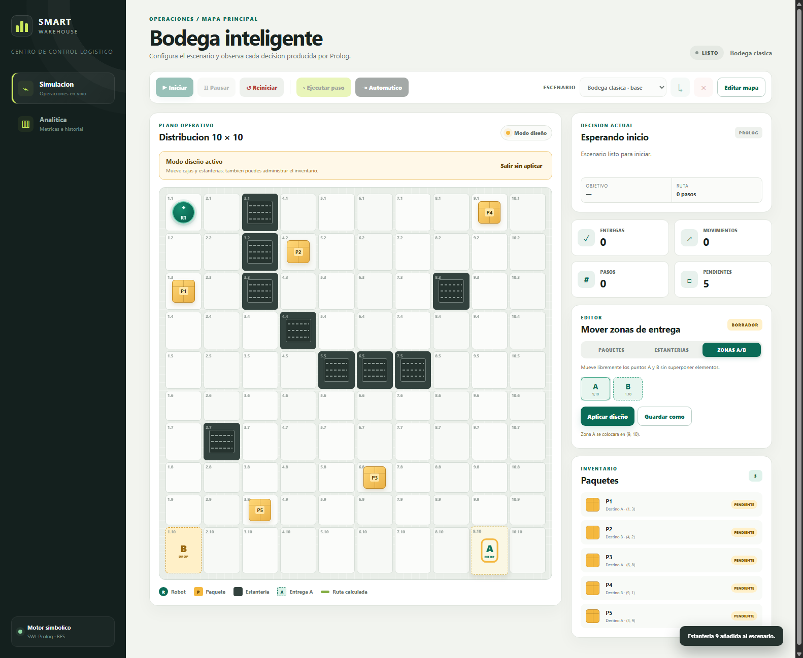
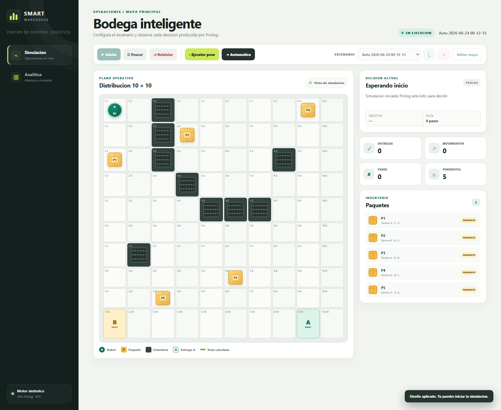
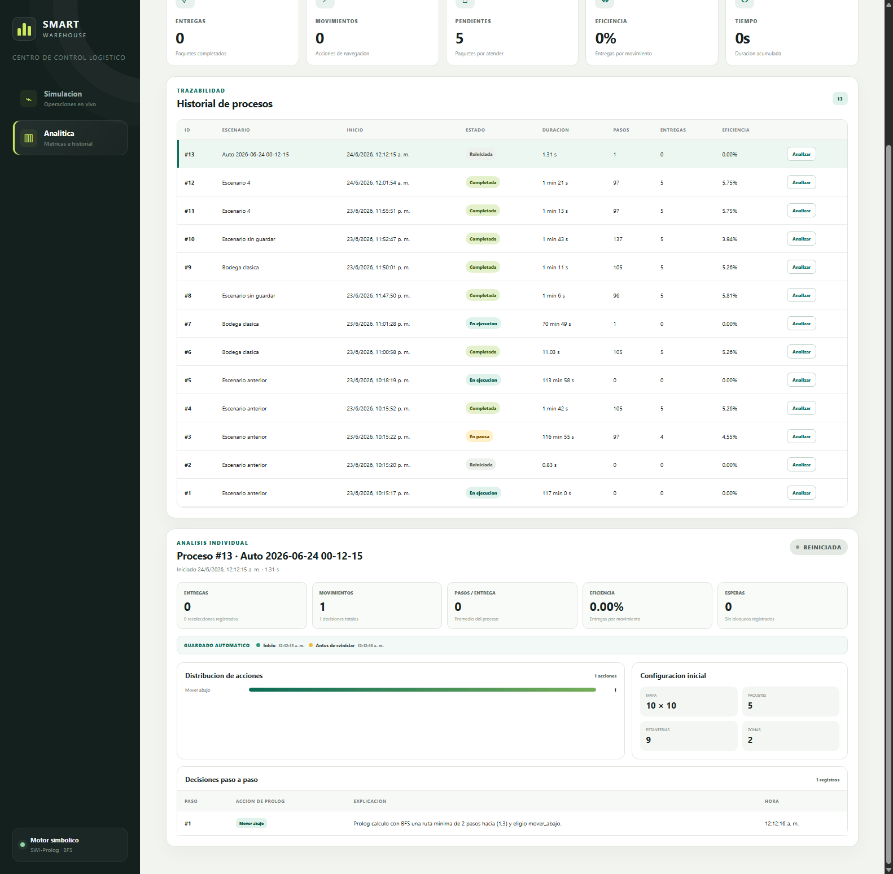

# Manual de Usuario - Smart Warehouse

## Iniciar

```powershell
cd proyecto_f2
docker compose up --build -d
```

Abra http://localhost:8521. La API queda en http://localhost:8520. Si el puerto esta ocupado, configure `PROYECTO_F2_BACKEND_PORT` y `PROYECTO_F2_FRONTEND_PORT` antes de ejecutar Docker Compose.

## Interpretar la interfaz

- Robot: ficha circular verde.
- Paquete: caja amarilla identificada como `P1`, `P2`, etc.
- Obstaculo: estanteria oscura.
- Zona A/B: casilla punteada de entrega.
- Puntos verdes numerados: ruta calculada por Prolog.

El panel derecho muestra la accion, la explicacion, el objetivo, la longitud de la ruta, las metricas y el inventario.

## Diseñar un escenario

Solo se puede editar cuando no hay una simulacion activa.

1. Pulse `Editar mapa`.
2. En `Paquetes`, seleccione una caja en el mapa, inventario o selector del editor.
3. Pulse una casilla libre o arrastre la caja hasta ella.
4. Use `Añadir paquete` o `Eliminar seleccionado` para cambiar el inventario y asigne su zona.
5. Abra `Estanterias`, seleccione `E1`, `E2`, etc., muévala o pulse `Añadir estanteria`.
6. Abra `Zonas A/B` y coloque cualquiera de los dos puntos en una casilla libre.
7. Use una de estas opciones:
   - `Aplicar diseño`: usa el diseño sin guardarlo permanentemente.
   - `Guardar como`: crea un escenario persistente.
   - `Actualizar`: modifica el escenario personalizado activo.
   - `Salir sin aplicar`: descarta el borrador.

No se puede colocar una caja o estanteria sobre el robot, otra entidad o una zona. Los escenarios con menos de cinco paquetes son validos, aunque la interfaz advierte cuántos faltan para cumplir el mínimo académico. El escenario base es inmutable.



## Cargar escenarios

Seleccione un escenario en la barra superior y pulse el boton de carga. Debe reiniciar primero si existe una simulacion activa.

El botón `×` elimina el escenario seleccionado después de confirmación. `Bodega clasica` no se puede eliminar y el historial asociado a escenarios eliminados se conserva.

Si aplica un diseño sin guardarlo, al pulsar `Iniciar` el sistema crea automáticamente un escenario con nombre `Auto fecha-hora`.



## Ejecutar

- `Iniciar`: crea una corrida con el escenario activo.
- `Ejecutar paso`: pide una decision a Prolog y ejecuta una accion.
- `Automatico`: ejecuta pasos cada 650 ms; vuelva a pulsarlo para detenerlo.
- `Pausar`: detiene el modo automatico y marca la corrida en pausa.
- `Reiniciar`: cierra la corrida y recupera la distribucion inicial del escenario.

Cada paso guarda un snapshot. También se crean puntos de control al iniciar, pausar, reanudar, completar y justo antes de reiniciar o reemplazar una ejecución.

Estados de paquete:

- `pendiente`: espera ser recogido.
- `en_robot`: viaja con el robot.
- `entregado`: llego a su zona.

## Analitica

La vista `Analitica` presenta entregas, movimientos, pendientes, eficiencia, tiempo y un historial persistente. Pulse `Analizar` en una fila para ver duración, pasos por entrega, esperas, distribución de acciones, configuración inicial y todas las explicaciones emitidas por Prolog paso a paso.

La franja `Guardado automatico` muestra los checkpoints disponibles, incluida la copia creada antes de reiniciar.



## Solucion de problemas

- `Puerto ocupado`: cambie los puertos en `.env` o detenga el contenedor que los utiliza.
- `SWI-Prolog no esta instalado`: utilice Docker Compose; la imagen ya lo incluye.
- `No se puede editar`: pulse `Reiniciar` para cerrar la simulacion activa.
- `Casilla protegida`: seleccione una casilla sin robot, zona, obstaculo ni otro paquete.
- `Prolog devuelve esperar`: revise que exista un camino entre el robot y los paquetes o zonas.
